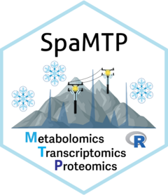
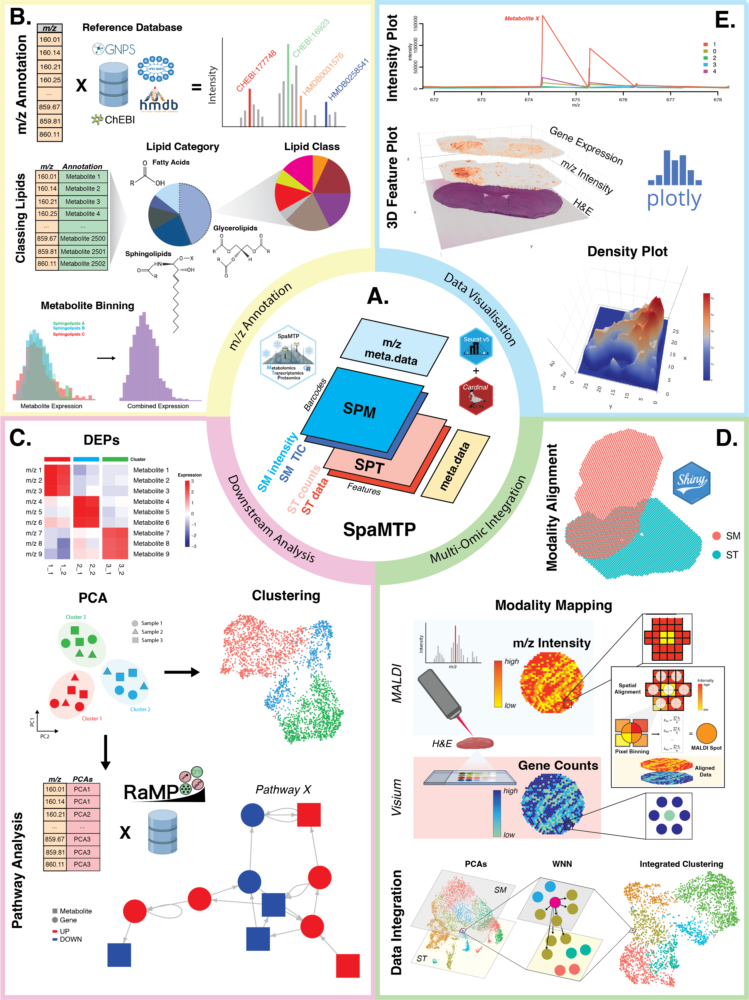

<!-- README.md is generated from README.Rmd. Please edit that file -->

# SpaMTP 

<!-- badges: start -->


## *R*-based User-Friendly Spatial Metabolomic, Transcriptomic, and Proteomic Data Analysis Tool

<br>

<!-- badges: end -->

SpaMTP is an R package designed for the integrative analysis of spatial metabolomics and spatial transcriptomics data. SpaMTP inherits functionalities from two well established R packages (Cardinal and Seurat) to present a user-friendly platform for integrative spatial-omics analysis. Build on the foundation of a [*Seurat Class Object*](https://satijalab.org/seurat/), this package has three major functionalities which include; (1) mass-to-charge ratio (m/z) metabolite annotation, (2) various downstream statistical analysis including differential metabolite expression and pathway analysis, and (3) integrative spatial-omics analysis. In addition, this package includes various functions for data visualisation and data import/export, permitting flexible usage with other established R and Python  packages.   

<br>



<br>

## Installation

You can install the current version of SpaMTP from
[GitHub](https://github.com/) with:

``` r
if (!require("devtools", quietly = TRUE))
    install.packages("devtools")

devtools::install_github("BiomedicalMachineLearning/SpaMTP")
```

For tutorials and more information please visit the [SpaMTP website](https://genomicsmachinelearning.github.io/SpaMTP/)
