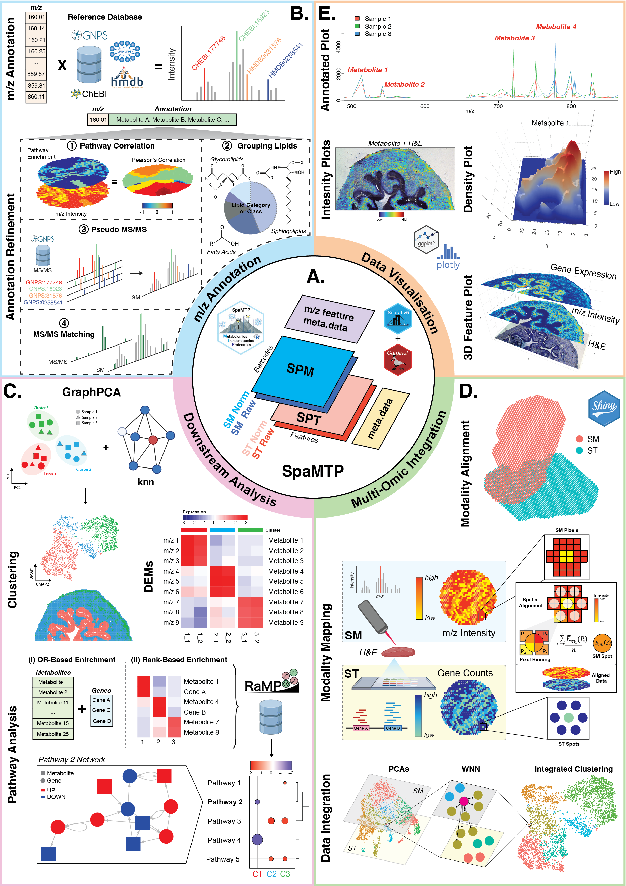

<!-- README.md is generated from README.Rmd. Please edit that file -->

# SpaMTP 

<!-- badges: start -->


## *R*-based User-Friendly Spatial Metabolomic, Transcriptomic, and Proteomic Data Analysis Tool

<br>

<!-- badges: end -->

SpaMTP is an R package designed for the integrative analysis of spatial metabolomics and spatial transcriptomics data. SpaMTP inherits functionalities from two well established R packages (Cardinal and Seurat) to present a user-friendly platform for integrative spatial-omics analysis. Build on the foundation of a [*Seurat Class Object*](https://satijalab.org/seurat/), this package has three major functionalities which include; (1) mass-to-charge ratio (m/z) metabolite annotation, (2) various downstream statistical analysis including differential metabolite expression and pathway analysis, and (3) integrative spatial-omics analysis. In addition, this package includes various functions for data visualisation and data import/export, permitting flexible usage with other established R and Python  packages.   

For more information and citing *SpaMTP* please visit our pre-print available [here](https://www.biorxiv.org/content/10.1101/2024.10.31.621429v1).

<br>



<br>

## Installation

You can install the current version of SpaMTP from
[GitHub](https://github.com/) with:

``` r
if (!require("devtools", quietly = TRUE))
    install.packages("devtools")

devtools::install_github("GenomicsMachineLearning/SpaMTP")
```

For tutorials and more information please visit the [SpaMTP website](https://genomicsmachinelearning.github.io/SpaMTP/)

### Apptainer

To download the image:
```
wget -c https://downloads.gmllab.com/SpaMTP/spamtp-1.1.sif
```
Verify it download correctly:
```
wget -q -O - https://downloads.gmllab.com/SpaMTP/spamtp-1.1.sif.md5 | md5sum -c -
```

Or to create an Apptainer image from scratch (you need the environment-linux.yml, dependencies.R and spamtp.def files):
```
apptainer build spamtp.sif spamtp.def
```

### Contributing

To reproduce the dependencies and install SpaMTP into a conda environment:
```
conda create --prefix [some-directory]/conda/spamtp python=3.10 r-base=4.4 imagemagick --y
conda activate [some-directory]/conda/spamtp
conda install -c conda-forge jupyter libconfig fontconfig freetype libtiff r-irkernel  --y
conda install --no-update-deps -c conda-forge r-here r-matrix r-Seurat r-SeuratObject r-hdf5r r-ggplot2 r-reshape2 r-patchwork fftw r-RCurl r-jpeg r-locfit r-ontologyindex --y
conda install --no-update-deps -c conda-forge r-fields r-ggdendro r-ggnewscale r-magick r-naturalsort r-pheatmap r-sf r-shinyjs r-zeallot r-r.utils --y
conda install --no-update-deps -c bioconda bioconductor-BiocGenerics bioconductor-enhancedvolcano bioconductor-biocparallel --y
conda install --no-update-deps -c bioconda bioconductor-protgenerics bioconductor-s4vectors bioconductor-biobase --y
conda install --no-update-deps -c bioconda bioconductor-edger bioconductor-fgsea bioconductor-limma bioconductor-scater bioconductor-singlecellexperiment --y
conda install --no-update-deps -c bioconda bioconductor-delayedmatrixstats bioconductor-hdf5array bioconductor-rhdf5 bioconductor-rhdf5lib --y
conda install --no-update-deps -c bioconda bioconductor-msnbase bioconductor-ebimage==4.48.0-0 --y
Rscript dependencies.R
```

