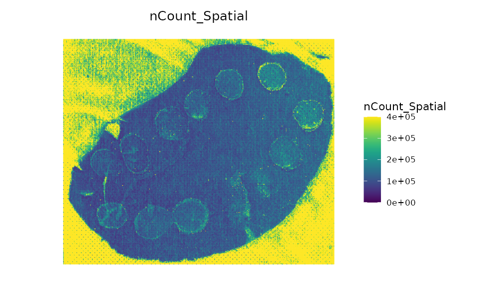
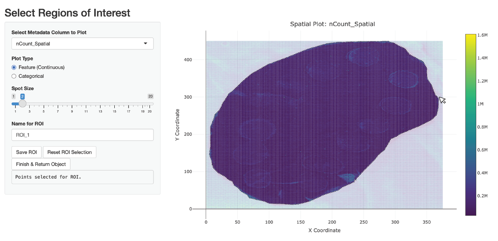
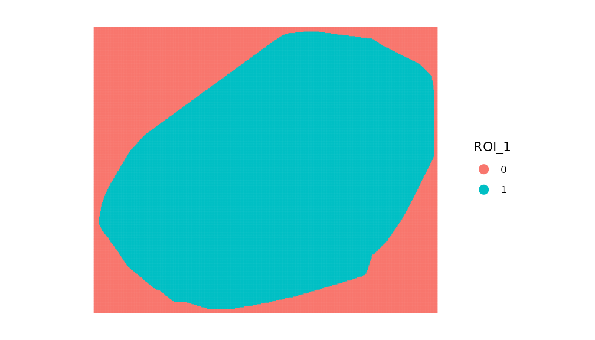
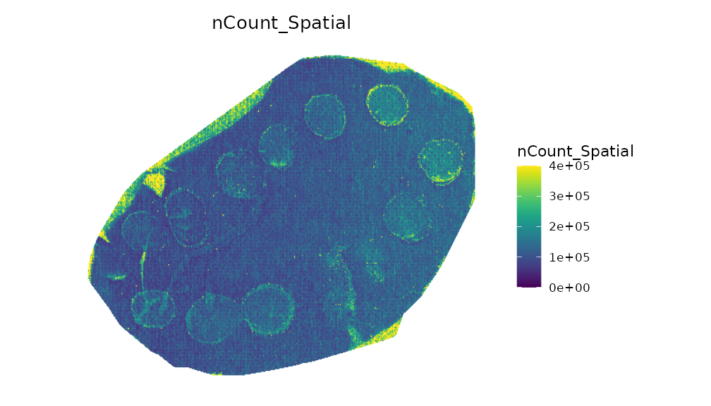

# SpaMTP: Handling Big Datasets

## Handling Large SM Datasets

SpaMTP is suitable for datasets of all sizes. However, extra large
datasets may need special handling to speed up the analysis process. To
demonstrate some helpful functions for processing large datasets we will
use a public mouse liver dataset with spotted chemicals standards
published [here](https://doi.org/10.1101/2024.10.14.618269).

Author: Andrew Causer

  

### Import *R* Libraries and Load Data

First we need to import the required libraries for this analysis.

``` r

## Install SpaMTP if not previously installed
if (!require("SpaMTP"))
    devtools::install_github("GenomicsMachineLearning/SpaMTP")

#General Libraries
library(SpaMTP)
library(Cardinal)
library(Seurat)
library(dplyr)

#For plotting + DE plots
library(ggplot2)
library(EnhancedVolcano)
library(viridis)
```

Next we will load the data, you can download or load it directly from
the [*SpaMTP* zenodo
page](https://zenodo.org/communities/spamtp/records).

``` r

spotted_large <- Cardinal::readImzML("./Spotted/2020-12-05_ME_X190_L1_Spotted_20umss_375x450_33at_DAN_Neg",resolution = 3, mass.range = c(100,1000), memory = T)
```

``` r

spotted_large
```

    MSImagingExperiment with 767528 features and 168750 spectra 
    spectraData(1): intensity
    featureData(1): mz
    pixelData(3): x, y, run
    coord(2): x = 1...375, y = 1...450
    runNames(1): 2020-12-05_ME_X190_L1_Spotted_20umss_375x450_33at_DAN_Neg
    experimentData(8): spectrumType, instrumentModel, ionSource, ..., scanPattern, scanType, lineScanDirection
    mass range: 100.0000 to 999.9959 
    centroided: NA 

You can see our dataset has 767,529 features and 168,750 pixels. This is
quite a large dataset that will require alot of memory to process.
However, it is likely we don’t need to analyse all the features and
pixels to generate meaningful biological conclusion.

### Annotating Large Datasets

Using the function `AnnotateBigData` we can find m/z values that were
successfully annotated and only perform the remainder of the downstream
analyses using these.

``` r

## Get all the m/z values from our cardinal object
mzs <- data.frame(Cardinal::featureData(spotted_large))$mz

## Annotate each m/z value
results <- AnnotateBigData(mzs, db = HMDB_db, ppm_error = 3, adducts = c("M-H", "M+Cl"), polarity = "negative") 
```

``` r

dim(results)[1]
```

    [1] 67060

We can now see we successfully annotated 67,060 different m/z values
which will reduce our dataset size by up to ~11.5x.

Lets look at the annoated results:

``` r

head(results, n = 5)
```

| observed_mz | all_IsomerNames | all_Isomers | all_Isomers_IDs | all_Adducts | all_Formulas | all_Errors | mz_names | present |
|:--:|:--:|:--:|:--:|:--:|:--:|:--:|:--:|:--:|
| 100.0039 | 2,4-Oxazolidinedione; hydroxyoxazolone | HMDB0245467; HMDB0253283 | hmdb:HMDB0245467; hmdb:HMDB0253283 | M-H | C3H3NO3 | 1.1688 | mz-100.003900076051 | TRUE |
| 100.0042 | 2,4-Oxazolidinedione; hydroxyoxazolone | HMDB0245467; HMDB0253283 | hmdb:HMDB0245467; hmdb:HMDB0253283 | M-H | C3H3NO3 | 1.8312 | mz-100.004200088201 | TRUE |
| 100.0084 | Cyclopentadienyl | HMDB0250665 | hmdb:HMDB0250665 | M+Cl | C5H5 | 1.2680 | mz-100.00840035281 | TRUE |
| 100.0087 | Cyclopentadienyl | HMDB0250665 | hmdb:HMDB0250665 | M+Cl | C5H5 | 1.7320 | mz-100.008700378461 | TRUE |
| 100.0171 | (S)-methylmalonate-semialdehyde; acetoacetate | HMDB0304000; HMDB0304256 | hmdb:HMDB0304000; hmdb:HMDB0304256 | M-H | C4H5O3 | 0.4013 | mz-100.017101462133 | TRUE |

We can then use these m/z values to subset our results and then generate
our SpaMTP Seurat object.

``` r

## Subset cardinal object
spotted_small <- Cardinal::subset(spotted_large, mz %in% results$observed_mz)

## Convert Cardinal object to SpaMTP object
spotted_small <- CardinalToSeurat(spotted_small)
```

### Region of Interest Selection

Now we have our filtered SpaMTP data object lets plot it.

``` r

ImageFeaturePlot(spotted_small, features = "nCount_Spatial", dark.background = F) &
  scale_fill_gradientn(colors = viridis::viridis(100), limits = c(0, 400000), na.value = viridis::viridis(100)[100])
```



We can see that there are alot of pixels outside the tissue section that
are clearly noise with high intensity values. We could remove these
using filtering methods, but for the purpose of demonstrating the
built-in ROI selection tool, we can also use SpaMTP to manually select
the region we wish to analyses.

Lets run this below and see an example of how to use this:

``` r

spotted_small <- SelectROIs(spotted_small)
```

### Please Wait


  

Here is an example of what the selection might look like:



``` r

head(spotted_small) %>% select(tail(names(.), 3))
```

|      | x_coord | y_coord | ROI_1 |
|:-----|:-------:|:-------:|:-----:|
| 1_1  |    1    |    1    |   0   |
| 2_1  |    2    |    1    |   0   |
| 3_1  |    3    |    1    |   0   |
| 4_1  |    4    |    1    |   0   |
| 5_1  |    5    |    1    |   0   |
| 6_1  |    6    |    1    |   0   |
| 7_1  |    7    |    1    |   0   |
| 8_1  |    8    |    1    |   0   |
| 9_1  |    9    |    1    |   0   |
| 10_1 |   10    |    1    |   0   |

Looking at the last 3 columns we can see our saved ROI selection area.
Lets plot it visually:

``` r

ImageDimPlot(spotted_small, group.by = "ROI_1", dark.background = F)
```



Now we can simply subset our dataset:

``` r

spotted_small <- subset(spotted_small, subset = ROI_1 == "1")

ImageFeaturePlot(spotted_small, features = "nCount_Spatial", dark.background = F)& scale_fill_gradientn(colors = viridis::viridis(100), limits = c(0, 400000), na.value = viridis::viridis(100)[100])
```



### Session Info

``` r

sessionInfo()
```

    ## R version 4.6.1 (2026-06-24)
    ## Platform: x86_64-pc-linux-gnu
    ## Running under: Ubuntu 24.04.4 LTS
    ## 
    ## Matrix products: default
    ## BLAS:   /usr/lib/x86_64-linux-gnu/openblas-pthread/libblas.so.3 
    ## LAPACK: /usr/lib/x86_64-linux-gnu/openblas-pthread/libopenblasp-r0.3.26.so;  LAPACK version 3.12.0
    ## 
    ## locale:
    ##  [1] LC_CTYPE=C.UTF-8       LC_NUMERIC=C           LC_TIME=C.UTF-8       
    ##  [4] LC_COLLATE=C.UTF-8     LC_MONETARY=C.UTF-8    LC_MESSAGES=C.UTF-8   
    ##  [7] LC_PAPER=C.UTF-8       LC_NAME=C              LC_ADDRESS=C          
    ## [10] LC_TELEPHONE=C         LC_MEASUREMENT=C.UTF-8 LC_IDENTIFICATION=C   
    ## 
    ## time zone: UTC
    ## tzcode source: system (glibc)
    ## 
    ## attached base packages:
    ## [1] stats4    stats     graphics  grDevices utils     datasets  methods  
    ## [8] base     
    ## 
    ## other attached packages:
    ##  [1] viridis_0.6.5          viridisLite_0.4.3      EnhancedVolcano_1.30.0
    ##  [4] ggrepel_0.9.8          ggplot2_4.0.3          dplyr_1.2.1           
    ##  [7] Seurat_5.5.1           SeuratObject_5.4.0     sp_2.2-3              
    ## [10] Cardinal_3.14.0        S4Vectors_0.50.1       ProtGenerics_1.44.0   
    ## [13] BiocGenerics_0.58.1    generics_0.1.4         BiocParallel_1.46.0   
    ## [16] SpaMTP_1.1.0.9000     
    ## 
    ## loaded via a namespace (and not attached):
    ##   [1] RColorBrewer_1.1-3     rstudioapi_0.19.0      jsonlite_2.0.0        
    ##   [4] magrittr_2.0.5         spatstat.utils_3.2-4   farver_2.1.2          
    ##   [7] rmarkdown_2.31         fs_2.1.0               ragg_1.5.2            
    ##  [10] vctrs_0.7.3            ROCR_1.0-12            memoise_2.0.1         
    ##  [13] spatstat.explore_3.8-2 htmltools_0.5.9        sass_0.4.10           
    ##  [16] sctransform_0.4.3      parallelly_1.48.0      KernSmooth_2.23-26    
    ##  [19] bslib_0.12.0           htmlwidgets_1.6.4      desc_1.4.3            
    ##  [22] ica_1.0-3              plyr_1.8.9             plotly_4.12.1         
    ##  [25] zoo_1.9-0              cachem_1.1.0           whisker_0.4.1         
    ##  [28] igraph_2.3.3           mime_0.13              lifecycle_1.0.5       
    ##  [31] pkgconfig_2.0.3        Matrix_1.7-5           R6_2.6.1              
    ##  [34] fastmap_1.2.0          fitdistrplus_1.2-6     future_1.75.0         
    ##  [37] shiny_1.14.0           digest_0.6.39          patchwork_1.3.2       
    ##  [40] tensor_1.5.1           RSpectra_0.16-2        irlba_2.3.7           
    ##  [43] textshaping_1.0.5      labeling_0.4.3         progressr_1.0.0       
    ##  [46] spatstat.sparse_3.2-0  httr_1.4.8             polyclip_1.10-7       
    ##  [49] abind_1.4-8            compiler_4.6.1         proxy_0.4-29          
    ##  [52] withr_3.0.3            S7_0.2.2               DBI_1.3.0             
    ##  [55] fastDummies_1.7.6      MASS_7.3-65            classInt_0.4-11       
    ##  [58] units_1.0-1            tools_4.6.1            lmtest_0.9-40         
    ##  [61] otel_0.2.0             httpuv_1.6.17          future.apply_1.20.2   
    ##  [64] goftest_1.2-3          glue_1.8.1             nlme_3.1-169          
    ##  [67] promises_1.5.0         sf_1.1-2               grid_4.6.1            
    ##  [70] Rtsne_0.17             cluster_2.1.8.2        reshape2_1.4.5        
    ##  [73] gtable_0.3.6           spatstat.data_3.1-9    class_7.3-23          
    ##  [76] tidyr_1.3.2            data.table_1.18.4      xml2_1.6.0            
    ##  [79] spatstat.geom_3.8-2    RcppAnnoy_0.0.23       RANN_2.6.2            
    ##  [82] pillar_1.11.1          stringr_1.6.0          spam_2.11-4           
    ##  [85] RcppHNSW_0.7.0         limma_3.68.5           later_1.4.8           
    ##  [88] splines_4.6.1          lattice_0.22-9         survival_3.8-6        
    ##  [91] deldir_2.0-4           tidyselect_1.2.1       CardinalIO_1.10.0     
    ##  [94] miniUI_0.1.2           pbapply_1.7-4          downlit_0.4.5         
    ##  [97] knitr_1.51             gridExtra_2.3.1        matter_2.14.0         
    ## [100] svglite_2.2.2          scattermore_1.2        xfun_0.60             
    ## [103] Biobase_2.72.0         statmod_1.5.2          matrixStats_1.5.0     
    ## [106] stringi_1.8.9          yaml_2.3.12            kableExtra_1.4.1      
    ## [109] evaluate_1.0.5         codetools_0.2-20       tibble_3.3.1          
    ## [112] cli_3.6.6              ontologyIndex_2.12     uwot_0.2.4            
    ## [115] xtable_1.8-8           reticulate_1.46.0      systemfonts_1.3.2     
    ## [118] jquerylib_0.1.4        Rcpp_1.1.2             globals_0.19.1        
    ## [121] spatstat.random_3.5-1  zeallot_0.2.0          png_0.1-9             
    ## [124] spatstat.univar_3.2-0  parallel_4.6.1         pkgdown_2.2.1         
    ## [127] dotCall64_1.2          listenv_1.0.0          e1071_1.7-17          
    ## [130] scales_1.4.0           ggridges_0.5.7         purrr_1.2.2           
    ## [133] rlang_1.3.0            cowplot_1.2.0          shinyjs_2.1.1
