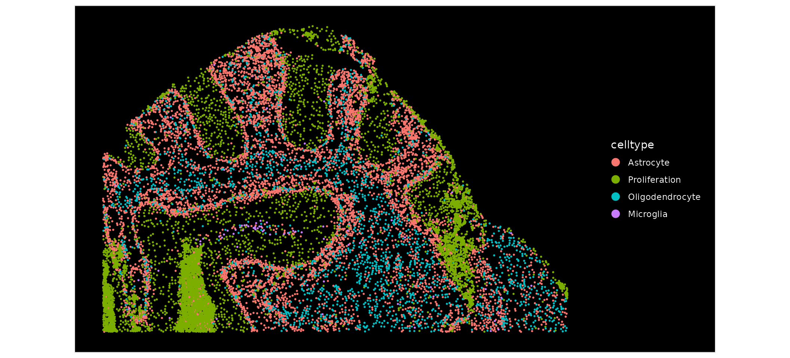
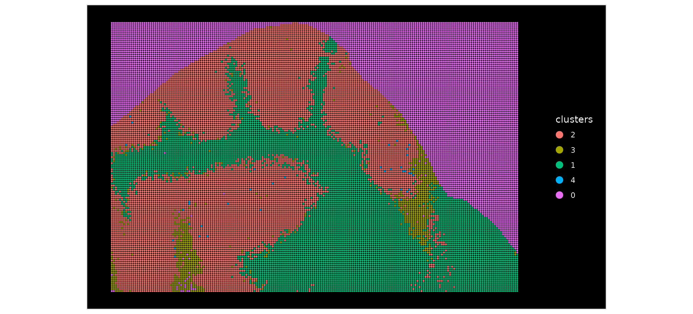
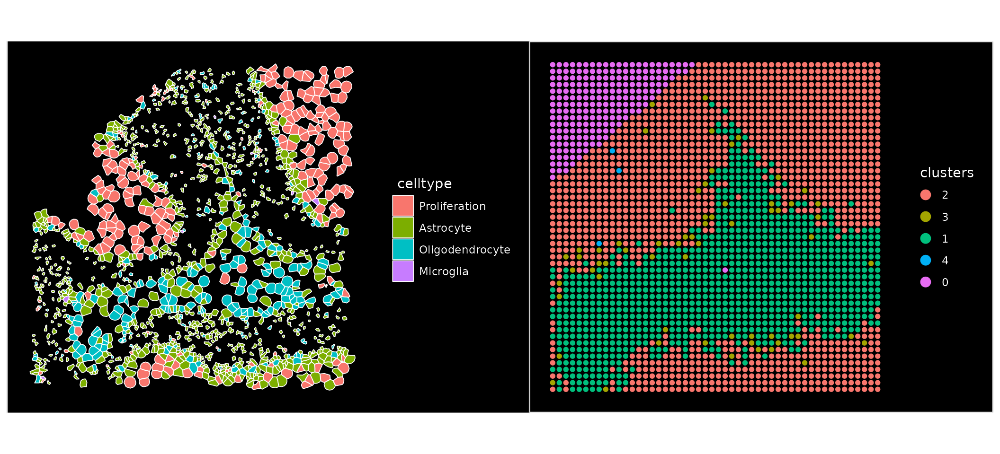
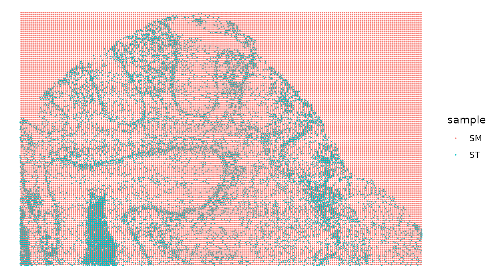
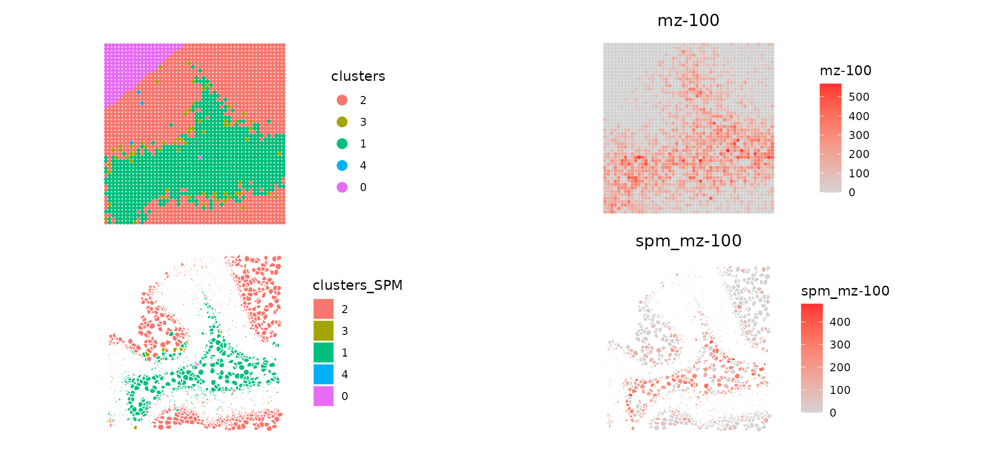
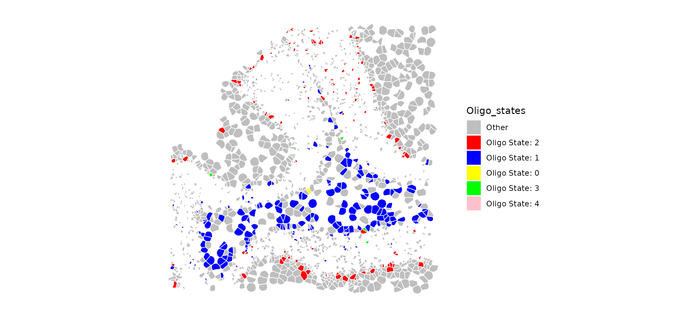
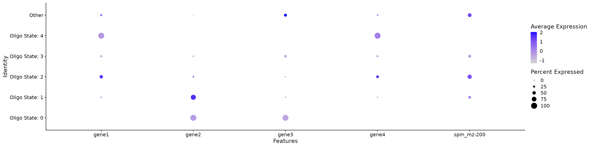
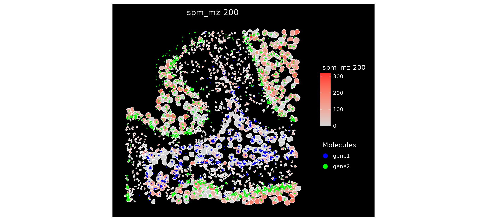

# SpaMTP: Simulated Single Cell Multi-Omics Analysis

This vignette will use
[***SpaMTP***](https://github.com/GenomicsMachineLearning/SpaMTP) to
integrate single cell resolution spatial transcriptomics data with
spatial metabolic data. This vignette will use simulated Xenium (ST) and
simulated MALDI-TOF (SM) data.

Author: Andrew Causer

``` r

## Install SpaMTP if not previously installed
if (!require("SpaMTP"))
    devtools::install_github("GenomicsMachineLearning/SpaMTP")

#General Libraries
library(SpaMTP)
library(Cardinal)
library(Seurat)
library(dplyr)
library(ggplot2)
```

##### Load Processed Data

Here, we will be using the simulated data which has synthetic clustering
and cell type names. The gene and metabolite names are also arbitrary,
this data is only used to highlight ***SpaMTP’s*** functionally with
single cell spatial datasets.

``` r

xenium_file <- resolve_spamtp_vignette_file(
  article = "Single_Cell_MultiOmics",
  filename = "Sim_Xenium.RDS",
  url = "https://zenodo.org/api/records/17247007/files/Sim_Xenium.RDS/content",
  expected_md5 = "28b74f9a959365352c8e8475846f66a3"
)
maldi_file <- resolve_spamtp_vignette_file(
  article = "Single_Cell_MultiOmics",
  filename = "Sim_MALDI.RDS",
  url = "https://zenodo.org/api/records/17247007/files/Sim_MALDI.RDS/content",
  expected_md5 = "bb5a9d6b2d819ebcce4b06c0f07cacbb"
)

xenium <- readRDS(xenium_file)
MALDI <- readRDS(maldi_file)

# These Zenodo objects were serialized with SeuratObject 5.0.1/5.0.2.
# Updating both objects adds slots introduced by newer FOV schemas before any
# spatial boundary is modified by Crop().
xenium <- suppressWarnings(
  suppressMessages(SeuratObject::UpdateSeuratObject(xenium))
)
MALDI <- suppressWarnings(
  suppressMessages(SeuratObject::UpdateSeuratObject(MALDI))
)
```

## Visualising Simulated Datasets

We can visualise the simulated datasets and observe the difference in
resolution between our single cell ST and lower resolution SM data.

First, lets look at our Xenium data:

``` r

ImageDimPlot(xenium, group.by = "celltype", size = 1)
```



Now, lets look at our MALDI data:

``` r

ImageDimPlot(MALDI, group.by = "clusters", size = 1)
```



Based on these plots, we can see that our Xenium data is at a much
higher resolution, compared to the MALDI data. We can zoom in and see
this in more detail:

*Setting Futures for FOV Creation*

``` r

# Futures may be required to use Seurat's `Crop()` function

library(future)
#> 
#> Attaching package: 'future'
#> The following objects are masked from 'package:Cardinal':
#> 
#>     reset, run
workers <- max(1L, min(4L, future::availableCores()))
future_strategy <- if (future::supportsMulticore()) "multicore" else "multisession"
plan(future_strategy, workers = workers)

# Permit large spatial objects without over-provisioning GitHub-hosted runners.
options(future.globals.maxSize = 16000 * 1024^2) # 16 GB serialization limit
```

``` r

# Generate a smaller FOV to look at a zoomed in region of the ST data
cropped.coords.xenium <- Crop(xenium[["segmentations"]], y = c(2000, 3000), x = c(8500, 9500), coords = "tissue")
xenium[["zoom"]] <- cropped.coords.xenium

# Generate a smaller FOV to look at a zoomed in region of the SM data
cropped.coords.MALDI <- Crop(MALDI[["fov"]], y = c(2000, 3000), x = c(8500, 9500), coords = "tissue")
MALDI[["zoom"]] <- cropped.coords.MALDI
```

Lets visualise this zoomed area now:

``` r

# Set the boundary as segmentation for our Xenium data
DefaultBoundary(xenium[["zoom"]]) <- "segmentation"

ImageDimPlot(xenium, group.by = "celltype", fov = "zoom", size = 1)| ImageDimPlot(MALDI, group.by = "clusters", fov = "zoom", size = 2)
```


Looking at our zoomed in FOV the single cell resolution ST provides much
higher levels of detail compared to the SM data.

## Mapping Single Cell Resolution ST and SM

We want to eventually map our SM data to our single cell resolution ST
data, meaning that for each single cell we will have both transcriptomic
and metabolic information. First, we can check the alignment of our
datasets.

``` r

# Set the boundary as segmentation for our Xenium data
CheckAlignment(ST.data = xenium, SM.data = MALDI, image.slice = "fov",size = 0.05) & coord_flip()
```



Based on this, we can see our datasets are aligned correctly. Next, we
will map our SM and Xenium ST data to generate a *SpaMTP* *Seurat*
object containing metabolite and transcriptomic information per
individual cell.

``` r

# Set the boundary as segmentation for our Xenium data
MO_data <- MapSpatialOmics(SM.data = MALDI, ST.data = xenium, ST.hires = TRUE, SM.assay = "Spatial",ST.assay = "Xenium", SM.fov = "fov", ST.image = "centroids")
```

Our two datasets have been aligned to each individual cell. Lets
visualise the results:

``` r

MO_data
#> An object of class Seurat 
#> 8 features across 15448 samples within 2 assays 
#> Active assay: SPT (4 features, 0 variable features)
#>  1 layer present: counts
#>  1 other assay present: SPM
#>  3 spatial fields of view present: centroids segmentations zoom
```

The multi-omic *SpaMTP* *Seurat* object now contains two assays, ‘SPT’
and ‘SPM’ which stores the transcriptomic and metabolomic data
respectively.

``` r

head(MO_data, n = 3)
```

This object also has the combined metadata from both original objects.
The metadata associated with our original SM object is marked by
“\_SPM”.

|  | orig.ident | nCount_Xenium | nFeature_Xenium | celltype | SPM_pixels | nCount_SPM | nFeature_SPM | orig.ident_SPM | nCount_Spatial_SPM | nFeature_Spatial_SPM | clusters_SPM | nCount_SPT | nFeature_SPT |
|:---|:--:|:--:|:--:|:--:|:--:|:--:|:--:|:--:|:--:|:--:|:--:|:--:|:--:|
| acficmpm-1 | SeuratProject | 0 | 0 | Astrocyte | 9850_3370 | 80 | 1 | SeuratProject | 80 | 1 | 2 | 0 | 0 |
| acfiiaog-1 | SeuratProject | 0 | 0 | Astrocyte | 9870_3390 | 0 | 0 | SeuratProject | 0 | 0 | 2 | 0 | 0 |
| acfimhih-1 | SeuratProject | 0 | 0 | Astrocyte | 9870_3370 | 58 | 1 | SeuratProject | 58 | 1 | 2 | 0 | 0 |

Next, we can compare the data spatially:

``` r

# Set the boundary as segmentation for our Xenium data
DefaultBoundary(MO_data[["zoom"]]) <- "segmentation"

p1 <- ImageDimPlot(MALDI, group.by = "clusters", fov = "zoom", size = 1.5, dark.background = F)/ ImageDimPlot(MO_data, group.by = "clusters_SPM", fov = "zoom", dark.background = F)
p2 <- ImageFeaturePlot(MALDI, features = "mz-100", fov = "zoom", size = 1.5, dark.background = F)/ ImageFeaturePlot(MO_data, features = "mz-100", fov = "zoom", dark.background = F)

p1|p2
```



Comparing the mapped data to the original SM data we can see that the
spatial pattern of both clusters and metabolite (‘mz-100’) match. Now
that our data is mapped to single cell resolution we have a much more
detailed visualisation of SM based clustering across our simulated
tissue sample.

SM data indicates the metabolic functioning of a cell, and based on this
we can identify cell types with different metabolic states:

``` r

table(MO_data$clusters_SPM, MO_data$celltype)
#>    
#>     Astrocyte Microglia Oligodendrocyte Proliferation
#>   2      3551        63             596          3472
#>   3       232         2              26          2329
#>   1      2743        34            1677           560
#>   4         8         0               1            14
#>   0         2         0               1           137
```

Looking at Oligodendrocytes for example, we can identify different
subtypes based on their metabolic activity.

``` r

MO_data$Oligo_states <- ifelse(MO_data$celltype == "Oligodendrocyte", paste0("Oligo State: ", MO_data$clusters_SPM),  "Other")

ImageDimPlot(MO_data, group.by = "Oligo_states", fov = "zoom", dark.background = F, cols = c("grey", "red", "blue", "yellow", "green", "pink"))
```



``` r

DotPlot(MO_data, group.by = "Oligo_states", features = c(rownames(MO_data[["SPT"]]), "spm_mz-200"))
```


This dotplot may suggest that Oligo State 1 and 2 are different cell
subtypes based on their differential expression of gene1/gene2 and
mz-200 (Note: this is synthetic data and has no biological context -
results only used as example).

An additional features of having multi-omic data mapped to the same
coordinates is that we can visualise the expression of both metabolites
and gene expression on a single plot.

``` r

ImageFeaturePlot(MO_data, features = "mz-200", molecules = c("gene1", "gene2"), fov = "zoom", mols.cols = c("blue", "green"))
```


Analysing this spatial plot, there is a clear correlation between
‘mz-100’ and ‘gene1’ suggesting there interaction or similar
functionality.

## Session Info

``` r

sessionInfo()
#> R version 4.6.1 (2026-06-24)
#> Platform: x86_64-pc-linux-gnu
#> Running under: Ubuntu 24.04.4 LTS
#> 
#> Matrix products: default
#> BLAS:   /usr/lib/x86_64-linux-gnu/openblas-pthread/libblas.so.3 
#> LAPACK: /usr/lib/x86_64-linux-gnu/openblas-pthread/libopenblasp-r0.3.26.so;  LAPACK version 3.12.0
#> 
#> locale:
#>  [1] LC_CTYPE=C.UTF-8       LC_NUMERIC=C           LC_TIME=C.UTF-8       
#>  [4] LC_COLLATE=C.UTF-8     LC_MONETARY=C.UTF-8    LC_MESSAGES=C.UTF-8   
#>  [7] LC_PAPER=C.UTF-8       LC_NAME=C              LC_ADDRESS=C          
#> [10] LC_TELEPHONE=C         LC_MEASUREMENT=C.UTF-8 LC_IDENTIFICATION=C   
#> 
#> time zone: UTC
#> tzcode source: system (glibc)
#> 
#> attached base packages:
#> [1] stats4    stats     graphics  grDevices utils     datasets  methods  
#> [8] base     
#> 
#> other attached packages:
#>  [1] future_1.75.0       ggplot2_4.0.3       dplyr_1.2.1        
#>  [4] Seurat_5.5.1        SeuratObject_5.4.0  sp_2.2-3           
#>  [7] Cardinal_3.14.0     S4Vectors_0.50.1    ProtGenerics_1.44.0
#> [10] BiocGenerics_0.58.1 generics_0.1.4      BiocParallel_1.46.0
#> [13] SpaMTP_1.1.0.9000  
#> 
#> loaded via a namespace (and not attached):
#>   [1] RColorBrewer_1.1-3     rstudioapi_0.19.0      jsonlite_2.0.0        
#>   [4] magrittr_2.0.5         spatstat.utils_3.2-4   farver_2.1.2          
#>   [7] rmarkdown_2.31         fs_2.1.0               ragg_1.5.2            
#>  [10] vctrs_0.7.3            ROCR_1.0-12            memoise_2.0.1         
#>  [13] spatstat.explore_3.8-2 htmltools_0.5.9        sass_0.4.10           
#>  [16] sctransform_0.4.3      parallelly_1.48.0      KernSmooth_2.23-26    
#>  [19] bslib_0.12.0           htmlwidgets_1.6.4      desc_1.4.3            
#>  [22] ica_1.0-3              plyr_1.8.9             plotly_4.12.1         
#>  [25] zoo_1.9-0              cachem_1.1.0           whisker_0.4.1         
#>  [28] igraph_2.3.3           mime_0.13              lifecycle_1.0.5       
#>  [31] pkgconfig_2.0.3        Matrix_1.7-5           R6_2.6.1              
#>  [34] fastmap_1.2.0          fitdistrplus_1.2-6     shiny_1.14.0          
#>  [37] digest_0.6.39          patchwork_1.3.2        tensor_1.5.1          
#>  [40] RSpectra_0.16-2        irlba_2.3.7            textshaping_1.0.5     
#>  [43] labeling_0.4.3         progressr_1.0.0        spatstat.sparse_3.2-0 
#>  [46] httr_1.4.8             polyclip_1.10-7        abind_1.4-8           
#>  [49] compiler_4.6.1         proxy_0.4-29           withr_3.0.3           
#>  [52] S7_0.2.2               DBI_1.3.0              fastDummies_1.7.6     
#>  [55] MASS_7.3-65            classInt_0.4-11        units_1.0-1           
#>  [58] tools_4.6.1            lmtest_0.9-40          otel_0.2.0            
#>  [61] httpuv_1.6.17          future.apply_1.20.2    goftest_1.2-3         
#>  [64] glue_1.8.1             nlme_3.1-169           promises_1.5.0        
#>  [67] sf_1.1-2               grid_4.6.1             Rtsne_0.17            
#>  [70] cluster_2.1.8.2        reshape2_1.4.5         gtable_0.3.6          
#>  [73] spatstat.data_3.1-9    class_7.3-23           tidyr_1.3.2           
#>  [76] data.table_1.18.4      xml2_1.6.0             spatstat.geom_3.8-2   
#>  [79] RcppAnnoy_0.0.23       ggrepel_0.9.8          RANN_2.6.2            
#>  [82] pillar_1.11.1          stringr_1.6.0          spam_2.11-4           
#>  [85] RcppHNSW_0.7.0         limma_3.68.5           later_1.4.8           
#>  [88] splines_4.6.1          lattice_0.22-9         survival_3.8-6        
#>  [91] deldir_2.0-4           tidyselect_1.2.1       CardinalIO_1.10.0     
#>  [94] miniUI_0.1.2           pbapply_1.7-4          downlit_0.4.5         
#>  [97] knitr_1.51             gridExtra_2.3.1        matter_2.14.0         
#> [100] svglite_2.2.2          scattermore_1.2        xfun_0.60             
#> [103] Biobase_2.72.0         statmod_1.5.2          matrixStats_1.5.0     
#> [106] stringi_1.8.9          yaml_2.3.12            kableExtra_1.4.1      
#> [109] evaluate_1.0.5         codetools_0.2-20       tibble_3.3.1          
#> [112] cli_3.6.6              ontologyIndex_2.12     uwot_0.2.4            
#> [115] xtable_1.8-8           reticulate_1.46.0      systemfonts_1.3.2     
#> [118] jquerylib_0.1.4        Rcpp_1.1.2             globals_0.19.1        
#> [121] spatstat.random_3.5-1  zeallot_0.2.0          png_0.1-9             
#> [124] spatstat.univar_3.2-0  parallel_4.6.1         pkgdown_2.2.1         
#> [127] dotCall64_1.2          listenv_1.0.0          viridisLite_0.4.3     
#> [130] e1071_1.7-17           scales_1.4.0           ggridges_0.5.7        
#> [133] purrr_1.2.2            rlang_1.3.0            cowplot_1.2.0         
#> [136] shinyjs_2.1.1
```
