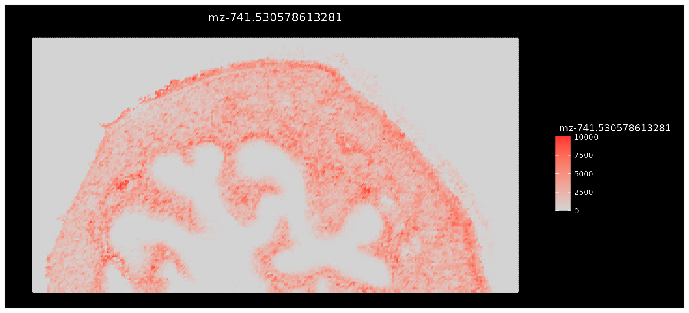
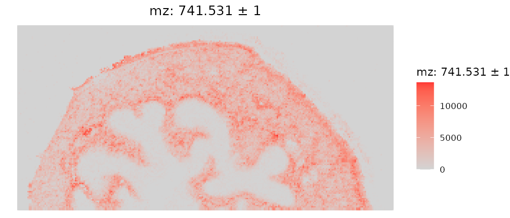
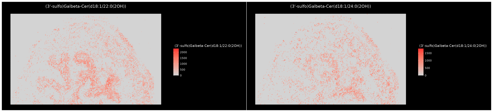
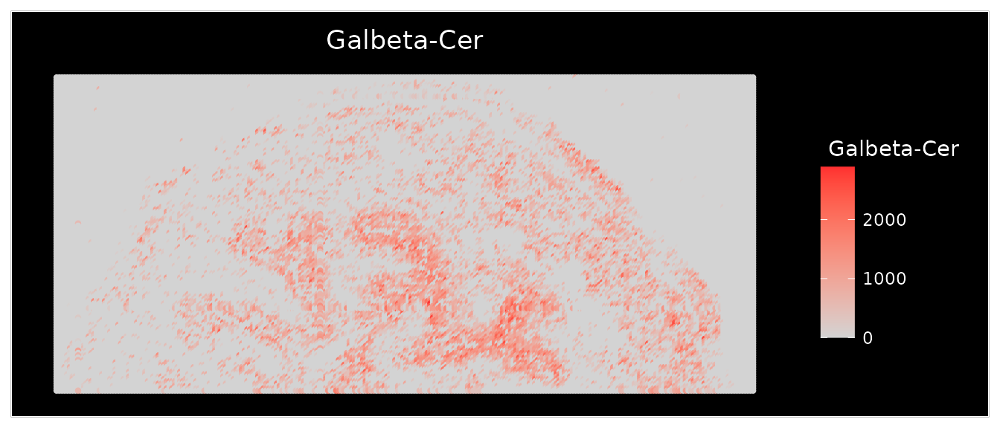
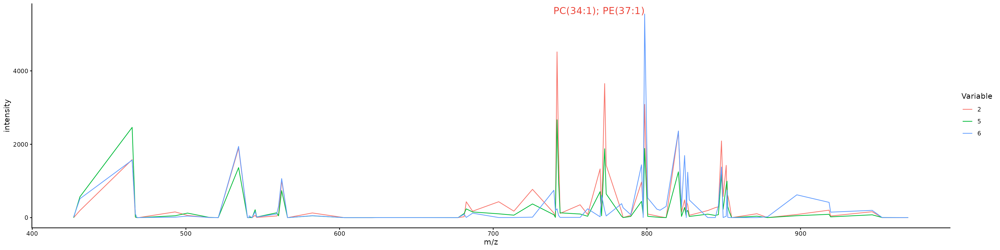
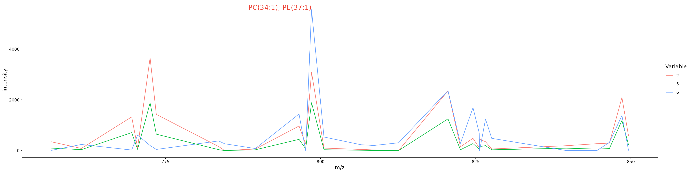
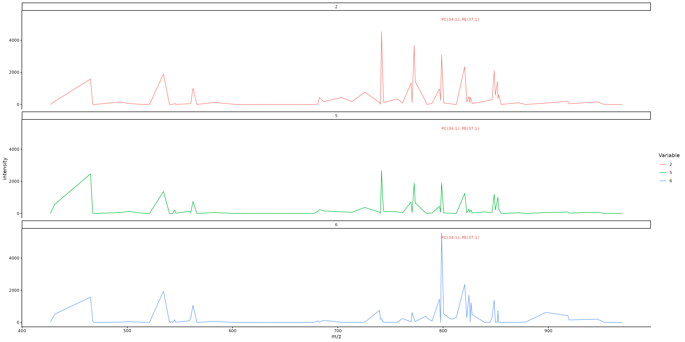
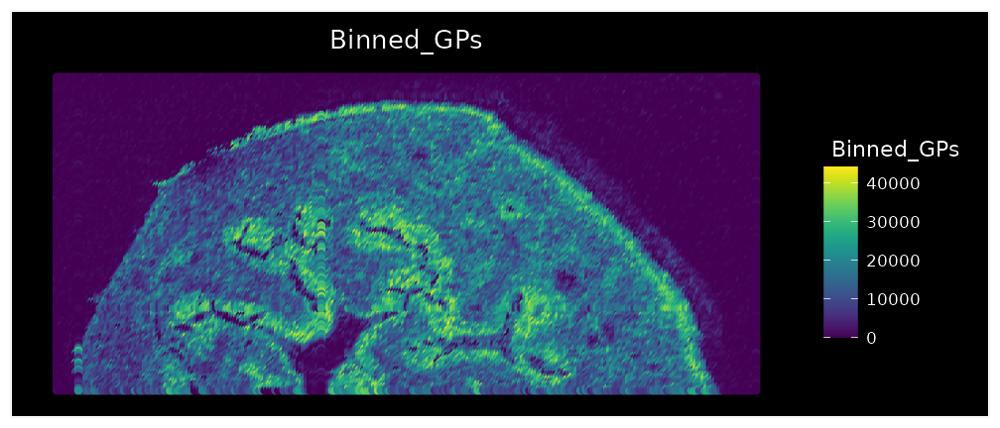
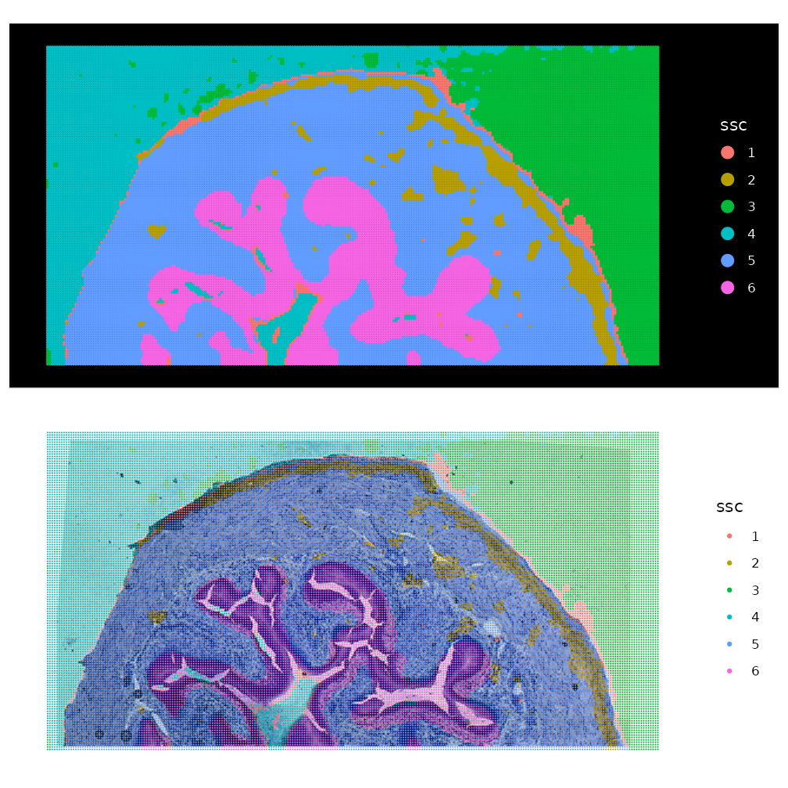
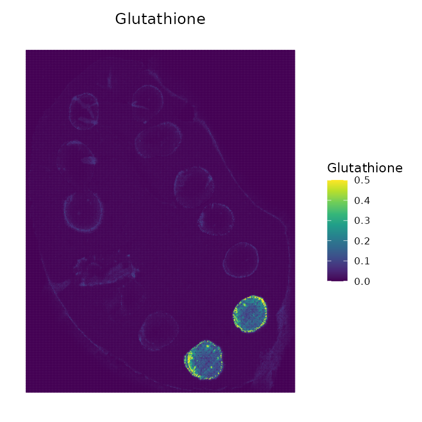

# SpaMTP: Additional Analysis Features

  

This vignette will highlights some additional features of
[***SpaMTP***](https://github.com/GenomicsMachineLearning/SpaMTP) that
can be useful for analysing and visualising your SM data. This vignette
will again use the public mouse urinary bladder dataset analysed
extensively
[here](https://genomicsmachinelearning.github.io/SpaMTP/articles/Mouse_Urinary_Bladder.html).

*Author: Andrew Causer*

``` r

## Install SpaMTP if not previously installed
if (!require("SpaMTP"))
    devtools::install_github("GenomicsMachineLearning/SpaMTP")

#General Libraries
library(SpaMTP)
library(Cardinal)
library(Seurat)
library(dplyr)

#For plotting + DE plots
library(ggplot2)
library(EnhancedVolcano)
library(viridis)
```

##### Load Processed Data

Here, we will be using already processed, clustered (via spatially-aware
Shrunken Centroid) and annotated data. For more information about how
the data was processed, please visit
[here](https://genomicsmachinelearning.github.io/SpaMTP/articles/Mouse_Urinary_Bladder.html).

``` r

bladder_annotated_file <- resolve_spamtp_vignette_file(
  article = "SpaMTP_Additional_Features",
  filename = "bladder_annotated.RDS",
  url = "https://zenodo.org/api/records/17246684/files/bladder_annotated.RDS/content",
  expected_md5 = "68b4a4fb4fb0aaa81fa138410d14ef0f"
)
bladder_annotated <- readRDS(bladder_annotated_file)

bladder_annotated <- UpdateSeuratObject(bladder_annotated) # Only Required if SeuratObjects => 5.0.2
```

## Querying an ***SpaMTP*** Dataset

***SpaMTP*** stores the relative m/z value annotations in the objects
feature metadata slot. We can see this below:

``` r

head(bladder_annotated@assays$Spatial@meta.data) 
```

|  | raw_mz | mz_names | observed_mz | all_IsomerNames | all_Isomers | all_Adducts | all_Formulas | all_Errors | Lipid.Maps.Category | Lipid.Maps.Main.Class | Species.Name | Species.Name.Simple |
|:---|:--:|:--:|:--:|:--:|:--:|:--:|:--:|:--:|:--:|:--:|:--:|:--:|
| 16 | 426.9289 | mz-426.928863525391 | 426.928863525391 | Laurenenyne A; Laurenenyne B; Katsuurenyne A | LMPK02000053; LMPK02000054; LMPK02000055 | M+K | C15H18O2Br2 | 3.8565 | NA | NA | NA | NA |
| 17 | 431.0381 | mz-431.038116455078 | 431.038116455078 | 5,7,3’,4’,5’-Pentahydroxy-3,6,8-trimethoxyflavone | LMPK12113357 | M+K | C18H16O10 | 1.4116 | NA | NA | NA | NA |
| 37 | 465.0228 | mz-465.022796630859 | 465.022796630859 | Aspergillusether D | LMPK13090053 | M+K | C20H20O6Cl2 | 8.725 | NA | NA | NA | NA |
| 39 | 467.1028 | mz-467.102752685547 | 467.102752685547 | Emeguisin B | LMPK13080006 | M+K | C24H25O5Cl | 1.1597 | NA | NA | NA | NA |
| 40 | 468.1027 | mz-468.102722167969 | 468.102722167969 | 14-carboxy-15,16,17,18,19,20-hexanor-N-acetyl-leukotriene E3 | LMFA03020084 | M+K | C19H27NO8S | 13.1953 | NA | NA | NA | NA |
| 41 | 469.1054 | mz-469.105377197266 | 469.105377197266 | 6-iodo-5-hydroxy-eicosa-8Z,11Z,14Z-trienoic acid gamma lactone | LMFA03000015 | M+K | C20H31O2I | 11.3775 | NA | NA | NA | NA |

However, there is are some useful functions that lets the user search
through their **SpaMTP** dataset to find either exact m/z values or
metabolite names that they are interested in. Lets see how each works:

The first is *FindNearestMZ()*, this function lets users find the m/z
value in their dataset that is closest to the value being queried.

``` r

FindNearestMZ(bladder_annotated, 741.5)
```

    ## [1] "mz-741.530578613281"

This is useful if the metabolite of interest has a known m/z mass, or if
the user wants to use *Seurat’s* feature plotting functions.

  

The second is *SearchAnnotations()*, this function lets users query a
metabolite to find if it is present within their dataset.

``` r

SearchAnnotations(bladder_annotated, metabolite = "Isorhamnetin 3-(6''-malonylglucoside)", search.exact = TRUE)
```

|  | raw_mz | mz_names | observed_mz | all_IsomerNames | all_Isomers | all_Adducts | all_Formulas | all_Errors | Lipid.Maps.Category | Lipid.Maps.Main.Class | Species.Name | Species.Name.Simple |
|:---|:--:|:--:|:--:|:--:|:--:|:--:|:--:|:--:|:--:|:--:|:--:|:--:|
| 130 | 603.0773 | mz-603.077331542969 | 603.077331542969 | Isorhamnetin 3-(6’‘-malonylglucoside); Larycitrin 3-(4’’-malonylrhamnoside) | LMPK12110589; LMPK12112481 | M+K | C25H24O15 | 4.3917 | NA | NA | NA | NA |

The `search.exact` parameter specifies whether there needs to be an
exact match to the metabolite name. If set to `FALSE`, users can find
all metabolites with similar names. For example, we want to see all the
different types of `(3'-sulfo)Galbeta-Cer` lipids in our dataset.

``` r

SearchAnnotations(bladder_annotated, metabolite = "(3'-sulfo)Galbeta-Cer", search.exact = FALSE)
```

|  | raw_mz | mz_names | observed_mz | all_IsomerNames | all_Isomers | all_Adducts | all_Formulas | all_Errors | Lipid.Maps.Category | Lipid.Maps.Main.Class | Species.Name | Species.Name.Simple |
|:---|:--:|:--:|:--:|:--:|:--:|:--:|:--:|:--:|:--:|:--:|:--:|:--:|
| 287 | 918.5832 | mz-918.583190917969 | 918.583190917969 | (3’-sulfo)Galbeta-Cer(d18:1/22:0(2OH)) | LMSP06020011 | M+K | C46H89NO12S | 10.3224 | NA | NA | NA | NA |
| 295 | 946.6147 | mz-946.61474609375 | 946.61474609375 | (3’-sulfo)Galbeta-Cer(d18:1/24:0(2OH)) | LMSP06020014 | M+K | C48H93NO12S | 10.2863 | NA | NA | NA | NA |

This function also lets users select the feature metadata column they
want to query. For example, if *RefineLipis()* has been run, users can
search for all lipids of the Class “GlcCer”.

``` r

SearchAnnotations(bladder_annotated, metabolite = "GlcCer", search.exact = FALSE, column.name = "Lipid.Maps.Main.Class")
```

|  | raw_mz | mz_names | observed_mz | all_IsomerNames | all_Isomers | all_Adducts | all_Formulas | all_Errors | Lipid.Maps.Category | Lipid.Maps.Main.Class | Species.Name | Species.Name.Simple |
|:---|:--:|:--:|:--:|:--:|:--:|:--:|:--:|:--:|:--:|:--:|:--:|:--:|
| 168 | 682.4571 | mz-682.457092285156 | 682.457092285156 | GlcCer(d18:1/12:0); GlcCer(d14:1/16:0) | LMSP0501AA01; LMSP0501AA39 | M+K | C36H69NO8 | 12.2859 | SP | GlcCer | GlcCer 30:1;O2 | GlcCer(30:1) |
| 236 | 808.5806 | mz-808.580627441406 | 808.580627441406 | GlcCer(d18:2(4E,8Z)/20:0(2OH\[R\])); GlcCer(d18:2(4E,8E)/20:0(2OH\[R\])); GlcCer(d14:1(4E)/24:1(15Z)(2OH)); GlcCer(d14:2(4E,6E)/24:0(2OH)); GlcCer(d16:2(4E,6E)/22:0(2OH)) | LMSP05010052; LMSP05010065; LMSP0501AA69; LMSP0501AA73; LMSP0501AA80 | M+K | C44H83NO9 | 13.2152 | SP | GlcCer | GlcCer 38:2;O3 | GlcCer(38:2) |

## Subsetting a ***SpaMTP*** Dataset by Metabolites

In some cases, we may want to reduce the number of features present in
our dataset. Often there are thousands or millions of metabolites in one
dataset, removing unwanted metabolites can often reduce the
computational load. Below, we demonstrate how to subset our bladder
dataset to only include Glycerophospholipids.

``` r

GPs <- SearchAnnotations(bladder_annotated, metabolite = "GP", search.exact = FALSE, column.name = "Lipid.Maps.Category")

bladder_GPs <- SubsetMZFeatures(bladder_annotated, features = GPs$mz_names)
```

``` r

bladder_annotated
```

    ## An object of class Seurat 
    ## 79 features across 34840 samples within 1 assay 
    ## Active assay: Spatial (79 features, 0 variable features)
    ##  1 layer present: counts
    ##  1 spatial field of view present: fov

``` r

bladder_GPs
```

    ## An object of class Seurat 
    ## 33 features across 34840 samples within 1 assay 
    ## Active assay: Spatial (33 features, 0 variable features)
    ##  1 layer present: counts
    ##  1 spatial field of view present: fov

We now only have 33 features, compared to the 79 in the original
dataset.

## Visualising SM data using ***SpaMTP***

An important part of any analysis pipeline is to generate informative
and clear visualisations of the results. ***SpaMTP*** has a range of
visualisation functions and features, which we will step through below.

### Plotting a m/z Value

Plotting in ***SpaMTP*** builds on *ggplot2* allowing for easy
organisation and plot manipulation. Below, we will plot the expression
of the m/z 741.530578613281 using *Seurat’s* plotting function
*ImageFeaturePlot()*. Below we use ggplot helper functions to orientate
the image correctly.

``` r

ImageFeaturePlot(bladder_annotated, features = "mz-741.530578613281", size = 2) & coord_flip() & scale_x_reverse()
```



Comparatively, the ***SpaMTP*** function *ImageMZPlot()* provides more
SM-based functionality, including:

- Plotting the closest m/z value to the numeric value provided.
- Plotting the combined expression of ± the mz value in ppm
- Plotting the spots as either circles (*ST*) or pixels (*SM*)

``` r

ImageMZPlot(bladder_annotated, mz = 741.53057, plusminus = 1, size = 1, plot.pixel = TRUE) & coord_flip() & scale_x_reverse()
```



### Plotting a Metabolite Name

In addition, ***SpaMTP*** also has the function
*ImageMZAnnotationPlot()*, which allows users to plot the spatial
expression of named metabolites. In addition to the features above, this
function also lets users:

- Plot from a specific column in the feature metadata containing the m/z
  metabolite annotations
- Combine the expression of all metabolites that match the specified
  name (as described above using plot.exact = `FALSE`).

We will use the “Galbeta-Cer” metabolites as an example:

``` r

mb <- (SearchAnnotations(bladder_annotated, metabolite = "Galbeta-Cer", search.exact = FALSE))$all_IsomerNames

mb
```

    ## [1] "(3'-sulfo)Galbeta-Cer(d18:1/22:0(2OH))"
    ## [2] "(3'-sulfo)Galbeta-Cer(d18:1/24:0(2OH))"

Lets plot them individually:

``` r

ImageMZAnnotationPlot(bladder_annotated, metabolites = c("(3'-sulfo)Galbeta-Cer(d18:1/22:0(2OH))", "(3'-sulfo)Galbeta-Cer(d18:1/24:0(2OH))"), slot = "counts", plot.exact = FALSE, size = 1.5) & coord_flip() & scale_x_reverse()
```



Lets plot them combined:

``` r

ImageMZAnnotationPlot(bladder_annotated, metabolites = "Galbeta-Cer", slot = "counts", plot.exact = FALSE, size = 1.5) & coord_flip() & 
  scale_x_reverse()
```



There are equivalent functions for ***SpaMTP*** *Seurat* objects that
contain images these being *SpatialMZPlot()* and
*SpatialMZAnnotationPlot()*. Examples of these are shown below.

### Plotting Mass Intensity Spectra Plots

Often we are interested in different patterns of metabolite expression
between groups such as clusters. Mass intensity plots can be useful at
displaying the overall patters of each tissue region. ***SpaMTP***
provides functionality to generate these plots and also label peaks with
selected metabolites.

``` r

ROI <- subset(bladder_annotated, subset = ssc %in% c("2", "5", "6")) 

MassIntensityPlot(ROI, group.by = "ssc", label.annotations = TRUE, metabolite.labels = c("PC(34:1)"), annotation.column = "Species.Name.Simple",labelAdj = 0,
  labelOffset = 1)
```



Based on this plot, we can see that our metabolite “PC(34:1)” has been
annotated on the plot. The plot looks quite crowded though. We can
either change the mass range to only show the specific region on the
spectrum, or we could generate individual plots for each cluster. We
will show both approaches below:

Change the mass range:

``` r

MassIntensityPlot(ROI, group.by = "ssc", mass.range = c(750, 850), label.annotations = TRUE, metabolite.labels = c("PC(34:1)"), annotation.column = "Species.Name.Simple",labelAdj = 0, labelOffset = 1)
```



Generate individual plots per cluster:

``` r

MassIntensityPlot(ROI, split.by  = "ssc", label.annotations = TRUE, metabolite.labels = c("PC(34:1)"), annotation.column = "Species.Name.Simple",labelAdj = 2, labelOffset = 0,labelCex = 3)
```



Now we can clearly see that this metabolite is highly expressed by
cluster 6!

There are various additional visualisation techniques such as 3D Density
Kernel plotting and various DE and pathway analysis plotting functions.
These can all be seen in either the [SM data
analysis](https://genomicsmachinelearning.github.io/SpaMTP/articles/Mouse_Urinary_Bladder.html)
or [Multi-Omic
data](https://genomicsmachinelearning.github.io/SpaMTP/articles/Multi-Omic_Mouse_Brain.html)
analysis vignettes.

## Binning Metabolites

Expression of specific metabolites on their own can sometime be
difficult to detect, however when combining the expression of similar
metabolites, these patterns can become more observable. ***SpaMTP*** has
the function *BinMetabolites()*, which lets users specify the
metabolites they want to combine the expression of. These values are
then stored in the `@meta.data` slot of the ***SpaMTP*** *Seurat* object
and can be plotted or used for further analysis. Below, we will
demonstrate how to bin the expression of all Glycerophospholipids.

``` r

mzs <- SearchAnnotations(bladder_annotated, metabolite = "GP", search.exact = FALSE, column.name = "Lipid.Maps.Category")$mz_names

bladder_annotated <- BinMetabolites(bladder_annotated, mzs = mzs, assay = "Spatial", slot = "counts", bin_name = "Binned_GPs")

head(bladder_annotated@meta.data)
```

|  | orig.ident | nCount_Spatial | nFeature_Spatial | sample | x_coord | y_coord | ssc | Binned_GPs |
|:---|:--:|:--:|:--:|:--:|:--:|:--:|:--:|:--:|
| 1_1 | SeuratProject | 54142.66 | 32 | mouse-bladder-peaks | 1 | 1 | 4 | 0.0000 |
| 2_1 | SeuratProject | 33354.74 | 12 | mouse-bladder-peaks | 2 | 1 | 4 | 0.0000 |
| 3_1 | SeuratProject | 62429.26 | 59 | mouse-bladder-peaks | 3 | 1 | 4 | 415.6588 |
| 4_1 | SeuratProject | 75365.22 | 89 | mouse-bladder-peaks | 4 | 1 | 4 | 0.0000 |
| 5_1 | SeuratProject | 75335.54 | 80 | mouse-bladder-peaks | 5 | 1 | 4 | 0.0000 |
| 6_1 | SeuratProject | 63557.09 | 61 | mouse-bladder-peaks | 6 | 1 | 4 | 425.8180 |

We can see the expression values have been stored in the `@meta.data`
column “Binnde_GPs”. Now lets plot the results:

``` r

ImageFeaturePlot(bladder_annotated, features = "Binned_GPs", size = 2) & coord_flip() & scale_x_reverse() & scale_fill_gradientn(colors = viridis::viridis(100))
```



We can see that there is high expression of GP’s in the urothelium and
adventitia layers of the bladder. This feature is especially useful to
combine metabolites that are all up expressed in a specific
condition/cluster (following differential expression analysis).

## Adding H&E Image to Spatial Metabolomic Data

One useful feature of ***SpaMPT*** is the ability to add a H&E or tissue
image to the *SpaMTP* object. This can allow the user to visualise key
structural metabolic patterns that match to the tissue morphology.
Below, we will demonstrate how to manually align your image with your SM
dataset.

``` r

bladder_HE <- AddSMImage("./mouse_urinary_bladder_HE.tif", bladder_annotated, msi.pixel.multiplier = 2)
```

This function will activate an interactive window where you can change
the MSI coordinates to align to the image provided. This includes
rotating, adjusting x and y coordinates, flipping around the x or y
axis, and also scaling. The user can also select any column in the
object’s metadata to plot. This can help assist the alignment process,
in particular by using clustering results.

Here is an example of what the alignment GUI looks like, and also the
perimeters we used to align the H&E image:


After clicking the return aligned data button a ***SpaMTP*** *Seurat*
object with the H&E image added to the `@image$slice1` slot will be
returned. Here “fov” is the original SM plotting coordinates and
“slice1” has the adjusted coordinates to match the H&E image.

``` r

bladder_HE@images
```

    ## $fov
    ## Spatial coordinates for 34840 cells
    ## Default segmentation boundary: centroids 
    ## Associated assay: Spatial 
    ## Key: Spatial_ 
    ## 
    ## $slice1
    ## Spatial coordinates for 34840 cells
    ## Default segmentation boundary: centroids 
    ## Associated assay: Spatial 
    ## Key: slice_

Lets now visualise this:

``` r

(ImageDimPlot(bladder_HE, group.by = "ssc", fov = "fov", size = 1) & scale_y_reverse() )/ 
  (SpatialDimPlot(bladder_HE, group.by = "ssc", images = "slice1", pt.size.factor = 3) &theme_void())
```



This also means that we can now visualise our data using the *Plot3D()*
function with a H&E image:

``` r

### Identified the m/z values that are to be plot
mzs <- unlist(lapply(c(798.5411, 741.5306), function(x) FindNearestMZ(data = bladder_annotated, target_mz = x)))
ROI_HE <- subset(bladder_HE, subset = ssc %in% c("2", "5", "6"))
```

``` r

Plot3DFeature(ROI_HE, features = mzs, show.image = "slice1", assays = "Spatial", between.layer.height = 300, names = c("PC(34:1)","SM(34:1)"), plot.height = 400, plot.width = 700, downscale.image = 2)
```

This function is designed for plotting two features simultaneously. If
we only want to visualise one of the features, we can use a work around
to only show a single trace, where trace 1 = feature1, trace 2 =
feature2 and trace 3 = image. Here, we just provide one feature to plot.
To stop this one feature being replicated, we can add an additional line
of code shown below:

``` r

p <- Plot3DFeature(ROI_HE, features = mzs[2], show.image = "slice1", assays = "Spatial", between.layer.height = 300, names = c("SM(34:1)", "SM(34:1)"), plot.height = 400, plot.width = 700, downscale.image = 2)

plotly::style(p, visible = FALSE, traces = 1)
```

## 3D Ploting of features and metadata

Although the Plot3DFeatures function is mainly used for plotting
features from different modalities (i.e. genes and metabolites). It can
also be used to plot metadata with feature or metadata between
modalities. Lets visualise this below:

``` r

# Plot3DFeatures can either take in a colour palette (i.e. "Reds", "Blues", etc.) or a list of RGB values
# In this case we want our feature to be plotted using "Reds" and our clustering results to be coloured in categorical colours 

col.palette <- list(
  "Reds",  # Use built-in Plotly colorscale
  list(     # Define custom colorscale manually
    list(0, "rgb(0,0,255)"),   # Blue at 0
    list(0.5, "rgb(0,255,0)"), # Green at 0.5
    list(1, "rgb(255,0,0)")    # Red at 1
  )
)


Plot3DFeature(ROI_HE, features = c(mzs[2], "ssc"), show.image = "slice1", assays = "Spatial", between.layer.height = 300, names = c("Metabolite", "Clusters"), plot.height = 400, plot.width = 700, downscale.image = 2, col.palette = col.palette)
```

If we want to specify the exact colours for our clusters we can use the
code below to convert colours/hex values to RGB:

``` r

# We will use the same colour palette as used in the "Mouse Urinary Bladder" tutorial
# Make sure that you only include values that are present in your plot
hex_list = list("2" = "#C2B03B",
                   "5" = "#0074B0",  
                   "6" = "#DE4D6C")

# Convert the names to numeric values
values <- as.numeric(names(hex_list))

# Normalize values between 0 and 1
normalized_values <- (values - min(values)) / (max(values) - min(values))

# Convert colors to RGB (supports both hex and named colors)
custom_colorscale <- lapply(seq_along(values), function(i) {
  rgb_values <- col2rgb(hex_list[[as.character(values[i])]])  # Convert to RGB
  list(normalized_values[i], paste0("rgb(", paste(rgb_values, collapse=","), ")"))
})


Plot3DFeature(ROI_HE, features = c(mzs[2], "ssc"), show.image = "slice1", assays = "Spatial", between.layer.height = 300, names = c("Metabolite", "Clusters"), plot.height = 400, plot.width = 700, downscale.image = 2, col.palette = list("Reds", custom_colorscale))
```

## Selecting Data Bin Size

One important element in analysing spatial metabolic data is choosing a
bin size to reduce the dimensionality of the dataset. SpaMTP provides an
interactive plot that lets you change the size of the bin and see which
metabolites are included within that bin for a specific peak, and how
that changes the expression spatially across the tissue. We can observe
this [below](https://agc888.shinyapps.io/InteractiveSpatialPlot/):

``` r

InteractiveSpatialPlot(ROI_HE)
```

### Please Wait


Based on this plot, users can adjust the bin size of their data (by
running `BinSpaMTP`) or can adjust the `plusminus` attribute when using
`ImageMZPlot`.

  

## Data Export

Exporting data can often be difficult when dealing with large datasets
of different data object types such as *R’s Seurat* compared to
*Python’s scanpy*. ***SpaMTP*** can easily export the data object into
matrix.mtx, barcodes.csv and features.csv files, which can be easily
read into all major spatial analysis packages. In addition, cell/pixel
and feature metadata is also exported as .csv files. Below we
demonstrate how to export the files:

``` r

SaveSpaMTPData(bladder_HE, outdir = "../Documents/SpaMTP_Output/", assay = "Spatial", slot = "counts", annotations = TRUE)
```

Lets visualise the output files directory structure:

``` r

fs::dir_tree("../Documents/SpaMTP_Output/")
```

    ## ../Documents/SpaMTP_Output/
    ## 
    ## ├── barcode_metadata.csv
    ## ├── feature_metadata.csv
    ## ├── filtered_feature_bc_matrix
    ## │   ├── barcodes.tsv
    ## │   ├── genes.tsv
    ## │   └── matrix.mtx
    ## └── spatial
    ##     ├── scalefactors_json.json
    ##     ├── tissue_lowres_image.png
    ##     └── tissue_positions_list.csv

This data can therefor be loaded into other applications such as
*AnnData* in python:

``` python
import anndata
import scanpy as sc
import pandas as pd
import numpy as np

adata = sc.read_10x_mtx(path = "../Documents/SpaMTP_Output/")
```

## Loading Directly from METASPACE

SpaMTP has implemented a similar method to the metaspace.py python
package, where users can directly load their chosen METASPACE dataset by
simply providing the dataset id, fdr threshold and annotation database
(the user may also provide their API key to access private datasets).

Below we will demonstrate how to load the public [moues liver with
spotted chemical standards
dataset](https://metaspace2020.org/annotations?db_id=38&ds=2020-12-07_03h16m14s).

``` r

metaspace <- Load_METASPACE(dataset_id = "2020-12-07_03h16m14s", fdr = 0.05, database= c("HMDB", "v4"), relative = TRUE)
```

    Downloading dataset [2020-12-07_03h16m14s] from METASPACE... 
    Downloading 52 ion images (full matrices) …
      |=====================================================================================| 100%
    Gathering metabolite intensity values per pixel ...
    Combining 52 annotations into a feature matrix...
    Conversion complete. Matrix dimensions: 52 rows x 168750 columns
    Generating Seurat Barcode Labels from Pixel Coordinates .... 
    Constructing Seurat Object ....
    Warning: Data is of class matrix. Coercing to dgCMatrix.
    Adding Pixel Metadata ....
    Creating Centroids for Spatial Seurat Object ....

``` r

metaspace
```

    ## An object of class Seurat 
    ## 52 features across 168750 samples within 1 assay 
    ## Active assay: Spatial (52 features, 0 variable features)
    ##  1 layer present: counts
    ##  1 spatial field of view present: fov

``` r

metaspace@assays$Spatial@meta.data %>%
  arrange(desc(msm)) %>%
  slice_head(n = 4)
```

| raw_mz | mz_names | formula | adduct | mz | msm | fdr | rhoSpatial | rhoSpectral | moc | offSample | intensity | moleculeNames |
|---:|:---|:---|:---|---:|---:|---:|---:|---:|---:|:---|---:|:---|
| 155.0615 | mz-155.06147 | C10H8N2 | -H | 155.0615 | 0.9812486 | 0.05 | 0.9840959 | 0.9979303 | 0.9991746 | TRUE | 103223.88 | 3-Indoleacetonitrile |
| 306.0765 | mz-306.07653 | C10H17N3O6S | -H | 306.0765 | 0.9643888 | 0.05 | 0.9773234 | 0.9868961 | 0.9998675 | FALSE | 87420.93 | Glutathione |
| 134.0472 | mz-134.04722 | C5H5N5 | -H | 134.0472 | 0.9561787 | 0.05 | 0.9622022 | 0.9938640 | 0.9998750 | FALSE | 59714.48 | Adenine |
| 145.0619 | mz-145.06187 | C5H10N2O3 | -H | 145.0619 | 0.9528979 | 0.05 | 0.9582900 | 0.9944670 | 0.9999055 | FALSE | 76438.52 | L-Glutamine; Ureidoisobutyric acid; D-Glutamine; Alanylglycine |

Based on the fdr limit of 5% we can import all relevant peaks. Lets
visualise `Glutathione`:

``` r

ImageMZAnnotationPlot(object = metaspace, metabolites = "Glutathione",column.name = "moleculeNames", dark.background = F) + scale_fill_gradientn(colours = viridis(10), limits = c(0,0.5), na.value = viridis(10)[10]) + coord_flip() + scale_x_reverse()
```



We can compare these results to the actual METASPACE page below

## Session Info

``` r

sessionInfo()
```

    ## R version 4.6.1 (2026-06-24)
    ## Platform: x86_64-pc-linux-gnu
    ## Running under: Ubuntu 24.04.4 LTS
    ## 
    ## Matrix products: default
    ## BLAS:   /usr/lib/x86_64-linux-gnu/openblas-pthread/libblas.so.3 
    ## LAPACK: /usr/lib/x86_64-linux-gnu/openblas-pthread/libopenblasp-r0.3.26.so;  LAPACK version 3.12.0
    ## 
    ## locale:
    ##  [1] LC_CTYPE=C.UTF-8       LC_NUMERIC=C           LC_TIME=C.UTF-8       
    ##  [4] LC_COLLATE=C.UTF-8     LC_MONETARY=C.UTF-8    LC_MESSAGES=C.UTF-8   
    ##  [7] LC_PAPER=C.UTF-8       LC_NAME=C              LC_ADDRESS=C          
    ## [10] LC_TELEPHONE=C         LC_MEASUREMENT=C.UTF-8 LC_IDENTIFICATION=C   
    ## 
    ## time zone: UTC
    ## tzcode source: system (glibc)
    ## 
    ## attached base packages:
    ## [1] stats4    stats     graphics  grDevices utils     datasets  methods  
    ## [8] base     
    ## 
    ## other attached packages:
    ##  [1] kableExtra_1.4.1       knitr_1.51             viridis_0.6.5         
    ##  [4] viridisLite_0.4.3      EnhancedVolcano_1.30.0 ggrepel_0.9.8         
    ##  [7] ggplot2_4.0.3          dplyr_1.2.1            Seurat_5.5.1          
    ## [10] SeuratObject_5.4.0     sp_2.2-3               Cardinal_3.14.0       
    ## [13] S4Vectors_0.50.1       ProtGenerics_1.44.0    BiocGenerics_0.58.1   
    ## [16] generics_0.1.4         BiocParallel_1.46.0    SpaMTP_1.1.0.9000     
    ## 
    ## loaded via a namespace (and not attached):
    ##   [1] RColorBrewer_1.1-3     rstudioapi_0.19.0      jsonlite_2.0.0        
    ##   [4] magrittr_2.0.5         spatstat.utils_3.2-4   farver_2.1.2          
    ##   [7] rmarkdown_2.31         fs_2.1.0               ragg_1.5.2            
    ##  [10] vctrs_0.7.3            ROCR_1.0-12            memoise_2.0.1         
    ##  [13] spatstat.explore_3.8-2 htmltools_0.5.9        curl_7.1.0            
    ##  [16] sass_0.4.10            sctransform_0.4.3      parallelly_1.48.0     
    ##  [19] KernSmooth_2.23-26     bslib_0.12.0           htmlwidgets_1.6.4     
    ##  [22] desc_1.4.3             ica_1.0-3              plyr_1.8.9            
    ##  [25] plotly_4.12.1          zoo_1.9-0              cachem_1.1.0          
    ##  [28] whisker_0.4.1          igraph_2.3.3           mime_0.13             
    ##  [31] lifecycle_1.0.5        pkgconfig_2.0.3        Matrix_1.7-5          
    ##  [34] R6_2.6.1               fastmap_1.2.0          fitdistrplus_1.2-6    
    ##  [37] future_1.75.0          shiny_1.14.0           digest_0.6.39         
    ##  [40] patchwork_1.3.2        tensor_1.5.1           RSpectra_0.16-2       
    ##  [43] irlba_2.3.7            textshaping_1.0.5      labeling_0.4.3        
    ##  [46] progressr_1.0.0        spatstat.sparse_3.2-0  httr_1.4.8            
    ##  [49] polyclip_1.10-7        abind_1.4-8            compiler_4.6.1        
    ##  [52] proxy_0.4-29           withr_3.0.3            S7_0.2.2              
    ##  [55] DBI_1.3.0              fastDummies_1.7.6      MASS_7.3-65           
    ##  [58] classInt_0.4-11        units_1.0-1            tools_4.6.1           
    ##  [61] lmtest_0.9-40          otel_0.2.0             httpuv_1.6.17         
    ##  [64] future.apply_1.20.2    goftest_1.2-3          glue_1.8.1            
    ##  [67] nlme_3.1-169           promises_1.5.0         sf_1.1-2              
    ##  [70] grid_4.6.1             Rtsne_0.17             cluster_2.1.8.2       
    ##  [73] reshape2_1.4.5         gtable_0.3.6           spatstat.data_3.1-9   
    ##  [76] class_7.3-23           tidyr_1.3.2            data.table_1.18.4     
    ##  [79] xml2_1.6.0             spatstat.geom_3.8-2    RcppAnnoy_0.0.23      
    ##  [82] RANN_2.6.2             pillar_1.11.1          stringr_1.6.0         
    ##  [85] spam_2.11-4            RcppHNSW_0.7.0         limma_3.68.5          
    ##  [88] later_1.4.8            splines_4.6.1          lattice_0.22-9        
    ##  [91] survival_3.8-6         deldir_2.0-4           tidyselect_1.2.1      
    ##  [94] CardinalIO_1.10.0      miniUI_0.1.2           pbapply_1.7-4         
    ##  [97] downlit_0.4.5          gridExtra_2.3.1        matter_2.14.0         
    ## [100] svglite_2.2.2          scattermore_1.2        xfun_0.60             
    ## [103] Biobase_2.72.0         statmod_1.5.2          matrixStats_1.5.0     
    ## [106] stringi_1.8.9          yaml_2.3.12            evaluate_1.0.5        
    ## [109] codetools_0.2-20       tibble_3.3.1           cli_3.6.6             
    ## [112] ontologyIndex_2.12     uwot_0.2.4             xtable_1.8-8          
    ## [115] reticulate_1.46.0      systemfonts_1.3.2      jquerylib_0.1.4       
    ## [118] Rcpp_1.1.2             globals_0.19.1         spatstat.random_3.5-1 
    ## [121] zeallot_0.2.0          png_0.1-9              spatstat.univar_3.2-0 
    ## [124] parallel_4.6.1         pkgdown_2.2.1          dotCall64_1.2         
    ## [127] listenv_1.0.0          e1071_1.7-17           scales_1.4.0          
    ## [130] ggridges_0.5.7         purrr_1.2.2            rlang_1.3.0           
    ## [133] cowplot_1.2.0          shinyjs_2.1.1
