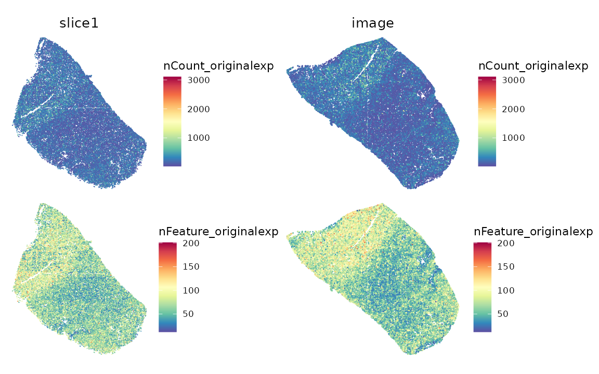
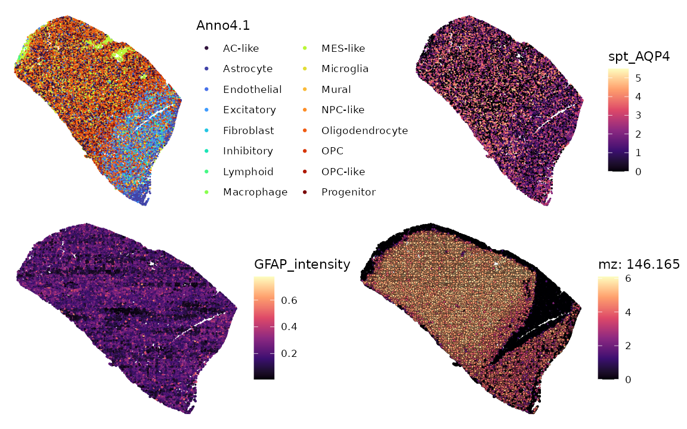
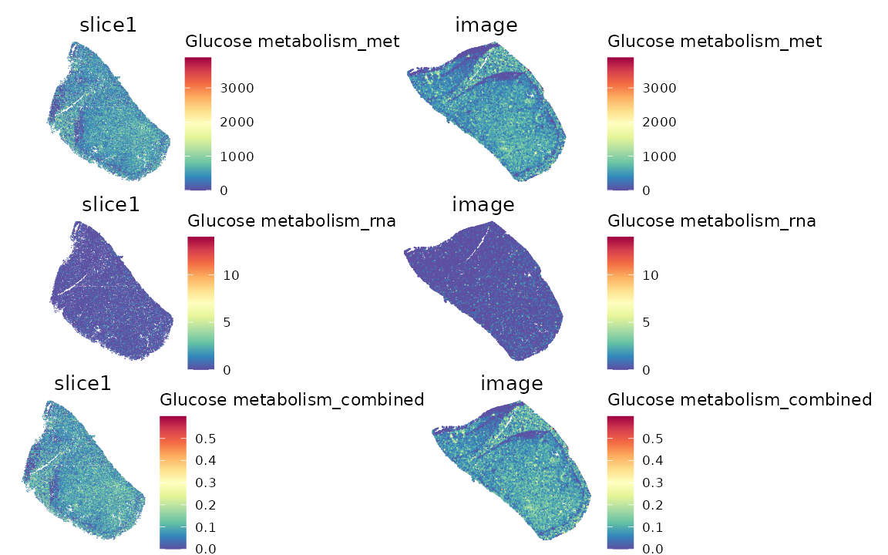
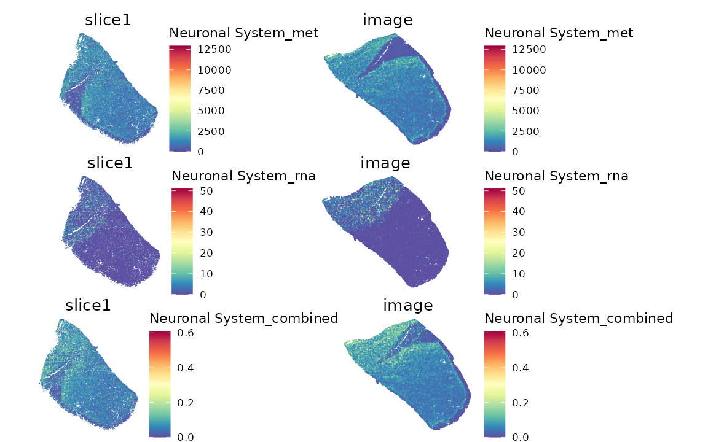
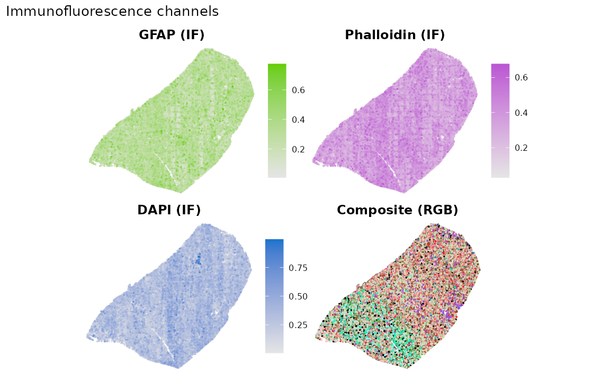

# SpaMTP: Single Cell Multi-Omic Analysis (Metabolomics, Transcriptomics, Proteomics)

## Proteomics + Spatial Metabolomics Integration

This tutorial demonstrates how to explore protein intensities alongside
spatial metabolomics and transcriptomics within a single *SpaMTP*
object. The dataset is derived from a patient with low-grade glioma
(LGG), with tissue curated to retain a clear distinction between the
leading edge and tumour regions. The workflow covers QC maps, metabolite
annotation, multi-panel spatial plots, and pathway scores that combine
metabolite and RNA signals.

### Requirements

You will need a *SpaMTP* object that contains:

- `SPM` assay with m/z features.
- `SPT` assay with gene counts.
- Metadata columns for spatial coordinates (`x_centroid`, `y_centroid`).
- Optional protein intensity columns (e.g., `GFAP_intensity`).

The dataset used in this tutorial consists of aligning SM, ST and SP
data on serial section. This was achieved using the python package
SMINT. The [alignment
script](https://github.com/GenomicsMachineLearning/SpaMTP/blob/main/inst/Publication_Files/Align_SM_ST_Tutorial.ipynb)
and [python-to-SpaMTP
script](https://github.com/GenomicsMachineLearning/SpaMTP/blob/main/inst/Publication_Files/FigS6_script.Rmd)
can be found following the respective links.

### Install and load packages

``` r

library(SpaMTP)
library(Seurat)
library(dplyr)
library(ggplot2)
library(viridis)
library(patchwork)
```

### Load the integrated object

``` r

data <- readRDS(url("https://zenodo.org/records/18282678/files/brain_tumour_integrated.rds?download=1"))
cregpathway <- readRDS(url("https://zenodo.org/records/18282678/files/brain_tumour_combined_pathways.rds?download=1"))
```

Below we can see the structure of our integrated data object

``` r

data
```

    ## An object of class Seurat 
    ## 913 features across 37886 samples within 2 assays 
    ## Active assay: SPM (574 features, 574 variable features)
    ##  3 layers present: counts, data, scale.data
    ##  1 other assay present: SPT
    ##  7 dimensional reductions calculated: PCA, UMAP, spt.pca, spt.umap, spm.pca, spm.umap, wnn.umap
    ##  2 images present: slice1, image

``` r

SpatialFeaturePlot(
  data,
  features = c("nCount_originalexp", "nFeature_originalexp"),
  pt.size.factor = 2
) & theme(legend.position = "right",legend.direction = "vertical")
```



### Annotate m/z features (optional)

We extract m/z values from the `SPM` assay and run a basic annotation
lookup.

``` r

spm <- data[["SPM"]]
mz_vals <- as.numeric(sub("^mz-", "", rownames(spm)))

spm@meta.features$raw_mz <- mz_vals
data[["SPM"]] <- spm

mz_df <- data.frame(
  row_id = seq_along(mz_vals),
  mz = mz_vals
)

annoresult <- SpaMTP:::annotateTable(mz_df, db = rbind(HMDB_db, Chebi_db))
head(annoresult)
```

| ID | Match | observed_mz | Reference_mz | Error | Adduct | Formula | Exactmass | Isomers | InchiKeys | IsomerNames | Isomers_IDs | Ramp_IDs | Score | MassScore | ChemicalScore | ReactiveSiteScore | ReactiveSiteStatus | IsotopeScore | AdductNetworkScore | MALDIMatrix | RuleClass | RuleSource | ReactiveGroup | MinimumReactiveSites |
|:--:|:--:|:--:|:--:|:--:|:--:|:--:|:--:|:--:|:--:|:--:|:--:|:--:|:--:|:--:|:--:|:--:|:--:|:--:|:--:|:--:|:--:|:--:|:--:|:--:|
| 1 | TRUE | 71.07229 | 71.07241 | 1.6596235 | M+H | C4H8N | 70.06513 | CHEBI:36781 | ZVJHJDDKYZXRJI-UHFFFAOYSA-O | 1-pyrrolinium | chebi:36781 | NA | 0.6090938 | 0.6090938 | 1 | 1 | not_required | NA | NA | unspecified | custom_adduct | user-supplied rule | none | 0 |
| 2 | TRUE | 71.98143 | 71.98142 | 0.1836505 | M+3H | C3H3NO4S3 | 212.92242 | HMDB0258602 | KFQOIIOEXZGRKT-UHFFFAOYSA-N | Sulforhodanin | hmdb:HMDB0258602 | NA | 0.6460658 | 0.9939474 | 1 | 1 | not_required | NA | NA | unspecified | custom_adduct | user-supplied rule | none | 0 |
| 2 | TRUE | 71.98143 | 71.98150 | 1.0277878 | M+3Na | C4H3O4S | 146.97685 | CHEBI:38715 | NJRXVEJTAYWCQJ-UHFFFAOYSA-K | thiomalate(3-) | chebi:38715 | NA | 0.3720785 | 0.8268412 | 1 | 1 | not_required | NA | NA | unspecified | custom_adduct | user-supplied rule | none | 0 |
| 2 | TRUE | 71.98143 | 71.98111 | 4.4458139 | M+2Na | CH3FO2S | 97.98378 | HMDB0254520 | KNWQLFOXPQZGPX-UHFFFAOYSA-N | METHANESULFONYL FLUORIDE | hmdb:HMDB0254520 | NA | 0.0185269 | 0.0285030 | 1 | 1 | not_required | NA | NA | unspecified | custom_adduct | user-supplied rule | none | 0 |
| 5 | TRUE | 77.96817 | 77.96827 | 1.3437715 | M+2Na-H | HO2 | 32.99711 | CHEBI:29793 | MYMOFIZGZYHOMD-UHFFFAOYSA-O | hydridodioxygen(1+) | chebi:29793 | NA | 0.4696287 | 0.7225057 | 1 | 1 | not_required | NA | NA | unspecified | custom_adduct | user-supplied rule | none | 0 |
| 6 | TRUE | 78.95509 | 78.95524 | 1.8057466 | M+H+2Na | C2H6Se2 | 189.87999 | CHEBI:176517 | VLXBWPOEOIIREY-UHFFFAOYSA-N | dimethyl diselenide | chebi:176517 | NA | 0.2780159 | 0.5560318 | 1 | 1 | not_required | NA | NA | unspecified | custom_adduct | user-supplied rule | none | 0 |

### Multi-panel spatial maps (cell type, gene, protein, metabolite)

Pick a metabolite m/z, a gene, and a protein feature available in your
object. We will use the protein GFAP as an example. The corresponding
gene and mz values are `AQP4` and `mz-146.1651` respectfully.

``` r

p1 <- SpatialDimPlot(data, group.by = "Anno4.1", images = "image", pt.size.factor = 2.5) +scale_fill_viridis_d(option = "turbo")+guides(fill = guide_legend(ncol = 2))
p2 <- SpatialFeaturePlot(data, features = "AQP4", slot = "data",images = "image",pt.size.factor = 2.5)+ scale_fill_viridis_c(option = "magma", na.value = "lightgrey")
p3 <- SpatialFeaturePlot(data, features = "GFAP_intensity", images = "image",pt.size.factor = 2.5)+ scale_fill_viridis_c(option = "magma")
p4 <- SpatialMZPlot(data, mzs = 146.1651, images = "image",pt.size.factor = 2.5, assay = "SPM", slot = "data")+ scale_fill_viridis_c(option = "magma")

(p1|p2)/(p3|p4) & coord_flip() & scale_y_reverse() & theme(legend.position = "right",legend.direction = "vertical")
```



### Pathway-level metabolite, RNA, and combined scores

We compute pathway scores for selected pathways by binning m/z features
and summing leading-edge genes, then combine the two modalities.

``` r

min_max <- function(x) {
  rng <- range(x, na.rm = TRUE)
  if (is.infinite(rng[1]) || rng[1] == rng[2]) {
    return(rep(0, length(x)))
  }
  (x - rng[1]) / (rng[2] - rng[1])
}

sum_genes <- function(obj, genes) {
  counts <- obj[["SPT"]]@counts
  valid <- intersect(genes, rownames(counts))
  if (length(valid) == 0) {
    warning("No genes found for pathway in SPT counts")
    return(rep(0, ncol(counts)))
  }
  colSums(counts[valid, , drop = FALSE])
}

score_pathway <- function(obj, pathway_df, pathway_name, type = "wiki", weight = 0.6) {
  selected <- pathway_df[
    pathway_df$pathwayName == pathway_name & pathway_df$type == type,
  ]
  stopifnot(nrow(selected) > 0)

  mzs <- as.numeric(strsplit(gsub("\\[.*?\\]", "", selected$adduct_info[1]), ";")[[1]])
  mzs <- unlist(lapply(mzs, function(x) FindNearestMZ(obj, target_mz = x, assay = "SPM")))

  obj <- BinMetabolites(
    obj,
    mzs,
    slot = "counts",
    bin_name = paste0(pathway_name, "_met"),
    assay = "SPM"
  )

  genes <- strsplit(selected$leadingEdge_genes[1], ";")[[1]]
  obj@meta.data[[paste0(pathway_name, "_rna")]] <- sum_genes(obj, genes)

  met_norm <- min_max(obj@meta.data[[paste0(pathway_name, "_met")]])
  rna_norm <- min_max(obj@meta.data[[paste0(pathway_name, "_rna")]])

  obj@meta.data[[paste0(pathway_name, "_combined")]] <-
    weight * met_norm + (1 - weight) * rna_norm

  list(obj = obj, genes = genes)
}
```

``` r

pathway_name <- "Glucose metabolism"
pathway_type <- "wiki"

res <- score_pathway(data, cregpathway, pathway_name, type = pathway_type)
data <- res$obj

p1 <- SpatialFeaturePlot(data, features = paste0(pathway_name, "_met"), pt.size.factor = 2.5)
p2 <- SpatialFeaturePlot(data, features = paste0(pathway_name, "_rna"), pt.size.factor = 2.5)
p3 <- SpatialFeaturePlot(data, features = paste0(pathway_name, "_combined"), pt.size.factor = 2.5)

p1/p2/p3 & theme(legend.position = "right",legend.direction = "vertical")
```



``` r

pathway_name <- "Neuronal System"
pathway_type <- "Reactome"

res <- score_pathway(data, cregpathway, pathway_name, type = pathway_type)
data <- res$obj

p1 <- SpatialFeaturePlot(data, features = paste0(pathway_name, "_met"), pt.size.factor = 2.5)
p2 <- SpatialFeaturePlot(data, features = paste0(pathway_name, "_rna"), pt.size.factor = 2.5)
p3 <- SpatialFeaturePlot(data, features = paste0(pathway_name, "_combined"), pt.size.factor = 2.5)

p1/p2/p3 & theme(legend.position = "right",legend.direction = "vertical")
```



### Optional: plot immunofluorescence channels

If your metadata includes separate intensity channels and an RGB
composite, you can map them as additional spatial panels.

``` r

x_coord <- data@meta.data[["x_centroid"]]
y_coord <- data@meta.data[["y_centroid"]]

required_cols <- c("GFAP_intensity", "Phalloidin_intensity", "DAPI_intensity", "color")
if (all(required_cols %in% colnames(data@meta.data))) {
  parse_rgb <- function(txt) {
    vapply(txt, function(s) {
      if (is.na(s) || s == "") return(NA_character_)
      nums <- as.numeric(strsplit(gsub("[() ]", "", s), ",", fixed = TRUE)[[1]])
      if (length(nums) != 3 || any(is.na(nums))) return(NA_character_)
      rgb(nums[1], nums[2], nums[3])
    }, character(1))
  }

  rgb_hex <- parse_rgb(data@meta.data[["color"]])

  chan_df <- data.frame(
    x = x_coord,
    y = y_coord,
    gfap_if = data@meta.data[["GFAP_intensity"]],
    phall_if = data@meta.data[["Phalloidin_intensity"]],
    dapi_if = data@meta.data[["DAPI_intensity"]],
    rgb_hex = rgb_hex
  )

  chan_panel <- function(var, title, high_col) {
    df_ord <- chan_df[order(chan_df[[var]]), ]
    ggplot(df_ord, aes(x, y, colour = .data[[var]])) +
      geom_point(size = 0.25) +
      coord_equal() +
      scale_colour_gradient(
        low = "grey90",
        high = high_col,
        na.value = "grey90",
        guide = "colourbar"
      ) +
      guides(colour = guide_colourbar(barheight = unit(38, "mm"))) +
      labs(title = title, colour = NULL) +
      theme_void(base_size = 10) +
      theme(plot.title = element_text(hjust = 0.5, face = "bold"))
  }

  p_gfap <- chan_panel("gfap_if", "GFAP (IF)", high_col = "chartreuse3")
  p_phall <- chan_panel("phall_if", "Phalloidin (IF)", high_col = "mediumorchid")
  p_dapi <- chan_panel("dapi_if", "DAPI (IF)", high_col = "dodgerblue3")

  p_rgb <- ggplot(chan_df, aes(x, y, colour = rgb_hex)) +
    geom_point(size = 0.25) +
    coord_equal() +
    scale_colour_identity() +
    labs(title = "Composite (RGB)") +
    theme_void(base_size = 10) +
    theme(plot.title = element_text(hjust = 0.5, face = "bold"))

  (p_gfap | p_phall) / (p_dapi | p_rgb) +
    plot_annotation(title = "Immunofluorescence channels") &
    theme(legend.box = "vertical")
} else {
  warning("Missing IF columns: ", paste(setdiff(required_cols, colnames(data@meta.data)), collapse = ", "))
}
```


