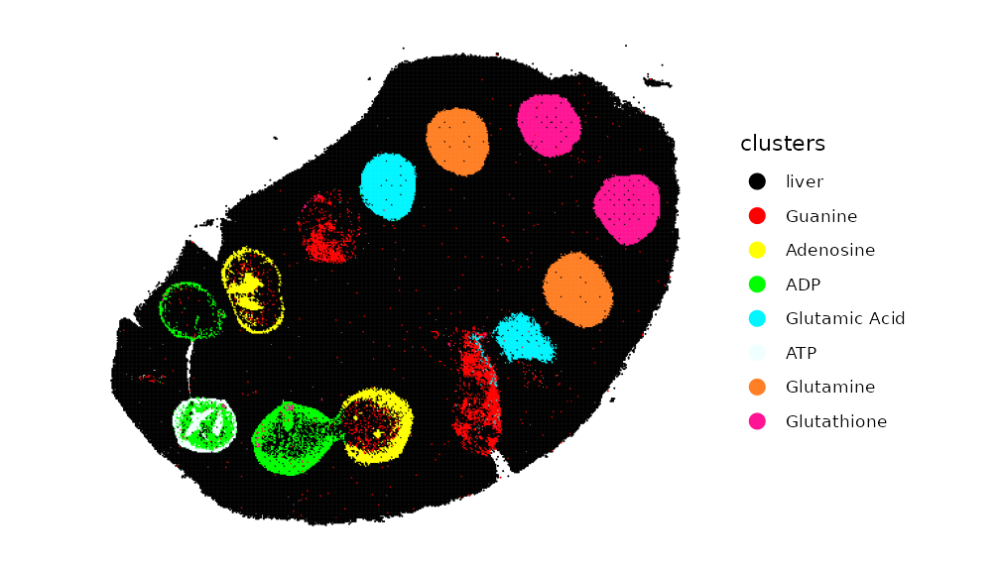
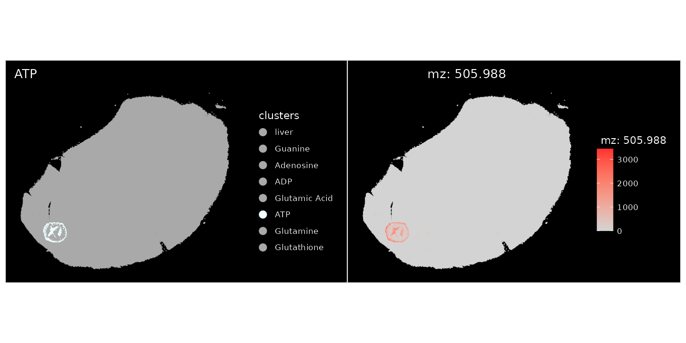
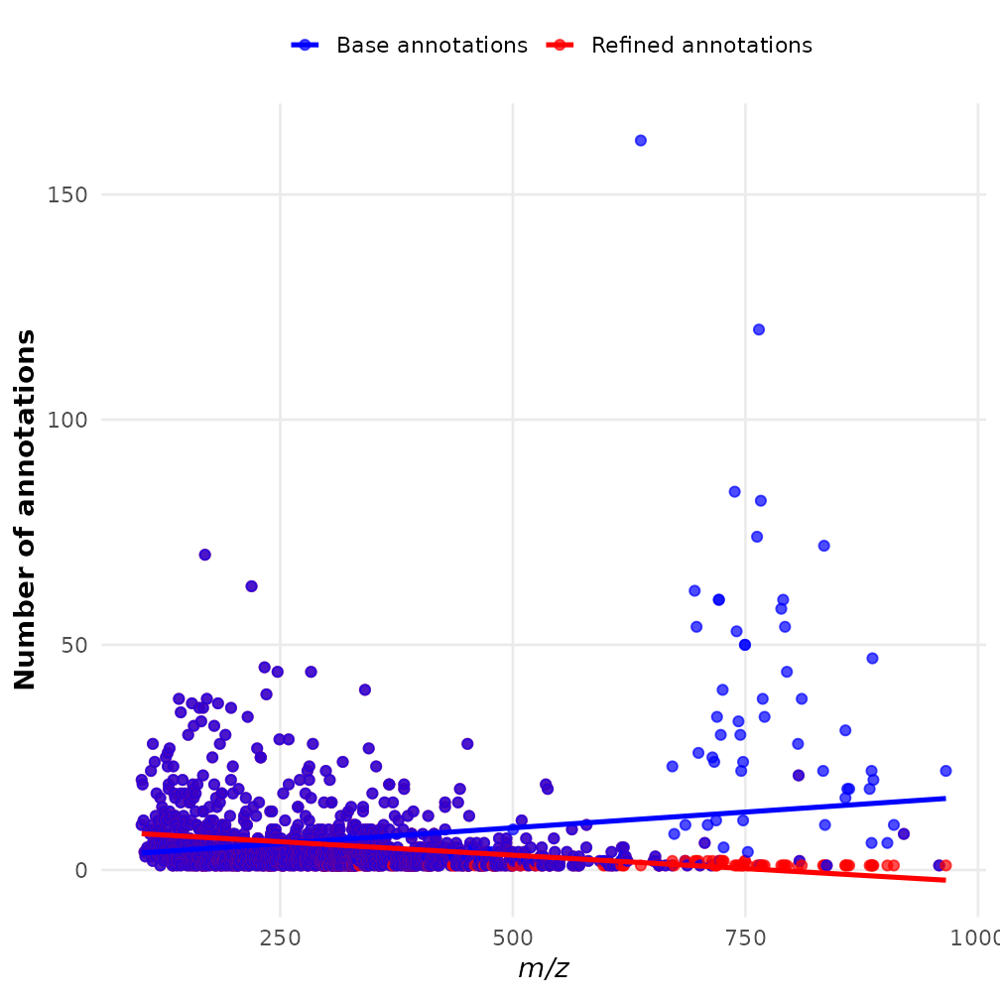

# SpaMTP: Refining Metabolite Annotations

## Refining m/z Metabolite Annotations with SpaMTP

This tutorial highlights how to use *SpaMTP* to refine m/z annotated
with multiple metabolites. *SpaMTP* implements this in 4 different ways,
with these functions:

1.  CalculateAnnotationStatistics
2.  RefineLipids
3.  Pseudo_msms
4.  Compare_msms

We will visit each in detail below.

Author: Andrew Causer

  

### Install and Import *R* Libraries

First we need to import the required libraries for this analysis.

``` r

## Install SpaMTP if not previously installed
if (!require("SpaMTP"))
    devtools::install_github("GenomicsMachineLearning/SpaMTP")

#General Libraries
library(SpaMTP)
library(Cardinal)
library(Seurat)
library(dplyr)
library(tidyr)

#For plotting + DE plots
library(ggplot2)
library(EnhancedVolcano)
library(viridis)
```

### 1) Pathway-Based Refinement: `CalculateAnnotationStatistics`

This function uses correlations in pathway expression (Metabolite only,
Gene only or Multi Omic based pathway information) to refine metabolite
annotation. Specifically, for each annotated metabolite, the expression
profiles for all known pathways associated with this metabolite are
calculated. Based on spatial colocalisation between relative pathways
and the given m/z mass, each metabolite is then ranked based on Pearson
correlation values and the number of significant pathways associated
with that metabolite.

Below we will use a [public mouse liver dataset with spotted chemicals
standards](https://zenodo.org/records/17289187) to demonstrate this:

``` r

spotted_url <- "https://zenodo.org/records/17289187/files/spotted_Annotated_H_Cl_Adducts.RDS?download=1"

spotted <- readRDS(url(spotted_url))
```

``` r

spotted
```

    ## An object of class Seurat 
    ## 1303 features across 109390 samples within 1 assay 
    ## Active assay: Spatial (1303 features, 0 variable features)
    ##  1 layer present: counts
    ##  1 spatial field of view present: fov

Here we have a SpaMTP Seurat object that is already processed, with m/z
annotated. Meaning we have 1303 annotated m/z values. This dataset
includes certain chemical compounds which were ‘spiked-in’ at known
locations. We will plot these below:

``` r

metabolite_colors <- list("ATP" = "azure","ADP" = "green","Adenosine" = "yellow", "Guanine" = "red","Glutamic Acid" = "turquoise1", "Glutamine" = "chocolate1","Glutathione" = "deeppink","liver" = "black")

ImageDimPlot(spotted, group.by = "clusters", cols = metabolite_colors, dark.background = F)
```



The plot highlights the location of each known metabolite. However, due
to the inherent issue of mass spectrometry imaging data one m/z mass may
be associated with multiple possible metabolites. For example *adenosine
triphosphate* or ATP was spiked-in to the second set of wells within the
liver (green). When we look at the annotation of ATP, we can see for
`m/z-505.988470137` there are 4 different annotations, one of which is
ATP.

``` r

SearchAnnotations(spotted, metabolite = "Adenosine triphosphate", search.exact = T)
```

|  | raw_mz | mz_names | observed_mz | all_IsomerNames | all_Isomers | all_Isomers_IDs | all_Adducts | all_Formulas | all_Errors |
|:---|:--:|:--:|:--:|:--:|:--:|:--:|:--:|:--:|:--:|
| 1162 | 505.9885 | mz-505.988470137 | 505.9885 | Adenosine triphosphate; dGTP; 2-hydroxy-dATP; \[\[(2R,5R)-5-(6-Aminopurin-9-yl)-3,4-dihydroxyoxolan-2-yl\]methoxy-hydroxyphosphoryl\] phosphono hydrogen phosphate | HMDB0000538; HMDB0001440; HMDB0059593; HMDB0257997 | hmdb:HMDB0000538; hmdb:HMDB0001440; hmdb:HMDB0059593; hmdb:HMDB0257997 | M-H | C10H16N5O13P3 | 0.0019 |

Plotting this m/z value spatially, it localises completely within the
ATP spiked-in region.

``` r

ImageDimPlot(spotted, group.by = "clusters", cols = setNames(
  ifelse(names(metabolite_colors) == "ATP", "azure", "darkgrey"),names(metabolite_colors)
))+ ggtitle("ATP")| ImageMZPlot(spotted, mzs = 505.9885)
```



This confirms that the correct annotation of `mz-505.988470137` is only
‘ATP’. This is the case with all other spiked-in chemicals. To refine
the annotations based on pathway correlation we can run SpaMTP’s
`CalculateAnnotationStatistics`:

``` r

## Step 1: Create a pathway assay - This can be done using only metabolites, or can be merged to include genes if applicable
spotted <- CreatePathwayAssay(spotted, analyte_type = "metabolites", assay = "Spatial", new_assay = "SPM_pathway", verbose = T)

## Step 2: Format Pathway Assay
DefaultAssay(spotted) <- "SPM_pathway"
spotted <- NormalizeData(spotted)
spotted <- ScaleData(spotted)

## Step 3: Run CalculateAnnotationStatistics
output <- CalculateAnnotationStatistics(data = spotted, mz.assay = "Spatial",pathway.assay="SPM_pathway", mz.slot = "counts", return.top = TRUE)
```

After running `CalculateAnnotationStatistics` the output will be a
dataframe containing the most likely annotation for each m/z value based
on correlations with pathway expression. Lets subset this output to look
at our spiked-in metabolites:

``` r

output[c(1162,1053,501,626,126,117,251,113,248,637,638,835,836),]
```

|  | raw_mz | mz_names | metabolite | n_sig_path | max_cor | z_score | pval | pval_adj | original_annotations |
|:---|:--:|:--:|:--:|:--:|:--:|:--:|:--:|:--:|:--:|
| 1162 | 505.9885 | mz-505.988470137 | Adenosine triphosphate | 2381 | 0.8374779 | 1.731981 | 0.0416385 | 0.1249154 | Adenosine triphosphate; dGTP; 2-hydroxy-dATP; \[\[(2R,5R)-5-(6-Aminopurin-9-yl)-3,4-dihydroxyoxolan-2-yl\]methoxy-hydroxyphosphoryl\] phosphono hydrogen phosphate |
| 1053 | 426.0221 | mz-426.022139245 | ADP | 3579 | 0.8985871 | 2.541858 | 0.0055132 | 0.0275662 | Adenosine 3’,5’-diphosphate; dGDP; ADP; \[(2S,3R,4R,5R)-5-(6-Aminopurin-9-yl)-3,4-dihydroxyoxolan-2-yl\]methyl phosphono hydrogen phosphate; Zidovudine diphosphate |
| 501 | 266.0895 | mz-266.089477461 | Adenosine | 104 | 0.9071216 | 3.756311 | 0.0000862 | 0.0006897 | 3’-Azido-3’-deoxythymidine, 98%; 8-Oxo-2’-deoxyadenosine; Adenosine; Deoxyguanosine; Vidarabine; Zidovudine; 9-Arabinofuranosyladenine; Formycin A |
| 626 | 302.0662 | mz-302.066155193 | Adenosine | 104 | 0.8019030 | 4.117214 | 0.0000192 | 0.0001726 | Hpmpa; 3’-Azido-3’-deoxythymidine, 98%; 8-Oxo-2’-deoxyadenosine; Adenosine; Deoxyguanosine; Vidarabine; Zidovudine; 9-Arabinofuranosyladenine; Formycin A |
| 126 | 150.0421 | mz-150.042133345 | Guanine | 42 | 0.6453926 | 3.000000 | 0.0013499 | 0.0053996 | 8-Oxo-7,8-dihydrodeoxyguanine; Guanine; 2-Hydroxyadenine; 8-Hydroxyadenine |
| 117 | 146.0459 | mz-146.045881333 | L-Glutamic acid | 373 | 0.8193504 | 4.792862 | 0.0000008 | 0.0000099 | N-lactoyl-Glycine; 5-Hydroxy-4-oxo-L-norvaline; Alanine acetate; N-Methyl-DL-aspartic acid; L-Glutamic acid; N-Methyl-D-aspartic acid; N-Acetylserine; O-Acetylserine; D-Glutamic acid; L-4-Hydroxyglutamate semialdehyde; 3-(Carboxymethylamino)propanoic acid; DL-Glutamate |
| 251 | 182.0226 | mz-182.022559065 | L-Glutamic acid | 343 | 0.2866179 | 5.439546 | 0.0000000 | 0.0000004 | Fosmidomycin; 2-Amino-4-phosphonobutyric acid; N-lactoyl-Glycine; 5-Hydroxy-4-oxo-L-norvaline; Alanine acetate; N-Methyl-DL-aspartic acid; L-Glutamic acid; N-Methyl-D-aspartic acid; N-Acetylserine; O-Acetylserine; D-Glutamic acid; L-4-Hydroxyglutamate semialdehyde; 3-(Carboxymethylamino)propanoic acid; DL-Glutamate |
| 113 | 145.0619 | mz-145.061865745 | L-Glutamine | 137 | 0.5805269 | 4.103823 | 0.0000203 | 0.0001626 | Alanylglycine; Cyclic Urea; Glycyl-D-Alanine; Glycylsarcosine; D-Alanyl glycine; L-Glutamine; Ureidoisobutyric acid; D-Glutamine; 3-ureido-isobutyrate |
| 248 | 181.0385 | mz-181.038543477 | L-Glutamine | 137 | 0.5005050 | 4.126675 | 0.0000184 | 0.0001472 | Alanylglycine; Cyclic Urea; Glycyl-D-Alanine; Glycylsarcosine; D-Alanyl glycine; L-Glutamine; Ureidoisobutyric acid; D-Glutamine; 3-ureido-isobutyrate |
| 637 | 306.0765 | mz-306.076529999 | Glutathione | 175 | 0.7969612 | 4.082483 | 0.0000223 | 0.0001337 | Glutathione; Glutathionate(1-); Methyl 2-((3,4-dihydro-3,4-dioxo-1-naphthalenyl)amino)benzoate; Hallacridone; Aristolodione; zaprinast |
| 638 | 306.0772 | mz-306.077181461 | Glutathione | 175 | 0.7969960 | 4.082483 | 0.0000223 | 0.0001337 | Glutathione; Glutathionate(1-); Methyl 2-((3,4-dihydro-3,4-dioxo-1-naphthalenyl)amino)benzoate; Hallacridone; Aristolodione; zaprinast |
| 835 | 342.0532 | mz-342.053207731 | Glutathione | 175 | 0.5391956 | 4.082483 | 0.0000223 | 0.0001337 | O-Desmethylindomethacin; Glutathione; Glutathionate(1-); Methyl 2-((3,4-dihydro-3,4-dioxo-1-naphthalenyl)amino)benzoate; Hallacridone; Aristolodione |
| 836 | 342.0539 | mz-342.053859193 | Glutathione | 175 | 0.5441561 | 4.082483 | 0.0000223 | 0.0001337 | O-Desmethylindomethacin; Glutathione; Glutathionate(1-); Methyl 2-((3,4-dihydro-3,4-dioxo-1-naphthalenyl)amino)benzoate; Hallacridone; Aristolodione |

We can see for each spiked-in metabolite the predicted metabolite with
the highest significance in each case corresponded to the spike-in. This
method gives the user higher confidence that the annotations of m/z
value are correct and biologically significant. Note: For large datasets
this function can take a while to run, the function
`CalculateSingleAnnotationStatistics` can be used instead to calculate
refined annotations for a single m/z value. Please visit the
[documentation](https://genomicsmachinelearning.github.io/SpaMTP/reference/CalculateSingleAnnotationStatistics.html)
for more information.

### 2) Lipid Nomenchlature Refinement

As described previously in the
[`Spatial Metabolomics Analysis`](https://genomicsmachinelearning.github.io/SpaMTP/articles/Mouse_Urinary_Bladder.html)
tutorial, because many different kinds of lipids can share the same
molecular weight, this may results in some m/z values possessing many
possible annotations. The SpaMTP function `RefineLipids` can be used to
simplify the lipid nomenclature into common lipid categories and
classes, giving more simplified annotations to a level that most SM
datasets are capable of identifying.

``` r

### Runs lipid nomenclature simplification on annotations
refined_lipid_annotations <- RefineLipids(spotted@assays$Spatial@meta.data, annotation.column = "all_IsomerNames", lipid_info = "simple")
```

We can count the number of metabolites assigned for each m/z before and
after refining the lipid annotations.

``` r

## Count original number of annotations per m/z 
refined_lipid_annotations <- refined_lipid_annotations %>%
  mutate(base_count = sapply(strsplit(all_IsomerNames, ";\\s*"), length))

## Count number of annotations per m/z following lipid simplification
refined_lipid_annotations <- refined_lipid_annotations %>%
  mutate(
    refined_count = ifelse(
      is.na(Lipid.Maps.Category),
      base_count,
      sapply(strsplit(Lipid.Maps.Category, ";\\s*"), length)
    )
  )
```

The maximum reduction in annotations was from 161 to 1. This is quite a
significant simplification which can help in processing large datasets.
Lets visualise the difference between each m/z value below:

``` r

# reshape to long format
df_long <- refined_lipid_annotations %>%
  select(raw_mz, refined_count, base_count) %>%
  pivot_longer(cols = c(refined_count, base_count),
               names_to = "Type", values_to = "Count")

# plot
ggplot(df_long, aes(x = raw_mz, y = Count, color = Type)) +
  geom_point(size = 2, alpha = 0.7) +
  geom_smooth(method = "lm", se = FALSE, size = 1.2) +
  scale_color_manual(values = c("refined_count" = "red",
                                "base_count" = "blue"),
                     labels = c("Base annotations", "Refined annotations")) +
  labs(
    x = expression(italic("m/z")),
    y = "Number of annotations",
    color = ""
  ) +
  theme_minimal(base_size = 14) +
  theme(
    legend.position = "top",
    panel.grid.minor = element_blank(),
    axis.title = element_text(face = "bold")
  )
```



We can see the larger m/z values, which correspond mostly to lipids,
display the biggest differences following annotation refinement.

### 3) Pseudo MS/MS-Based Refinement

To come!

### 4) Refinement with Paired Targeted Metabolic Data

To come!
