# SpaMTP: Spatial Metabolomics Analysis

## Analsysing Spatial Metabolomic Data with SpaMTP

This tutorial highlights the utility of
[**SpaMTP**](https://github.com/GenomicsMachineLearning/SpaMTP) for
analysing pixel level or single-cell resolution spatial metabolomics
(SM) data. Note: This tutorial has been updated for compatibility with
**Cardinal V3.8**.

Using **SpaMTP** we will highlight:

- Loading Spatial Metabolomic (SM) Data
- Using *Cardinal* tools - Tissue Segmentation using SSC
- Automated Metabolite Annotation of m/z Masses
- Simplifying Lipid Nomenclature into Lipid Categories and Classes
- Differential Expression Analysis of Annotated Metabolites
- Metabolite Expression Visualisation
- Pathway Analysis
- Re-Clustering using PCA and Seurat
- Finding Spatially Correlated Metabolites

Author: Andrew Causer

  

### Install and Import *R* Libraries

First we need to import the required libraries for this analysis.

``` r

## Install SpaMTP if not previously installed
if (!require("SpaMTP"))
    devtools::install_github("GenomicsMachineLearning/SpaMTP")

#General Libraries
library(SpaMTP)
library(Cardinal)
library(Seurat)
library(dplyr)

#For plotting + DE plots
library(ggplot2)
library(EnhancedVolcano)
library(viridis)
```

  

### Load SM Data using SpaMTP

There are three main ways to load data with *SpaMTP*. To demonstrate
each we will use three different public datasets which you can download
or load directly from [*SpaMTP* zenodo
page](https://zenodo.org/communities/spamtp/records).

#### 1. Converting From a Cardinal Object

The first method is to convert a already loaded *Cardinal* object
directly to a *SpaMTP* object. This will allow users to analyse any
pre-existing cardinal dataset using SpaMTP, and also use pre-processing
tools implemented by both packages. To demonstrate this we will load,
process and convert the ‘PIGII_206’ [pig fetus
dataset](https://bioconductor.org/packages/release/data/experiment/vignettes/CardinalWorkflows/inst/doc/MSI-segmentation.html).

``` r

# Load directly from file
#pig206 <- readRDS("./Documents/pig206.RDS")

# Resolve a checksum-verified local cache, downloading only when absent.
pig206_file <- resolve_spamtp_vignette_file(
  article = "Mouse_Urinary_Bladder",
  filename = "pig206.RDS",
  url = "https://zenodo.org/api/records/17246555/files/pig206.RDS/content",
  expected_md5 = "d056b5c31c136b6e64ffb975ebca9100"
)
pig206 <- readRDS(pig206_file)
```

``` r

pig206
```

    ## MSImagingExperiment with 10200 features and 4959 spectra 
    ## spectraData(1): intensity
    ## featureData(1): mz
    ## pixelData(3): x, y, run
    ## coord(2): x = 10...120, y = 1...66
    ## runNames(1): PIGII_206
    ## mass range:  150.0833 to 1000.0000 
    ## centroided: FALSE

This is an unprocessed cardinal object containing 4,959 spectra with
10,200 m/z values ranging between 150 to 1000 m/z. This object can then
be processed following [*Cardinal’s*
vignette](https://bioconductor.org/packages/release/data/experiment/vignettes/CardinalWorkflows/inst/doc/MSI-segmentation.html).

``` r

pig206 <- summarizeFeatures(pig206, c(Mean="mean"))

pig206_peaks <- pig206 |>
    normalize(method="tic") |>
    peakProcess(SNR=3, sampleSize=0.1,
        tolerance=0.5, units="mz")
```

``` r

pig206_peaks
```

    ## MSImagingExperiment with 687 features and 4959 spectra 
    ## spectraData(1): intensity
    ## featureData(3): mz, count, freq
    ## pixelData(3): x, y, run
    ## coord(2): x = 10...120, y = 1...66
    ## runNames(1): PIGII_206
    ## metadata(1): processing_20260814011042
    ## mass range: 150.2917 to 999.8333 
    ## centroided: TRUE

Following our processing steps the cleaned dataset contains 687 peaks.
Using *Cardinal* we can visualise one of these peaks (m/z 537) below
which is abundant in the pig liver.

``` r

image(pig206_peaks, mz=537.08)
```

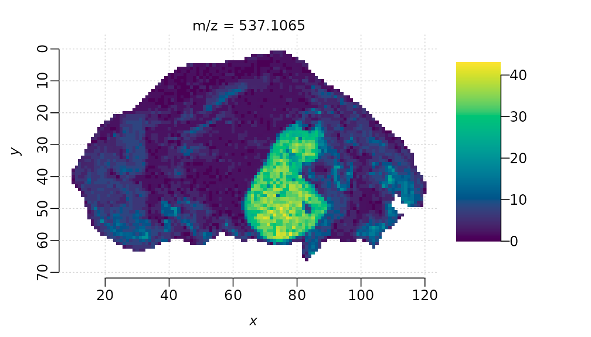

In addition to pre-processing methods, we can also run additional
analyses such as *Cardinal’s* tissue segmentation with spatial shrunken
centroids (ssc).

Following the [*Cardinal’s*
vignette](https://bioconductor.org/packages/release/data/experiment/vignettes/CardinalWorkflows/inst/doc/MSI-segmentation.html),
we will use the same values for:

- Spatial neighborhood radius = 2
- Maximum number of segments/clusters = 8
- Sparsity thresholding parameter = 2,4,8,16,32,64

``` r

set.seed(1)
pig206_ssc <- spatialShrunkenCentroids(pig206_peaks,
    weights="adaptive", r=2, k=8, s=2^(1:6))
```

``` r

col_palette = list("1" = "#5aa14f",
                   "2" = "#4f79a6",
                   "3" = "#e2585a",
                   "4" = "#76b8b3", 
                   "5" = "#ebc948", 
                   "6" = "#f18e29")

image(pig206_ssc, i=5,type="class",col= unlist(unname(col_palette)))
```

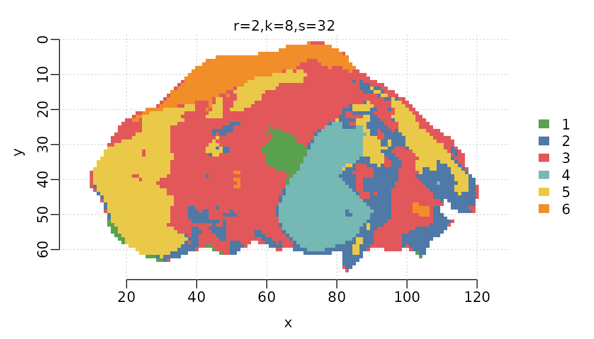

From this we can see areas such as the liver, heart, and brain
distinguished as segments 4, 1, and 5 respectively, as presented in the
original *Cardinal* vignette.

Although the majority of functions within the SpaMTP package are used as
wrappers for analysing and modifying Seurat objects, there are a few
functions that are designed to assist in SM analysis in Cardinal. The
function below is one, which allows you to add the SCC results back to a
spectral Cardinal Object, stored in the `pixelData` slot.

``` r

pig206_peaks <- add_ssc_annotation(pig206_peaks, pig206_ssc, resolution = "r=2,k=8,s=32")
```

``` r

pig206_peaks
```

    ## MSImagingExperiment with 687 features and 4959 spectra 
    ## spectraData(1): intensity
    ## featureData(3): mz, count, freq
    ## pixelData(4): x, y, run, ssc
    ## coord(2): x = 10...120, y = 1...66
    ## runNames(1): PIGII_206
    ## metadata(1): processing_20260814011042
    ## mass range: 150.2917 to 999.8333 
    ## centroided: TRUE

Once finished with the analysis using *Cardinal* we can use the *SpaMTP*
function `CardinalToSeurat` to generate a SpaMTP object from the
processed data.

``` r

pig206_spamtp <- CardinalToSeurat(pig206_peaks)
```

``` r

pig206_spamtp
```

    ## An object of class Seurat 
    ## 687 features across 4959 samples within 1 assay 
    ## Active assay: Spatial (687 features, 0 variable features)
    ##  1 layer present: counts
    ##  1 spatial field of view present: fov

We can see like the *Cardinal* object, the converted *SpaMTP* object
also contains 687 peaks and 4,959 pixels. Furthermore, our ssc results
are stored in our *SpaMTP* object metadata.

``` r

head(pig206_spamtp@meta.data, n = 5)
```

|      |  orig.ident   | nCount_Spatial | nFeature_Spatial |  x  |  y  |    run    | ssc |
|:-----|:-------------:|:--------------:|:----------------:|:---:|:---:|:---------:|:---:|
| 72_1 | SeuratProject |    2010.586    |       599        | 72  |  1  | PIGII_206 |  6  |
| 73_1 | SeuratProject |    2016.971    |       597        | 73  |  1  | PIGII_206 |  3  |
| 74_1 | SeuratProject |    2012.432    |       612        | 74  |  1  | PIGII_206 |  3  |
| 75_1 | SeuratProject |    1996.075    |       597        | 75  |  1  | PIGII_206 |  3  |
| 76_1 | SeuratProject |    2008.766    |       605        | 76  |  1  | PIGII_206 |  3  |

Lets also generate some plots to compare:

``` r

image(pig206_peaks, mz=537.08)
title("Cardinal", outer = TRUE)
```

``` r

ImageMZPlot(pig206_spamtp, mzs = 537.106, size = 2.2, dark.background = F) + scale_x_reverse()+coord_flip()+scale_fill_gradientn(colours = viridis(10))+ ggtitle("SpaMTP")
```

``` r

image(pig206_ssc, i=5,type="class",col= unlist(unname(col_palette)))
title("Cardinal", outer = TRUE)
```

``` r

ImageDimPlot(pig206_spamtp, group.by = "ssc", size = 2.2, dark.background = F, cols = col_palette) + scale_x_reverse()+coord_flip() + ggtitle("SpaMTP")
```

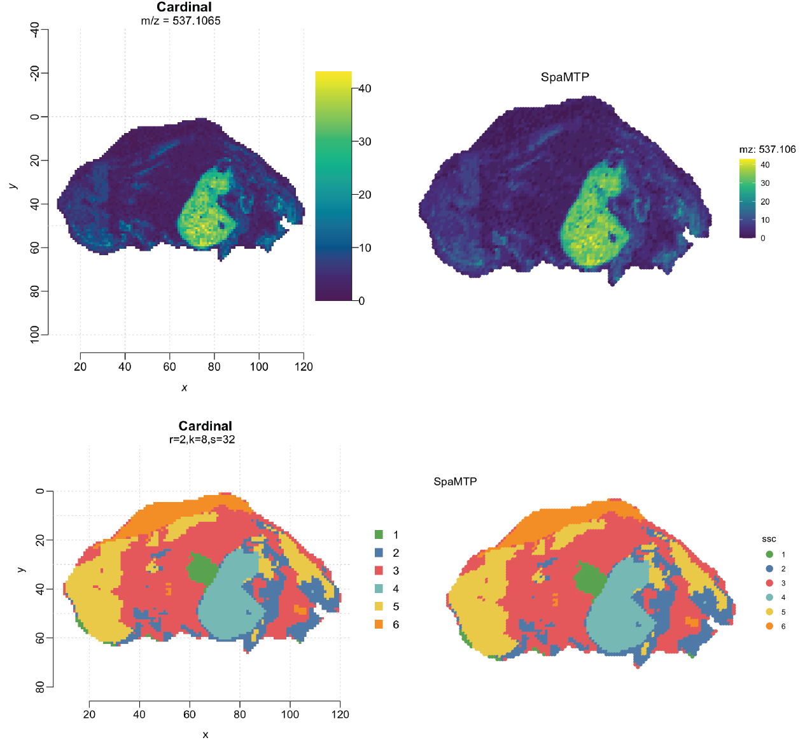

We can see the feature and ssc segment plots match between *SpaMTP* and
*Cardinal* objects.

#### 2. Load Data Directly

*SpaMTP* also provides a function for loading data directly from .ibd
and .imzML files. This `LoadSM` *SpaMTP* function is a wrapper on
*Cardinal’s readImzML()* function. For more information on how this
function works, and the relative inputs it accepts please head to
[*Cardinal’s* documentation
page](https://rdrr.io/bioc/Cardinal/man/readMSIData.html). This function
also has capabilities for splitting data containing multiple runs, into
individual *SpaMTP* data FOV’s. Below we will use the [Human Renal Cell
Carcinoma
(RCC)](https://www.bioconductor.org/packages/release/data/experiment/vignettes/CardinalWorkflows/inst/doc/MSI-testing.html)
public dataset to demonstrate this.

The corresponding .imzML files can be downloaded directly from [*SpaMTP*
zenodo page](https://zenodo.org/records/17246588).

``` r

rcc_spamtp <- LoadSM(file = "./rcc-files/rcc", mass.range = c(150, 1000), multi.run = T)
```

``` r

rcc_spamtp
```

    ## An object of class Seurat 
    ## 10200 features across 16000 samples within 1 assay 
    ## Active assay: Spatial (10200 features, 0 variable features)
    ##  1 layer present: counts
    ##  8 spatial fields of view present: fov.1 fov.2 fov.3 fov.4 fov.5 fov.6 fov.7 fov.8

This dataset contains 10,200 *m/z*-values across 8 different runs which
are split into individual FOV’s. Each run contains a cancer and normal
sample which have been loaded in the metadata. Lets visualise each run
in one plot:

``` r

ImageDimPlot(rcc_spamtp, group.by = "diagnosis", dark.background = F, fov = names(rcc_spamtp@images), size = 2, 
             cols = c("red", "blue"),na.value= "white")
```

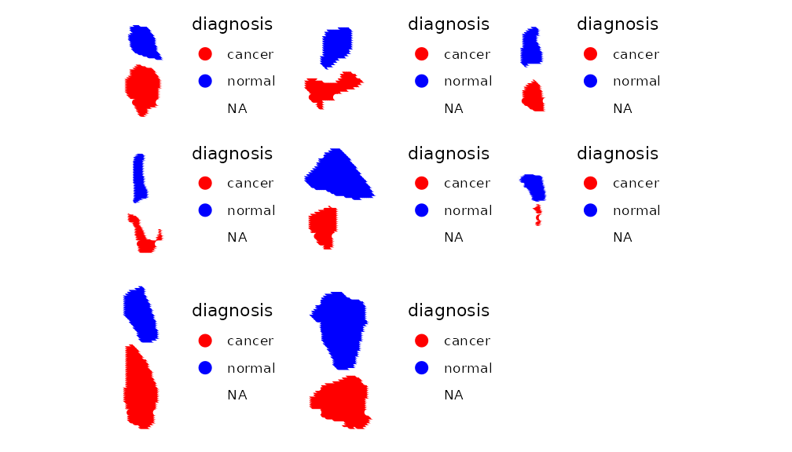

#### 3. Load Intensity Matrix files

The final method of loading SM data into a *SpaMTP* object is through an
intensity matrix stored in a `.csv` file. This is different to .ibd and
.imzML files that were used above, the layout of this dataset is
demonstrated below:

|  x  |  y  | mz_1 | mz_2 | mz_3 |  …  | mz_n |
|:---:|:---:|:----:|:----:|:----:|:---:|:----:|
|  0  |  1  |  0   |  0   |  11  |  …  |  0   |
|  0  |  2  |  0   |  0   |  0   |  …  |  0   |
|  0  |  3  |  15  |  0   |  0   |  …  |  32  |
|  0  |  4  |  20  |  0   |  0   |  …  |  32  |
|  0  |  5  |  0   |  20  |  0   |  …  |  0   |

To demonstrate this we will use a public mouse bladder SM data first
published by [Römpp et
al.(2010)](https://doi.org/10.1002/anie.200905559), and used in the
[*Cardinal V3* article](https://doi.org/10.1038/s41592-023-02070-z).

NOTE: The data used below is processed data from [*Cardinal’s* V3
Vignette (2023)](https://github.com/Vitek-Lab/Cardinal3-vignettes). The
raw data is from, “[Histology by Mass Spectrometry: Label-Free Tissue
Characterization Obtained from High-Accuracy Bioanalytical
Imaging](https://doi.org/10.1002/anie.200905559)”, and can be downloaded
from [Project
PXD001283](https://www.ebi.ac.uk/pride/archive/projects/PXD001283).

This dataset will be used for the remainder of the tutorial.

``` r

# Load directly from file
#bladder <- ReadSM_mtx("./Documents/bladder_csv.csv", mz.prefix = "mz-", feature.start.column = 2)

# Load through the same checksum-verified cache used by the CI build.
bladder_file <- resolve_spamtp_vignette_file(
  article = "Mouse_Urinary_Bladder",
  filename = "bladder_csv.csv",
  url = "https://zenodo.org/api/records/17246684/files/bladder_csv.csv/content",
  expected_md5 = "505fac26445a56ae00cc377b87b03143"
)
bladder <- ReadSM_mtx(mtx.file = bladder_file, mz.prefix = "mz-", feature.start.column = 2)
```

``` r

bladder
```

    ## An object of class Seurat 
    ## 305 features across 34840 samples within 1 assay 
    ## Active assay: Spatial (305 features, 0 variable features)
    ##  1 layer present: counts
    ##  1 spatial field of view present: fov

Because *SpaMTP* is built on a *Seurat* Object, we can use useful
pre-established *Seurat* and *ggplot2* functions to plot the spatial
distribution of the total number of features (m/z’s) present per pixel.

``` r

ImageFeaturePlot(bladder, features = "nFeature_Spatial", size = 1) + coord_flip() + scale_x_reverse()
```

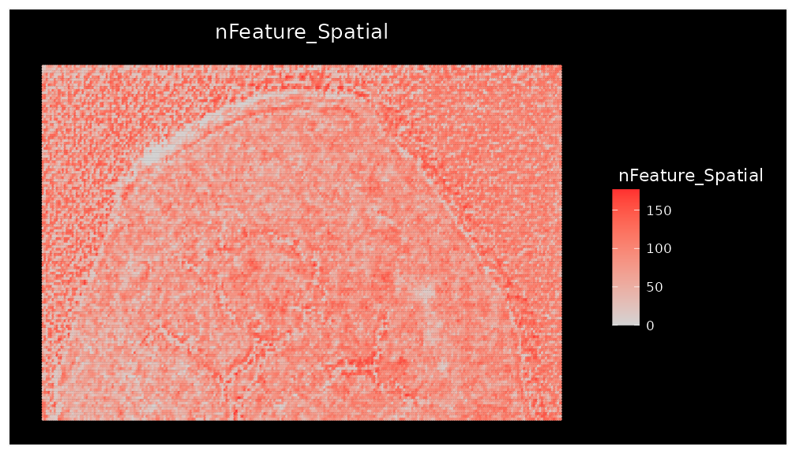

In addition we can also add metadata such as tissue segmentation results
from ssc. These segments were generated following parameters specified
in [*Cardinal’s* V3 Vignette
(2023)](https://github.com/Vitek-Lab/Cardinal3-vignettes), with ‘r= 2,
k=10, s=24’ using ‘gausian’ weights.

``` r

bladder_metadata_file <- resolve_spamtp_vignette_file(
  article = "Mouse_Urinary_Bladder",
  filename = "bladder_metadata.csv",
  url = "https://zenodo.org/api/records/17246684/files/bladder_metadata.csv/content",
  expected_md5 = "d2a6fc89ed617a0b29a291b4ecd2b715"
)
bladder_metadata <- read.csv(bladder_metadata_file, row.names = 1)
```

``` r

head(bladder_metadata, n = 5)
```

|     |       sample        | ssc |
|:----|:-------------------:|:---:|
| 1_1 | mouse-bladder-peaks |  4  |
| 2_1 | mouse-bladder-peaks |  4  |
| 3_1 | mouse-bladder-peaks |  4  |
| 4_1 | mouse-bladder-peaks |  4  |
| 5_1 | mouse-bladder-peaks |  4  |

``` r

bladder@meta.data[colnames(bladder_metadata)]<- bladder_metadata

bladder$ssc <- factor(bladder$ssc) # Required format for some Seurat functions
```

Lets visualise the ssc segmentations added:

``` r

col_palette = list("1" = "#9FBEAC", 
                   "2" = "#C2B03B",
                   "3" = "#F99D1D",
                   "4" = "#008E87", 
                   "5" = "#0074B0",  
                   "6" = "#DE4D6C", 
                   "7" = "#F99D1D",
                   "8" = "#DE4D6C",
                   "9" = "#BF212E")

ImageDimPlot(bladder, group.by = "ssc", cols = col_palette, dark.background = F, size = 2)+ coord_flip() + scale_x_reverse()
```

    ## Coordinate system already present.
    ## ℹ Adding new coordinate system, which will replace the existing one.


We can see that our segmentation plot matches [*Cardinal’s* previously
published results](https://doi.org/10.1038/s41592-023-02070-z).
Published in the original paper by [Römpp et
al.(2010)](https://doi.org/10.1002/anie.200905559) we will visualise
three m/z values that define organ structures within the urinary
bladder.

``` r

ImageMZPlot(bladder, mzs = c(770.5104, 770.56, 741.5307), size = 1.5) & coord_flip() & scale_x_reverse()
```

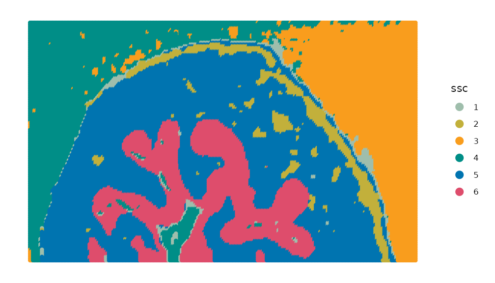

Based on the plots above, there are a few clusters that are associated
with regions outside the tissue. It is clear that cluster 3 and 4 are
outside the tissue and can therefore be removed.

``` r

ROI <- subset(bladder, subset = ssc %in% c("3", "4"), invert = T) 
```

However, to ensure our dataset is clean of technical noise before we
begin downstream analyses we can perform some further data processing
and QC.

#### Sample Pre-Processing and Quality Control

Pre-processing and quality control (QC) are import steps in any pipeline
and should be performed prior to any downstream analysis. For spatial
metabolic data, there are various packages which have robust functions
and applications for removing technical noise from a SM dataset, these
include *Cardinal* and *SCILS-LAB* as previously described. *SpaMTP*
also provides general pre-processing functions such as data
normalisation, scaling and filtering.

  

Although our data may be normalised and filtered, it still may contains
some pixels which are outside the tissue region (cluster 1). To ensure
we remove this technical noise we can visualise some QC metrics using
*SpaMTP*.

First we will look at the total number of features and total intensity
per pixel between our segments:

``` r

VlnPlot(ROI, features = c("nCount_Spatial", "nFeature_Spatial"),group.by = "ssc",cols = col_palette)+ theme_minimal()
```

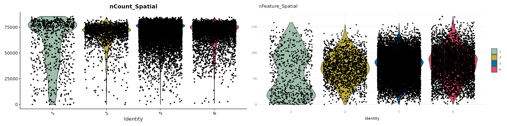

Based on this we can see cluster 1 follows a different distribution
compared to the other clusters and is also likely outside the tissue
regions. Lets also remove this cluster.

``` r

ROI <- subset(ROI, subset = ssc == 1, invert = T)
```

Another metric to assess is the relative intensity values of each m/z
across a sample. It is likely a sign of technical noise in cases where
some m/z values present with excessively large intensities in comparison
to the rest of the dataset. We can visualise this by comparing our raw
data to our normalised and filtered dataset.

``` r

raw_bladder_file <- resolve_spamtp_vignette_file(
  article = "Mouse_Urinary_Bladder",
  filename = "raw_bladder.RDS",
  url = "https://zenodo.org/api/records/17246684/files/raw_bladder.RDS/content",
  expected_md5 = "a385f37641929a43ef6ab917febaf036"
)
raw_bladder <- readRDS(raw_bladder_file)
```

These plots display the intensity of each m/z summed across all pixels
per group. Based on this, the majority of m/z values in our processed
data display intensities within a similar distribution, across each
cluster, suggesting that there are no outlying m/z values. The
unprocessed raw data can be seen to contain some m/z values with
excessively large intensities which have been removed through
processing.

Using this function we can also look at the distribution of specific
features across groups by providing a feature name. Lets try and
visualise the total intensity of “mz-740.471557617188” across each
cluster using the box.plot function:

``` r

MZBoxPlot(seurat.obj = ROI,group.by = "ssc", mzs = "mz-740.471557617188", log.data = TRUE, show.points = F, top.cutoff = 0.05,bottom.cutoff = 0.05,cols = col_palette) 
```

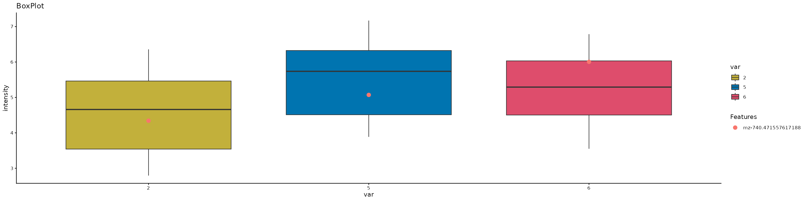

Based on this we can see that the “mz = 740.471557617188” is expressed
in all clusters and is highest in cluster 6.

Similar to before we can interchangeably convert our data between
*SpaMTP* and *Cardinal* objects, meaning pre-processing or analysis
tools from either package can be used at any point during the analysis
pipeline. We will demonstrate how to use the `ConvertSeuratToCardinal`
function later in this tutorial. As we have demonstrated our data is of
good quality we can continue our analysis.

  

### Metabolite Annotation of m/z Masses

One of the major steps in the analysis of metabolomics is the
identification/annotation of m/z masses to their relative common
metabolite name. There are various public websites that can be used to
run this, however, they are often complicated and do not take in an R
object or annotate them directly.

*SpaMTP* has a user-friendly function that assigns possible annotations
to each m/z value based on a few variables:

- db: Database to query. The default `NULL` uses the bundled RaMP 3.0
  chemical-property table and preserves current `RAMP_C_*` identifiers
  for pathway analysis. A custom database can still be supplied.
- polarity: Polarity mode the experiment was run in -\> either
  “positive” or “negative”
- adducts: Specify different adduct ions that are likely formed or lost
  during the mass spectrometry imaging.

``` r

pathway_annotation_score_threshold <- 0.01
pathway_metabolite_pval_cutoff <- 1

bladder_annotated <- AnnotateSM(
  bladder,
  db = NULL,
  ppm_error = 15,
  adducts = "M+K",
  polarity = "positive",
  min_score = 0
)
```

    Filtering 'Lipidmaps_db' database by M+K adduct/s

    Searching database against input m/z's to return annotaiton results

    Adding annotations to Seurat Object .... 

    Returning Seurat object that include ONLY SUCCESSFULLY ANNOTATED m/z features

``` r

bladder_annotated
```

    ## An object of class Seurat 
    ## 156 features across 34840 samples within 1 assay 
    ## Active assay: Spatial (156 features, 0 variable features)
    ##  1 layer present: counts
    ##  1 spatial field of view present: fov

The indexed annotation uses the current bundled RaMP chemical
properties. All ppm-valid candidates are stored (`min_score = 0`), so
downstream pathway analysis and the interactive network viewer can apply
a user-defined score threshold without re-running annotation.

These annotations are stored in the feature meta.data slot within our
SpaMTP Object, lets take a look:

``` r

head(bladder_annotated[["Spatial"]]@meta.data, n = 3)
```

|  | raw_mz | mz_names | observed_mz | all_IsomerNames | all_Isomers | all_Isomers_IDs | all_Adducts | all_Formulas | all_Errors | all_Scores | all_Ramp_IDs |
|:---|:--:|:--:|:--:|:--:|:--:|:--:|:--:|:--:|:--:|:--:|:--:|
| 1 | 403.0434 | mz-403.043426513672 | 403.043426513672 | Xanthotoxol glucoside; 6-methylpretetramide(1-); sulfometuron methyl; Sulfometuron-methyl | hmdb:HMDB0038626; chebi:132734; chebi:9348; hmdb:HMDB0258595 | hmdb:HMDB0038626; chebi:132734; chebi:9348; hmdb:HMDB0258595 | M+K | C17H16O9; C20H14NO6; C15H16N4O5S | 2.0755; 5.9333; 9.6053; 9.6061 | 0.734; 0.3957; 0.1264; 0.1264 | RAMP_C_000019192; RAMP_C_000267915; RAMP_C_000171863 |
| 2 | 404.0514 | mz-404.051422119141 | 404.051422119141 | 2-S-glutathionyl acetate; 6-methylpretetramide; 4beta-(2-Aminoethylthio)catechin; Hydromorphone-3-sulphate; Morphine 3-Sulfate; Morphinan-3,6-diol, 7,8-didehydro-4,5-epoxy-17-methyl-, (5alpha,6alpha)-, 3-(hydrogen sulfate); Clinafloxacin | hmdb:HMDB0062198; chebi:27879; hmdb:HMDB0037475; hmdb:HMDB0060825; hmdb:HMDB0254891; hmdb:HMDB0254892; hmdb:HMDB0250323 | hmdb:HMDB0062198; chebi:27879; hmdb:HMDB0037475; hmdb:HMDB0060825; hmdb:HMDB0254891; hmdb:HMDB0254892; hmdb:HMDB0250323 | M+K | C12H19N3O8S; C20H15NO6; C17H19NO6S; C17H17ClFN3O3 | 2.5282; 4.1474; 12.483; 12.4841; 14.8075 | 0.704; 0.5671; 0.0355; 0.0354; 0.01 | RAMP_C_000041567; RAMP_C_000267915; RAMP_C_000018079; RAMP_C_000040738; RAMP_C_000168710; RAMP_C_000168711; RAMP_C_000164865 |
| 5 | 409.0564 | mz-409.056396484375 | 409.056396484375 | fraxin; 5-Hydroxy-6-methoxycoumarin 7-glucoside; Ferulic acid 4-O-glucuronide; Feruloyl C1-glucuronide; Isoferulic acid 3-O-glucuronide; Isoferuloyl C1-glucuronide; cis-Ferulic acid 4-glucuronide; Fraxin; Remoxipride; Parecoxib; Tetomilast; n-\[\[(5-Methyl-3-phenylisoxazol-4-yl)-phenyl\]sulfonyl\]propanamide; parecoxib | chebi:5170; hmdb:HMDB0039774; hmdb:HMDB0041733; hmdb:HMDB0041734; hmdb:HMDB0041747; hmdb:HMDB0041749; hmdb:HMDB0240725; hmdb:HMDB0252486; hmdb:HMDB0014553; hmdb:HMDB0256127; hmdb:HMDB0258864; hmdb:HMDB0257987; chebi:73038 | chebi:5170; hmdb:HMDB0039774; hmdb:HMDB0041733; hmdb:HMDB0041734; hmdb:HMDB0041747; hmdb:HMDB0041749; hmdb:HMDB0240725; hmdb:HMDB0252486; hmdb:HMDB0014553; hmdb:HMDB0256127; hmdb:HMDB0258864; hmdb:HMDB0257987; chebi:73038 | M+K | C16H18O10; C16H23BrN2O3; C19H18N2O4S | 7.9173; 7.9251; 7.9251; 9.8602; 13.419; 13.4201; 13.4244 | 0.2284; 0.2278; 0.2278; 0.1145; 0.0218; 0.0218; 0.0218 | RAMP_C_000166720; RAMP_C_000020310; RAMP_C_000022212; RAMP_C_000022213; RAMP_C_000022226; RAMP_C_000022228; RAMP_C_000156936; RAMP_C_000166720; RAMP_C_000008843; RAMP_C_000169775; RAMP_C_000172085; RAMP_C_000171361; RAMP_C_000169775 |

We can see that for each m/z value, along with all possible annotations,
we also observe information including database ID, the adduct used to
annotate this metabolite, the common chemical formula, and the
plus-minus ppm error between the observed mass and the reference mass of
these annotated molecules in our reference dataset.

In addition to storing the m/z annotations in the feature meta.data
slot, if `save.intermediate = TRUE` is set within *AnnotateSM()*, the
scored candidates and their RaMP provenance are stored in
`@tools$mz_annotation`. A compatibility copy remains in `@tools$db_3`.
The scored result is used later for pathway analysis. For more
information visit the hidden window below:

*Storing an intermediate data.frame for downstream pathway analysis*

``` r

AnnotationInfo(bladder_annotated)
```

    ## $schema_version
    ## [1] 2
    ## 
    ## $engine
    ## [1] "indexed-chemical-v2"
    ## 
    ## $ramp_version
    ## [1] "3.0.7"
    ## 
    ## $generated_at
    ## [1] "2026-08-14 01:11:50 UTC"
    ## 
    ## $candidates
    ## [1] 409
    ## 
    ## $assay
    ## [1] "Spatial"
    ## 
    ## $raw_mz_column
    ## [1] "raw_mz"
    ## 
    ## $polarity
    ## [1] "positive"
    ## 
    ## $maldi_matrix
    ## [1] "unspecified"
    ## 
    ## $ppm
    ## [1] 15
    ## 
    ## $min_score
    ## [1] 0
    ## 
    ## $adducts
    ## [1] "M+K"
    ## 
    ## $database
    ## [1] "bundled RaMP 3.0.7 chem_props"

``` r

str(bladder_annotated@tools$mz_annotation, max.level = 1)
```

    ## List of 2
    ##  $ metadata:List of 13
    ##  $ results :'data.frame':    409 obs. of  25 variables:

  

Based on these results, we can now perform a serious of analyses to
identify which metabolites are associated with certain biological
features/processes.

  

### Simplifying Lipid Nomenclature into Lipid Catagories and Classes

Because lipids are made of many carbon molecules in a long chain there
are many different kinds of lipids that share the same molecular weight.
This results in some annotations for a mass being very long, due to the
numerous possible lipids matching that m/z value. Lets use a SpaMTP
function to simplify the lipid nomenclature into common lipid categories
and classes! This gives more simplified annotations to a level that most
SM datasets are capable of identifying.

``` r

bladder_annotated@assays$Spatial@meta.data <- RefineLipids(bladder_annotated@assays$Spatial@meta.data, annotation.column = "all_IsomerNames", lipid_info = "simple")

refined_annotations <- bladder_annotated@assays$Spatial@meta.data # get the refined annotations from our feature meta.data slot
```

``` r

cat("non-lipid metabolites ... ")
head(refined_annotations, 1)


cat("refined lipid names ... ")
refined_annotations[11,]
```

| non-lipid metabolites |
|-----------------------|

| raw_mz | mz_names | observed_mz | all_IsomerNames | all_Isomers | all_Isomers_IDs | all_Adducts | all_Formulas | all_Errors | all_Scores | all_Ramp_IDs | Lipid.Maps.Category | Lipid.Maps.Main.Class | Species.Name | Species.Name.Simple |
|:--:|:--:|:--:|:--:|:--:|:--:|:--:|:--:|:--:|:--:|:--:|:--:|:--:|:--:|:--:|
| 403.0434 | mz-403.043426513672 | 403.043426513672 | Xanthotoxol glucoside; 6-methylpretetramide(1-); sulfometuron methyl; Sulfometuron-methyl | hmdb:HMDB0038626; chebi:132734; chebi:9348; hmdb:HMDB0258595 | hmdb:HMDB0038626; chebi:132734; chebi:9348; hmdb:HMDB0258595 | M+K | C17H16O9; C20H14NO6; C15H16N4O5S | 2.0755; 5.9333; 9.6053; 9.6061 | 0.734; 0.3957; 0.1264; 0.1264 | RAMP_C_000019192; RAMP_C_000267915; RAMP_C_000171863 | NA | NA | NA | NA |

  

| refined lipid metabolites |
|---------------------------|

|  | raw_mz | mz_names | observed_mz | all_IsomerNames | all_Isomers | all_Isomers_IDs | all_Adducts | all_Formulas | all_Errors | all_Scores | all_Ramp_IDs | Lipid.Maps.Category | Lipid.Maps.Main.Class | Species.Name | Species.Name.Simple |
|:---|:--:|:--:|:--:|:--:|:--:|:--:|:--:|:--:|:--:|:--:|:--:|:--:|:--:|:--:|:--:|
| 19 | 432.0835 | mz-432.083526611328 | 432.083526611328 | gamma-L-Glutamyl-S-(2-carboxy-1-propyl)cysteinylglycine; (gamma-Glutamyl-gamma-glutamyl)-S-methylcysteine; dihydromacarpine; Besifloxacin; Amsacrine; amsacrine | hmdb:HMDB0029394; hmdb:HMDB0039424; chebi:18029; hmdb:HMDB0249089; hmdb:HMDB0014421; chebi:2687 | hmdb:HMDB0029394; hmdb:HMDB0039424; chebi:18029; hmdb:HMDB0249089; hmdb:HMDB0014421; chebi:2687 | M+K | C14H23N3O8S; C22H19NO6; C19H21ClFN3O3; C21H19N3O3S | 0.5016; 2.0165; 11.9853; 13.0915; 13.0965 | 0.796; 0.7375; 0.0452; 0.026; 0.0259 | RAMP_C_000010478; RAMP_C_000019968; RAMP_C_000262014; RAMP_C_000163840; RAMP_C_000008737 | NA | NA | NA | NA |

We can see that for metabolites that are not lipids, the names are
returned as NA, however those that are annotated as lipids have been
simplified into a more human readable format.

Some key m/z masses that were observed and annotated in the [original
publication](https://doi.org/10.1002/anie.200905559) are listed in the
table below:

| m/z mass | Annotated Metabolite |
|:--------:|:--------------------:|
| 741.5307 |       SM(34:1)       |
| 798.5410 |       PC(34:1)       |
| 812.5566 |       PE(38:1)       |

Lets see how these m/z’s are annotated using ***SpaMTP***:

``` r

key_mzs <- c(741.5307, 798.5410, 812.5566)
key_mz_names <- c()

for (mz in key_mzs){
    key_mz_names <- c(key_mz_names, FindNearestMZ(bladder_annotated, mz)) #Find the nearest m/z in our dataset to the mass provided
}

matches <- refined_annotations[refined_annotations$mz_names %in% key_mz_names,][c("raw_mz","Species.Name.Simple")] 
matches
```

|     |  raw_mz  |  Species.Name.Simple   |
|:---:|:--------:|:----------------------:|
| 196 | 741.5306 | **SM(34:1)**; PA(37:1) |
| 231 | 798.5411 | **PC(34:1)**; PE(37:1) |
| 238 | 812.5562 | PC(35:1); **PE(38:1)** |

For plotting we will use our subset ROI object.

``` r

ROI <- subset(bladder_annotated, subset = ssc %in% c("2", "5", "6"))
```

``` r

ImageMZAnnotationPlot(ROI, metabolites = c("SM(34:1)", "PC(34:1)"), size = 1, column.name = "Species.Name.Simple", plot.exact = F, dark.background = F, plot.pixel = T) & coord_flip() & scale_x_reverse()  & scale_colour_gradientn(colors = viridis(100)) 
```

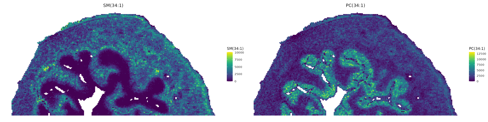

We can see that our annotations match those published previously. Due to
the limitations with MSI based technologies, we can not exactly identify
the chemical structure of each molecule, meaning that some *m/z* values
have multiple lipid names/annotations.

  

### Differential Expression Analysis of Annotated Metabolites

One key step in understanding biological processes is determining genes,
proteins or metabolites that demonstrate significantly different
expression between given populations or cell types. Based on the
analysis above, for this urinary bladder we identified 3 main tissue
regions these being :

| ssc segment | Tissue Region |
|:-----------:|:-------------:|
|      2      |  adventitia   |
|      5      |    muscle     |
|      6      |  urothelium   |

These regions are identified also in the following references:
[1](https://doi.org/10.1002/anie.200905559),
[2](https://www.nature.com/articles/s41592-023-02070-z#citeas)

Lets use SpaMTP’s *FindAllDEMs()* function to identify differentially
expressed m/z metabolites (DEMs) between each of these three tissue
regions. This function uses similar methods to those established for
genetic data, whereby pixels are pseudo-bulked into random pools and
assessed for differential expression
([limma](https://doi.org/10.1093/nar/gkv007).

``` r

ROI <- NormalizeSMData(ROI)

# Performs pooling, pseudo-bulking and edgeR Differential Expression Analysis
cluster_DEMs <- FindAllDEMs(data = ROI, slot = "data", ident = "ssc", n = 5, logFC_threshold = 1, 
                            DE_output_dir =NULL, return.individual = FALSE, 
                            run_name = "FindAllDEMs", annotation.column = "all_IsomerNames") # DE results are returned in a data.frame
```

    Pooling one sample into 3 replicates...

    Running limma DE Analysis for  FindAllDEMs  -> with samples [ 5, 2, 6 ]

    Starting condition: 5

    Starting condition: 2

    Starting condition: 6

Lets observe the top 10 DE metabolites for each cluster in a heatmap:

``` r

DEMsHeatmap(cluster_DEMs, only.pos = FALSE, order.by = "logFC",
            plot_annotations_column = "annotations", nlabels.to.show = 1, 
            n = 15, save_to_path = NULL
            ,plot.save.height = 10, plot.save.width = 15, annotation_colors = col_palette[c("2","5","6")])
```

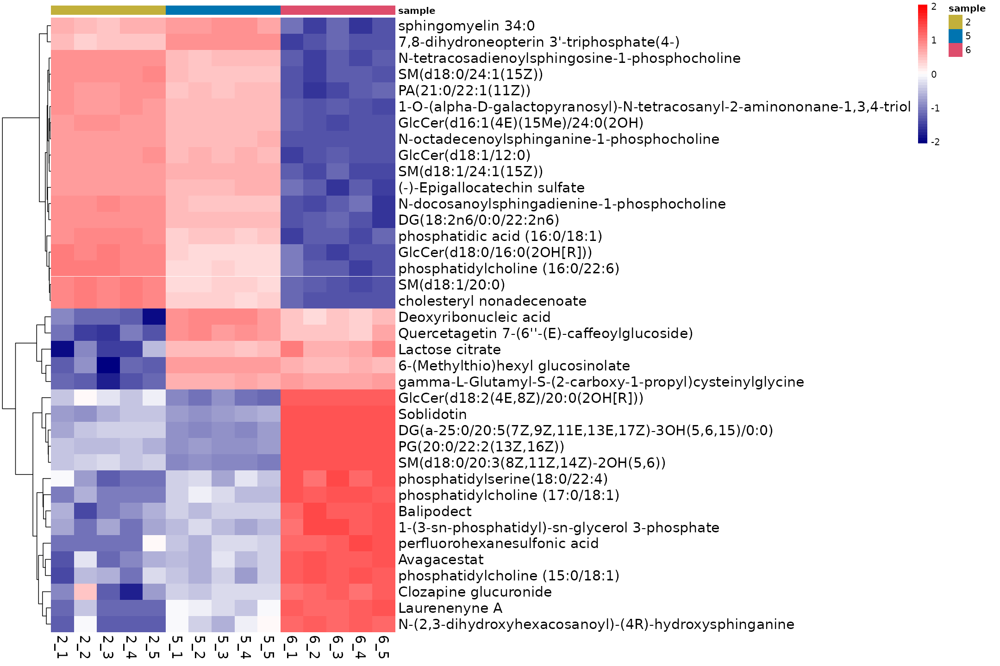

We can also observe the spatial expression patterns of some top DE
metabolites.

``` r

(ImageDimPlot(ROI, group.by = "ssc", split.by = "ssc", size = 2, cols = col_palette)/
ImageMZAnnotationPlot(ROI, metabolites = c("LacCer(d18:1/12:0)","SM(d18:0/16:0)","Bastimolide B"), size = 2)) & coord_flip() & scale_x_reverse()
```

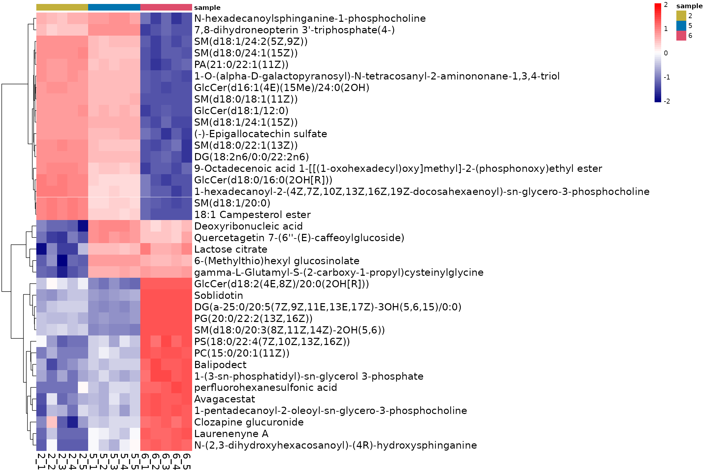

We can see that the expression of these metabolites matches the spatial
location of each of these three tissue regions quite well.

Noted in the heatmap above, there are many lipids which are identified
as being DE. In particular, there are two lipids of interest which have
been identified in the original publication as key metabolites that
differentiate the muscle (cluster 5) and urothelium (cluster 6). These
being SM(34:1) and PC(34:1) respectively.

The code below performs differential expression analysis just between
the the muscle (cluster 5) and urothelium (cluster 6) pixels, to
determine if the differential expression of these lipids can be
detected.

``` r

### Subsets the original dataset to only include cluster 5 and 6
ROI_x <- subset(ROI, subset = ssc %in% c("5", "6"))

### Performs differential expression analysis between the two groups
cluster_DEMs_x <- FindAllDEMs(data = ROI_x, ident = "ssc", n = 5, logFC_threshold = 1, 
                           DE_output_dir =NULL, return.individual = FALSE, 
                            run_name = "FindAllDEMs", annotation.column = "all_IsomerNames" )

### Runs lipid nomenclature simplification on the DEM results
cluster_DEMs_x$DEMs <- RefineLipids(cluster_DEMs_x$DEMs, annotation.column = "annotations", lipid_info = "simple")

### Subsets the DEM results to only get up regulated metabolites for cluster 5 and 6
urothelium <- cluster_DEMs_x$DEMs[cluster_DEMs_x$DEMs$cluster == "6",]

### Sets up colouring for significant spots in volcano plot
keyvals <- ifelse(
    urothelium$logFC < 0  & urothelium$P.Value < 10e-4, 'royalblue',
      ifelse(urothelium$logFC > 0 & urothelium$P.Value < 10e-4, 'red',
        'black'))
  keyvals[is.na(keyvals)] <- 'black'
  names(keyvals)[keyvals == 'red'] <- 'Cluster 6'
  names(keyvals)[keyvals == 'black'] <- 'Non-Sig'
  names(keyvals)[keyvals == 'royalblue'] <- 'Cluster 5'

### Changes the shape of the lipid annotations  of interest in volcano plot
metabolites <- matches$Species.Name.Simple[1:2]

keyvals.shape <- ifelse(
    urothelium$Species.Name.Simple == metabolites[1], 15,
      ifelse(urothelium$Species.Name.Simple == metabolites[2], 17,
        20))
  keyvals.shape[is.na(keyvals.shape)] <- 20
  names(keyvals.shape)[keyvals.shape == 20] <- 'Other'
  names(keyvals.shape)[keyvals.shape == 15] <- metabolites[1]
  names(keyvals.shape)[keyvals.shape == 17] <- metabolites[2]

### Plots volcano plot with DEM results
volc_plot <- EnhancedVolcano::EnhancedVolcano( urothelium,
                                  selectLab = metabolites, 
                                  lab = urothelium$Species.Name.Simple,
                                  #FCcutoff = 0,
                                  colCustom = keyvals,
                                  shapeCustom = keyvals.shape,
                                  #cutoffLineType = 'blank',
                                  pCutoff = 10e-4,
                                  FCcutoff = NA,
                                  pointSize = 6,
                                  labSize = 5,
                                  labCol = 'black',
                                  labFace = 'bold',
                                  colAlpha = 4/5,
                                  x = 'logFC',
                                  y = 'P.Value', 
                                  gridlines.major = FALSE,
                                  gridlines.minor = FALSE)
```

``` r

volc_plot
```

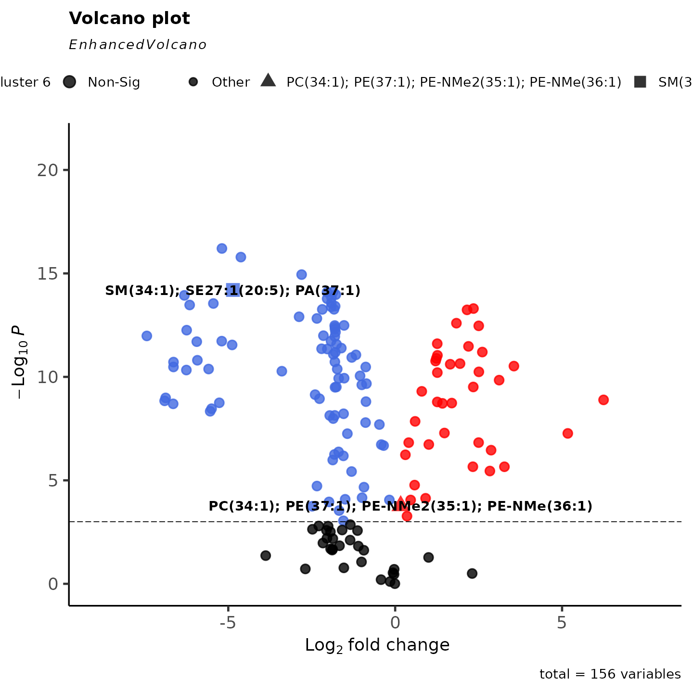

In the volcano plot above, we can see that our analysis correctly
identified SM(34:1) to be up-regulated in cluster 5, and PC(34:1) was
up-regulated in cluster 6.

Lipids are a key metabolite expressed within the urinary bladder. Lets
take a deeper look into the differentially expressed lipids groups with
respect to their main category and class:

``` r

### Runs lipid nomenclature simplification on the DEM results generated between cluster 2, 5 and 6
cluster_DEMs$DEMs <- RefineLipids(cluster_DEMs$DEMs, annotation.column = "annotations", lipid_info = "simple")
```

``` r

# lets look at the Differenitally expressed Lipids groups
UP <- cluster_DEMs$DEMs[cluster_DEMs$DEMs$regulate == "Up",] # lets get the upregulated lipids for each cluster

# Compute counts of Lipid Maps Categories for 'Up' and 'Down' entries
category_counts <- UP %>%
  group_by(cluster, Lipid.Maps.Category) %>%
  summarise(count = n()) %>%
  ungroup()

category_counts <- category_counts %>%
  mutate(Lipid.Maps.Category = ifelse(is.na(Lipid.Maps.Category), "Non-Lipids", Lipid.Maps.Category))


# Plot bar graph
ggplot(category_counts, aes(x = Lipid.Maps.Category, y = count, fill = cluster)) +
  geom_bar(stat = "identity", position = "dodge") +
  labs(title = "Relative Number of Up Regulated Lipids Grouped by Catagory",
       x = "Lipid Maps Category",
       y = "Count") +
  theme_classic() +
  scale_fill_manual(values = col_palette) 
```

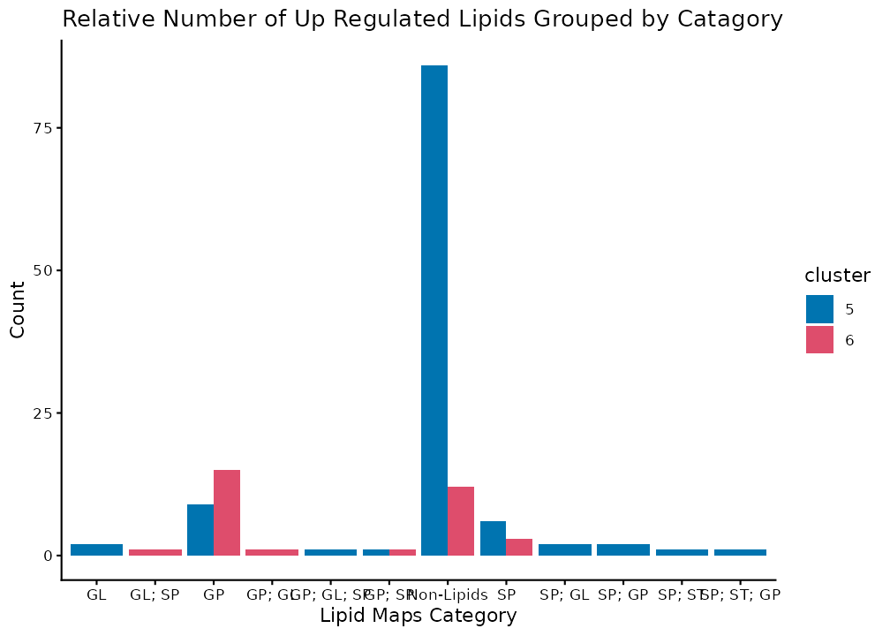

The results displayed in the bar graph above demonstrate the number of
different types of lipid **categories** differentially expressed in each
cluster. Lipid categories are the most simple/broad annotation of a
lipid. For example, GL stands for glycerolipids, which can represent
such lipids classes as diglycerols and triglycerols. Likewise, SP stands
for sphingolipids, which include lipids from classes such as
sphingomyelins and glycosphingolipids. For more information on different
lipid categories and classes, please visit the following links
([1](https://doi.org/10.1016%2Fj.bbalip.2011.06.009),[2](https://doi.org/10.1021/acs.analchem.0c01690)).

Lets now look at the different lipid classes that were differentially
expressed by each cluster.

``` r

# Compute counts of Lipid Maps Categories for 'Up' and 'Down' entries
category_counts <- UP %>%
  group_by(cluster, Lipid.Maps.Main.Class) %>%
  summarise(count = n()) %>%
  ungroup()

category_counts <- category_counts %>%
  mutate(Lipid.Maps.Category = ifelse(is.na(Lipid.Maps.Main.Class), "Non-Lipids", Lipid.Maps.Main.Class))


# Plot bar graph
ggplot(category_counts, aes(x = Lipid.Maps.Main.Class, y = count, fill = cluster)) +
  geom_bar(stat = "identity", position = "dodge") +
  labs(title = "Relative Number of Up Regulated Lipids Grouped by Classes",
       x = "Lipid Maps Category",
       y = "Count") +
  theme_classic() +
  scale_fill_manual(values = col_palette) 
```

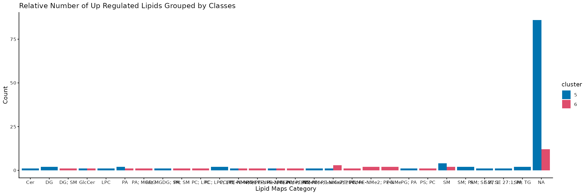

### Metabolite Expression Visualisation

Based on the analysis performed above, there are various ways we can
visualise the data spatially. SpaMTP has a large range of methods to
visualise data including binning common metabolites, 3D plots displaying
metabolite/gene expression and more. Below, we will demonstrate some of
the key plotting methods.

First, using the DE lipid results from above, we can plot the combined
expression of all glycerophospholipids (GP) that were up expressed by
our urothelium cells (cluster 6).

``` r

### Identified the m/z values that are GP lipids up expressed in cluster 6
mz <- na.omit(UP[c(UP$cluster == "6"& UP$Lipid.Maps.Category == "GP"),]$gene)

### Adds the binned expression value of all of these lipids into a column in the SpaMTP object's @meta.data slot
ROI <- BinMetabolites(ROI, mz, slot = "counts", bin_name = "GPs")
```

``` r

head(ROI, n = 3)
```

|  | orig.ident | nCount_Spatial | nFeature_Spatial | x_coord | y_coord | sample | ssc | GPs |
|:---|:--:|:--:|:--:|:--:|:--:|:--:|:--:|:--:|
| 130_11 | SpaMTP | 70658.19 | 56 | 130 | 11 | mouse-bladder-peaks | 5 | 0.0000 |
| 123_12 | SpaMTP | 50833.22 | 25 | 123 | 12 | mouse-bladder-peaks | 5 | 0.0000 |
| 124_12 | SpaMTP | 60326.05 | 40 | 124 | 12 | mouse-bladder-peaks | 5 | 669.3766 |

``` r

ImageFeaturePlot(ROI, features = c("GPs"), size = 2, dark.background = F) & coord_flip() & scale_x_reverse()
```

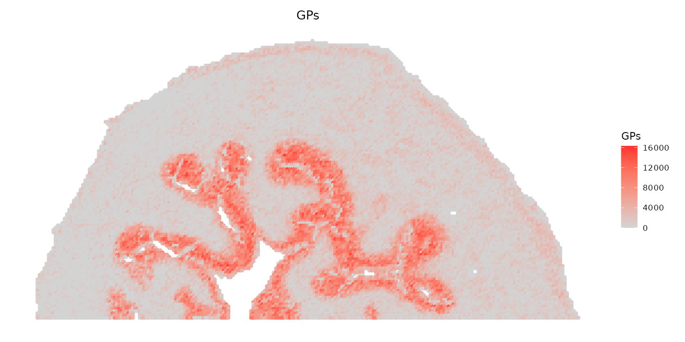

We can see clearly that the combined expression of these GP lipids is
highly expressed in the urothelium cells.

Next, we can observe the expression of two key lipids (same as those
described above) in a 3D plot:

``` r

### Identified the m/z values that are to be plot
mzs <- unlist(lapply(c(798.5411, 741.5306), function(x) FindNearestMZ(data = ROI, target_mz = x)))

Plot3DFeature(ROI, features = mzs, assays = "Spatial", between.layer.height = 100, names = c("PC(34:1)","SM(34:1)"), plot.height = 400, plot.width = 700)
```

Based on our analysis above the lipid ‘PC(30:2)’ was enriched in the
uroepithelum cluster (cluster 6). This lipid was not mentioned in the
original paper, but may be biologically relevant to the uroepithelum. To
check this we can generate some key visualisations:

``` r

ImageMZAnnotationPlot(bladder_annotated, metabolites = "PC(30:2)", column.name = "Species.Name.Simple", size = 2) & coord_flip() & scale_x_reverse()
```

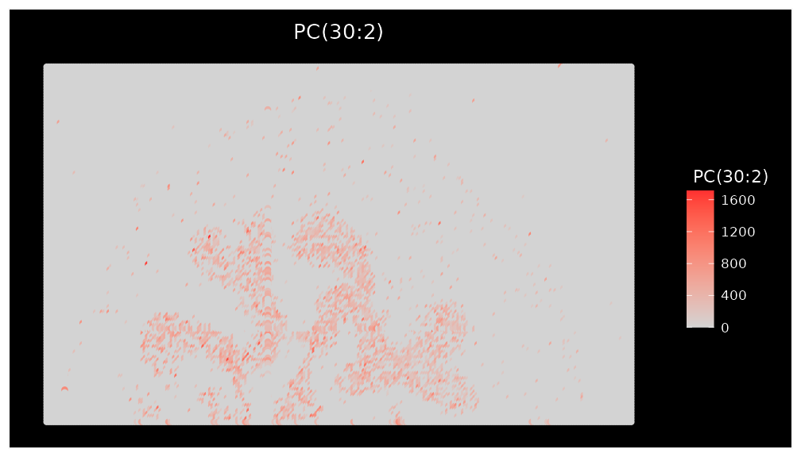

SpaMTP also includes a useful density plot function that generates a
[HTML](https://github.com/GenomicsMachineLearning/SpaMTP/blob/main/vignettes/vignette_data_files/Mouse_Urinary_Bladder/mzs_density_map.html)
which allows the user to simultaneously visualise any m/z peak and it’s
relative metabolite annotation spatially. Users have access to a mass
intensity plot where they can select any m/z peak, which will then be
plotted and all possible metabolite annotations will be listed. Lets
demonstrate below, try visualising “mz-740.471557617188” which matches
the plot for ‘PC(30:2)’ above:

``` r

DensityMap(object = ROI, assay = "Spatial", slot = "counts", folder = "vignette_data_files/Mouse_Urinary_Bladder/")
```

  

Interactive Bar and Dot Plot

**Instructions:** Enter a number to describe the number of equally
spaced points at which the density is to be estimated.

### Pathway Analysis

In order to understand biological processes and complex diseases at a
deeper level, we often look at biological pathways as a whole rather the
expression of just individual metabolites/genes. SpaMTP pathway analysis
uses a reference dataset that contains various biological pathways
(i.e. KEGG or RAMP_DB) to determine significant changes in biological,
cellular or molecular processes.

The first pathway analysis method uses the *Fishers Exact Test* to
identify significant differentially expressed pathways based on the
presence of specified features. Users can provide a list of metabolites
or metabolites and genes, identified through DE analysis. This method
will then identify significant pathways based on the relative proportion
of features matching between the list provided and those present within
the pathway.

The below code is performing FishersExactTest Pathway analysis on
metabolites significantly over expressed in the urothelium (cluster 6):

``` r

## Subsets to include only UP-regulated m/z values in cluster 6 (relative to cluster 2 and 5)
cluster_6 <- UP[UP$cluster == "6",] 

## Based on these mz values we can get their corresponding annotations which are in the database ID format (stored in `$all_Isomer_IDs`)
metabolite_ids <- ROI[["Spatial"]]@meta.data[ROI[["Spatial"]]@meta.data$all_IsomerNames %in% cluster_6$annotations,]$all_Isomers_IDs

## We can then unlist them to get all the unique possible annotations 
metabolite_ids <- unique(unlist(lapply(metabolite_ids, function(x){strsplit(x, "; ")[[1]]})))

### NOTE: Rather then matching the annotation results back to the metabolite annotations, DE can be run changing the 'annotation.column' = "all_Isomer_IDs`
```

Lets now run FishersPathwayTest

``` r

cluster_6_pathways <- FishersPathwayAnalysis(list("metabolites" = metabolite_ids),
                            max_path_size = 500,
                            alternative = "greater",
                            min_path_size = 5,
                            pathway_all_info = T,
                            pval_cutoff = 0.05,
                            verbose = TRUE)
```

    Fisher Testing ......
    Loading files ......
    Loading files finished!
    Expanding database to extract all potential metabolites
    Parsing the information of given analytes class
    Begin metabolic pathway analysis ......
    Merging datasets
    Running test
    Calculating p value......
    P value obtained
    Done

``` r

cluster_6_pathways[1:4,]
```

| pathway_name | pathway_id | type | pathwayCategory | p_val | fdr | ratio | analytes_in_pathways | total_in_pathways |
|:--:|:--:|:--:|:--:|:--:|:--:|:--:|:--:|:--:|
| Phosphatidylcholine Biosynthesis PC(14:0/22:1(13Z)) | SMP14237 | hmdb | smpdb3 | 0.0013101 | 0.1304617 | 0.1875 | 3 | 16 |
| Phosphatidylcholine Biosynthesis PC(18:1(11Z)/18:0) | SMP14395 | hmdb | smpdb3 | 0.0013101 | 0.1304617 | 0.1875 | 3 | 16 |
| Phosphatidylcholine Biosynthesis PC(18:1(9Z)/18:0) | SMP14424 | hmdb | smpdb3 | 0.0013101 | 0.1304617 | 0.1875 | 3 | 16 |
| Phosphatidylcholine Biosynthesis PC(20:0/16:1(9Z)) | SMP14567 | hmdb | smpdb3 | 0.0013101 | 0.1304617 | 0.1875 | 3 | 16 |

We can also run FisherPathwayTest using just m/z values. Lets try this
below and see how the results differ. This time we will use `Chebi_db`,
`Lipidmaps_db` and `HMDB_db` to annotate the m/z values, and we will use
all possible positive adducts. (Note: the mz values are stored in the
data.frame column called `gene`).

``` r

cluster_6_mz_pathways <- FishersPathwayAnalysis(list("mzs" = cluster_6$gene),
                            min_path_size = 5,
                            max_path_size = 500,    
                            alternative = "greater",
                            pathway_all_info = T,
                            pval_cutoff = 1,
                            verbose = TRUE)
```

``` r

cluster_6_mz_pathways[1:4,]
```

| pathway_name | pathway_id | type | pathwayCategory | p_val | fdr | ratio | analytes_in_pathways | total_in_pathways |
|:--:|:--:|:--:|:--:|:--:|:--:|:--:|:--:|:--:|
| Cardiolipin Biosynthesis CL(18:0/18:2(9Z,12Z)/16:1(9Z)/16:1(9Z)) | SMP28204 | hmdb | smpdb3 | 0.0105764 | 0.608169 | 0.5 | 3 | 6 |
| Cardiolipin Biosynthesis CL(18:0/18:2(9Z,12Z)/16:1(9Z)/18:0) | SMP28205 | hmdb | smpdb3 | 0.0105764 | 0.608169 | 0.5 | 3 | 6 |
| Cardiolipin Biosynthesis CL(18:0/18:2(9Z,12Z)/18:0/18:2(9Z,12Z)) | SMP28207 | hmdb | smpdb3 | 0.0105764 | 0.608169 | 0.5 | 3 | 6 |
| Cardiolipin Biosynthesis CL(18:0/18:2(9Z,12Z)/18:1(9Z)/18:1(9Z)) | SMP28218 | hmdb | smpdb3 | 0.0105764 | 0.608169 | 0.5 | 3 | 6 |

  

Now, lets visualise these results.We will first plot the results
generated based on the provided metabolite ID’s.

``` r

VisualisePathways(ROI,pathway_df = cluster_6_pathways,p_val_threshold = 0.1,assay = "Spatial",slot = "counts")
```

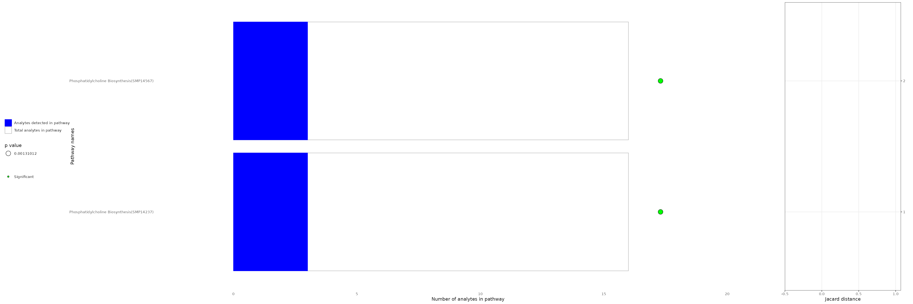

We can also plot the results generated from running Fishers Exact Test
using the m/z values. This will allow us to plot the expression of each
pathway spatially!

``` r

VisualisePathways(bladder_annotated,pathway_df = cluster_6_mz_pathways,p_val_threshold = 0.1,assay = "Spatial",slot = "counts")
```

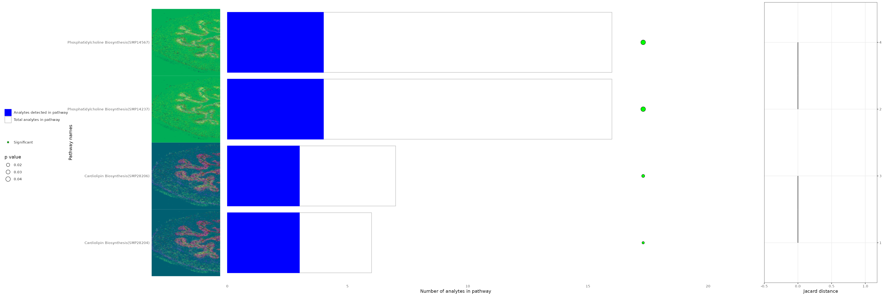

The second form of pathway analysis identifies differentially expressed
pathways per group/cluster based on a the relative expression of
metabolites and/or genes. Using a similar approach to
[GSEA](https://www.gsea-msigdb.org/gsea/index.jsp) features are ranked
based on log fold change between groups, and the relative enrichment
scores of these features are used to identify significant pathways
differentially expressed by each group.

The code below uses the “ssc” clustering and the pseudo-bulking DE
results to identify significant pathways per cluster:

``` r

DE_pathways <- FindRegionalPathways(SpaMTP = ROI,
                                ident = "ssc",
                                DE.list = list(cluster_DEMs$DEMs),
                                analyte_types = c("metabolites"),
                                SM_assay = "Spatial",
                                ST_assay = NULL,
                                annotation_score_threshold = pathway_annotation_score_threshold,
                                pval_cutoff_mets = pathway_metabolite_pval_cutoff)
```

``` r

DE_pathways
```

| pathwayName | pval | padj | log2err | ES | NES | size | leadingEdge | Cluster_id | adduct_info | leadingEdge_metabolites | leadingEdge_metabolites_id | leadingEdge_genes | met_regulation | rna_regulation | group_importance | pathwayRampId | sourceId | type | pathwayCategory |
|:---|---:|---:|---:|---:|---:|---:|:---|:---|:---|:---|:---|:---|:---|:---|---:|:---|:---|:---|:---|
| Sphingolipid metabolism: integrated pathway | 0.0003858 | 0.0003858 | 0.4984931 | 0.6587452 | 2.421067 | 10 | RAMP_C_0…. | 2 | 741.530578613281\[M+K\];743.546752929688\[M+K\];769.561889648438\[M+K\];797.593017578125\[M+K\];825.623657226562\[M+K\];851.640014648438\[M+K\];853.655090332031\[M+K\] | SM(d18:1/16:0);SM(d18:0/16:0);SM(d18:1/18:0);SM(d18:1/20:0);SM(d18:1/22:0);SM(d18:1/24:1(15Z));SM(d18:1/24:0) | hmdb:HMDB0010169;hmdb:HMDB0010168;hmdb:HMDB0001348;hmdb:HMDB0012102;hmdb:HMDB0012103;hmdb:HMDB0012107;hmdb:HMDB0011697 |  | ↑;↓;↑;↑;↑;↑;↑;↑;↑ |  | 6.277175 | RAMP_P_000053597 | WP4726 | wiki | NA |
| Sphingolipid metabolism: integrated pathway | 0.0007370 | 0.0007370 | 0.4772708 | 0.7986888 | 1.671158 | 10 | RAMP_C_0…. | 5 | 741.530578613281\[M+K\];743.546752929688\[M+K\];769.561889648438\[M+K\];825.623657226562\[M+K\];851.640014648438\[M+K\];853.655090332031\[M+K\] | SM(d18:1/16:0);SM(d18:0/16:0);SM(d18:1/18:0);SM(d18:1/22:0);SM(d18:1/24:1(15Z));SM(d18:1/24:0) | hmdb:HMDB0010169;hmdb:HMDB0010168;hmdb:HMDB0001348;hmdb:HMDB0012103;hmdb:HMDB0012107;hmdb:HMDB0011697 |  | ↑;↑;↑;↑;↑;↑;↑;↑ |  | 6.277175 | RAMP_P_000053597 | WP4726 | wiki | NA |
| Sphingolipid metabolism: integrated pathway | 0.0000408 | 0.0000408 | 0.5573322 | -0.8406708 | -2.184950 | 10 | RAMP_C_0…. | 6 | 741.530578613281\[M+K\];743.546752929688\[M+K\];769.561889648438\[M+K\];797.593017578125\[M+K\];825.623657226562\[M+K\];851.640014648438\[M+K\];853.655090332031\[M+K\] | SM(d18:1/16:0);SM(d18:0/16:0);SM(d18:1/18:0);SM(d18:1/20:0);SM(d18:1/22:0);SM(d18:1/24:1(15Z));SM(d18:1/24:0) | hmdb:HMDB0010169;hmdb:HMDB0010168;hmdb:HMDB0001348;hmdb:HMDB0012102;hmdb:HMDB0012103;hmdb:HMDB0012107;hmdb:HMDB0011697 |  | ↓;↓;↓;↓;↓;↓;↓;↓;↓ |  | 6.277175 | RAMP_P_000053597 | WP4726 | wiki | NA |

The example uses `pval_cutoff_mets = 1`, so annotated metabolites can
contribute to pathway ranks regardless of DE significance. Set it back
to `0.05` for the stricter DE-significant analysis. To increase
annotation coverage further, we can broaden the adduct range from `M+K`
to both `M+H` and `M+K` and re-run the analysis.

``` r

## Get Data
ROI_pathays <- subset(bladder, subset = ssc %in% c("2", "5", "6"))

## Re-annotate
ROI_pathays <- AnnotateSM(
  ROI_pathays,
  db = NULL,
  ppm_error = 15,
  polarity = "positive",
  adducts = c("M+H", "M+K"),
  min_score = 0
)


## Re-run DE analysis
DE <- FindAllDEMs(data = ROI_pathays, ident = "ssc", n = 5, logFC_threshold = 1, 
                            DE_output_dir =NULL, return.individual = FALSE, 
                            run_name = "FindAllDEMs", annotation.column = "all_IsomerNames")


DE_pathways <- FindRegionalPathways(SpaMTP = ROI_pathays,
                                ident = "ssc",
                                DE.list = list(DE$DEMs),
                                analyte_types = c("metabolites"),
                                SM_assay = "Spatial",
                                ST_assay = NULL,
                                annotation_score_threshold = pathway_annotation_score_threshold,
                                pval_cutoff_mets = pathway_metabolite_pval_cutoff)
```

``` r

DE_pathways
```

| pathwayName | pval | padj | log2err | ES | NES | size | leadingEdge | Cluster_id | adduct_info | leadingEdge_metabolites | leadingEdge_metabolites_id | leadingEdge_genes | met_regulation | rna_regulation | group_importance | pathwayRampId | sourceId | type | pathwayCategory |
|:--:|:--:|:--:|:--:|:--:|:--:|:--:|:--:|:--:|:--:|:--:|:--:|:--:|:--:|:--:|:--:|:--:|:--:|:--:|:--:|
| Fatty acid metabolism | 0.0153843 | 0.0230765 | 0.3807304 | -0.7129829 | -1.6717864 | 7 | RAMP_C_0…. | 2 | 503.981231689453\[M+H\];817.102783203125\[M+H\];834.126831054688\[M+H\];835.128479003906\[M+H\];873.067810058594\[M+K\] | ATP(4-);2,3-trans-enoyl CoA(4-);butyryl-CoA(4-);trans-3-enoyl-CoA;(R)-3-hydroxyacyl-CoA(4-) | chebi:30616;chebi:58856;chebi:57371;chebi:27700;chebi:57319 |  | ↓;↓;↓;↓;↓;↓ |  | 12.63887 | RAMP_P_000049955 | map01212 | kegg | kegg |
| Fatty acid metabolism | 0.0153843 | 0.0230765 | 0.3807304 | -0.7129829 | -1.6717864 | 7 | RAMP_C_0…. | 2 | 503.981231689453\[M+H\];817.102783203125\[M+H\];834.126831054688\[M+H\];835.128479003906\[M+H\];873.067810058594\[M+K\] | ATP(4-);2,3-trans-enoyl CoA(4-);butyryl-CoA(4-);trans-3-enoyl-CoA;(R)-3-hydroxyacyl-CoA(4-) | chebi:30616;chebi:58856;chebi:57371;chebi:27700;chebi:57319 |  | ↓;↓;↓;↓;↓;↓ |  | 12.63887 | RAMP_P_000049984 | R-HSA-8978868 | reactome | NA |
| Fatty acid metabolism | 0.0153843 | 0.0230765 | 0.3807304 | -0.7129829 | -1.6717864 | 7 | RAMP_C_0…. | 2 | 503.981231689453\[M+H\];817.102783203125\[M+H\];834.126831054688\[M+H\];835.128479003906\[M+H\];873.067810058594\[M+K\] | ATP(4-);2,3-trans-enoyl CoA(4-);butyryl-CoA(4-);trans-3-enoyl-CoA;(R)-3-hydroxyacyl-CoA(4-) | chebi:30616;chebi:58856;chebi:57371;chebi:27700;chebi:57319 |  | ↓;↓;↓;↓;↓;↓ |  | 12.63887 | RAMP_P_000115760 | PMC7825801\_\_F3 | pfocr | NA |
| Fatty acid metabolism | 0.0518919 | 0.0778378 | 0.2042948 | 0.7081923 | 1.3199499 | 7 | RAMP_C_0…. | 5 | 464.014862060547\[M+K\];503.981231689453\[M+H\];817.102783203125\[M+H\];834.126831054688\[M+H\];835.128479003906\[M+H\];873.067810058594\[M+K\] | Thiamine pyrophosphate;ATP(4-);2,3-trans-enoyl CoA(4-);butyryl-CoA(4-);trans-3-enoyl-CoA;(R)-3-hydroxyacyl-CoA(4-) | hmdb:HMDB0001372;chebi:30616;chebi:58856;chebi:57371;chebi:27700;chebi:57319 |  | ↑;↑;↑;↑;↑;↑;↑ |  | 12.63887 | RAMP_P_000049955 | map01212 | kegg | kegg |
| Fatty acid metabolism | 0.0518919 | 0.0778378 | 0.2042948 | 0.7081923 | 1.3199499 | 7 | RAMP_C_0…. | 5 | 464.014862060547\[M+K\];503.981231689453\[M+H\];817.102783203125\[M+H\];834.126831054688\[M+H\];835.128479003906\[M+H\];873.067810058594\[M+K\] | Thiamine pyrophosphate;ATP(4-);2,3-trans-enoyl CoA(4-);butyryl-CoA(4-);trans-3-enoyl-CoA;(R)-3-hydroxyacyl-CoA(4-) | hmdb:HMDB0001372;chebi:30616;chebi:58856;chebi:57371;chebi:27700;chebi:57319 |  | ↑;↑;↑;↑;↑;↑;↑ |  | 12.63887 | RAMP_P_000049984 | R-HSA-8978868 | reactome | NA |
| Fatty acid metabolism | 0.0518919 | 0.0778378 | 0.2042948 | 0.7081923 | 1.3199499 | 7 | RAMP_C_0…. | 5 | 464.014862060547\[M+K\];503.981231689453\[M+H\];817.102783203125\[M+H\];834.126831054688\[M+H\];835.128479003906\[M+H\];873.067810058594\[M+K\] | Thiamine pyrophosphate;ATP(4-);2,3-trans-enoyl CoA(4-);butyryl-CoA(4-);trans-3-enoyl-CoA;(R)-3-hydroxyacyl-CoA(4-) | hmdb:HMDB0001372;chebi:30616;chebi:58856;chebi:57371;chebi:27700;chebi:57319 |  | ↑;↑;↑;↑;↑;↑;↑ |  | 12.63887 | RAMP_P_000115760 | PMC7825801\_\_F3 | pfocr | NA |
| Fatty acid metabolism | 0.8438178 | 0.8991416 | 0.0572461 | -0.2779282 | -0.6942918 | 7 | RAMP_C_0…. | 6 | 464.014862060547\[M+K\];503.981231689453\[M+H\];817.102783203125\[M+H\];834.126831054688\[M+H\];835.128479003906\[M+H\];873.067810058594\[M+K\] | Thiamine pyrophosphate;ATP(4-);2,3-trans-enoyl CoA(4-);butyryl-CoA(4-);trans-3-enoyl-CoA;(R)-3-hydroxyacyl-CoA(4-) | hmdb:HMDB0001372;chebi:30616;chebi:58856;chebi:57371;chebi:27700;chebi:57319 |  | ↓;↓;↑;↑;↑;↑;↑ |  | 12.63887 | RAMP_P_000049955 | map01212 | kegg | kegg |
| Fatty acid metabolism | 0.8438178 | 0.8991416 | 0.0572461 | -0.2779282 | -0.6942918 | 7 | RAMP_C_0…. | 6 | 464.014862060547\[M+K\];503.981231689453\[M+H\];817.102783203125\[M+H\];834.126831054688\[M+H\];835.128479003906\[M+H\];873.067810058594\[M+K\] | Thiamine pyrophosphate;ATP(4-);2,3-trans-enoyl CoA(4-);butyryl-CoA(4-);trans-3-enoyl-CoA;(R)-3-hydroxyacyl-CoA(4-) | hmdb:HMDB0001372;chebi:30616;chebi:58856;chebi:57371;chebi:27700;chebi:57319 |  | ↓;↓;↑;↑;↑;↑;↑ |  | 12.63887 | RAMP_P_000049984 | R-HSA-8978868 | reactome | NA |
| Fatty acid metabolism | 0.8438178 | 0.8991416 | 0.0572461 | -0.2779282 | -0.6942918 | 7 | RAMP_C_0…. | 6 | 464.014862060547\[M+K\];503.981231689453\[M+H\];817.102783203125\[M+H\];834.126831054688\[M+H\];835.128479003906\[M+H\];873.067810058594\[M+K\] | Thiamine pyrophosphate;ATP(4-);2,3-trans-enoyl CoA(4-);butyryl-CoA(4-);trans-3-enoyl-CoA;(R)-3-hydroxyacyl-CoA(4-) | hmdb:HMDB0001372;chebi:30616;chebi:58856;chebi:57371;chebi:27700;chebi:57319 |  | ↓;↓;↑;↑;↑;↑;↑ |  | 12.63887 | RAMP_P_000115760 | PMC7825801\_\_F3 | pfocr | NA |
| Peroxisomal lipid metabolism | 0.0669344 | 0.0669344 | 0.1999152 | -0.6777406 | -1.4405588 | 5 | RAMP_C_0…. | 2 | 503.981231689453\[M+H\];817.102783203125\[M+H\];835.128479003906\[M+H\] | ATP(4-);2,3-trans-enoyl CoA(4-);trans-3-enoyl-CoA | chebi:30616;chebi:58856;chebi:27700 |  | ↓;↓;↓;↓ |  | 12.63887 | RAMP_P_000050361 | R-HSA-390918 | reactome | NA |
| Peroxisomal lipid metabolism | 0.1380898 | 0.1380898 | 0.1238422 | 0.7077131 | 1.2292704 | 5 | RAMP_C_0…. | 5 | 464.014862060547\[M+K\];503.981231689453\[M+H\];817.102783203125\[M+H\];835.128479003906\[M+H\] | Thiamine pyrophosphate;ATP(4-);2,3-trans-enoyl CoA(4-);trans-3-enoyl-CoA | hmdb:HMDB0001372;chebi:30616;chebi:58856;chebi:27700 |  | ↑;↑;↑;↑;↑ |  | 12.63887 | RAMP_P_000050361 | R-HSA-390918 | reactome | NA |
| Peroxisomal lipid metabolism | 0.8991416 | 0.8991416 | 0.0537873 | -0.2777402 | -0.6118528 | 5 | RAMP_C_0…. | 6 | 464.014862060547\[M+K\];503.981231689453\[M+H\];817.102783203125\[M+H\];835.128479003906\[M+H\] | Thiamine pyrophosphate;ATP(4-);2,3-trans-enoyl CoA(4-);trans-3-enoyl-CoA | hmdb:HMDB0001372;chebi:30616;chebi:58856;chebi:27700 |  | ↓;↓;↑;↑;↑ |  | 12.63887 | RAMP_P_000050361 | R-HSA-390918 | reactome | NA |
| Sphingolipid metabolism: integrated pathway | 0.0015400 | 0.0046200 | 0.4550599 | 0.5272824 | 2.1116909 | 11 | RAMP_C_0…. | 2 | 703.57470703125\[M+H\];769.561889648438\[M+K\];797.593017578125\[M+K\];825.623657226562\[M+K\];851.640014648438\[M+K\];853.655090332031\[M+K\] | SM(d18:1/16:0);SM(d18:1/18:0);SM(d18:1/20:0);SM(d18:1/22:0);SM(d18:1/24:1(15Z));SM(d18:1/24:0) | hmdb:HMDB0010169;hmdb:HMDB0001348;hmdb:HMDB0012102;hmdb:HMDB0012103;hmdb:HMDB0012107;hmdb:HMDB0011697 |  | ↑;↑;↑;↑;↑;↑;↑;↑ |  | 12.63887 | RAMP_P_000053597 | WP4726 | wiki | NA |
| Sphingolipid metabolism: integrated pathway | 0.0145074 | 0.0435221 | 0.3807304 | 0.6901695 | 1.3593517 | 11 | RAMP_C_0…. | 5 | 503.981231689453\[M+H\];686.583801269531\[M+K\];703.57470703125\[M+H\];743.546752929688\[M+K\];769.561889648438\[M+K\];797.593017578125\[M+K\];825.623657226562\[M+K\];851.640014648438\[M+K\];853.655090332031\[M+K\] | ATP(4-);Cer(d18:1/24:1(15Z));SM(d18:1/16:0);SM(d18:0/16:0);SM(d18:1/18:0);SM(d18:1/20:0);SM(d18:1/22:0);SM(d18:1/24:1(15Z));SM(d18:1/24:0) | chebi:30616;hmdb:HMDB0004953;hmdb:HMDB0010169;hmdb:HMDB0010168;hmdb:HMDB0001348;hmdb:HMDB0012102;hmdb:HMDB0012103;hmdb:HMDB0012107;hmdb:HMDB0011697 |  | ↑;↑;↑;↑;↑;↑;↑;↑;↑;↑;↑ |  | 12.63887 | RAMP_P_000053597 | WP4726 | wiki | NA |
| Sphingolipid metabolism: integrated pathway | 0.0001022 | 0.0003065 | 0.5384341 | -0.7797898 | -2.2001213 | 11 | RAMP_C_0…. | 6 | 703.57470703125\[M+H\];743.546752929688\[M+K\];769.561889648438\[M+K\];797.593017578125\[M+K\];825.623657226562\[M+K\];851.640014648438\[M+K\];853.655090332031\[M+K\] | SM(d18:1/16:0);SM(d18:0/16:0);SM(d18:1/18:0);SM(d18:1/20:0);SM(d18:1/22:0);SM(d18:1/24:1(15Z));SM(d18:1/24:0) | hmdb:HMDB0010169;hmdb:HMDB0010168;hmdb:HMDB0001348;hmdb:HMDB0012102;hmdb:HMDB0012103;hmdb:HMDB0012107;hmdb:HMDB0011697 |  | ↓;↓;↓;↓;↓;↓;↓;↓;↓ |  | 12.63887 | RAMP_P_000053597 | WP4726 | wiki | NA |

We can see that we now have many more differentially expressed pathways!
Lets plot these results:

``` r

PlotRegionalPathways(regpathway = DE_pathways)
```

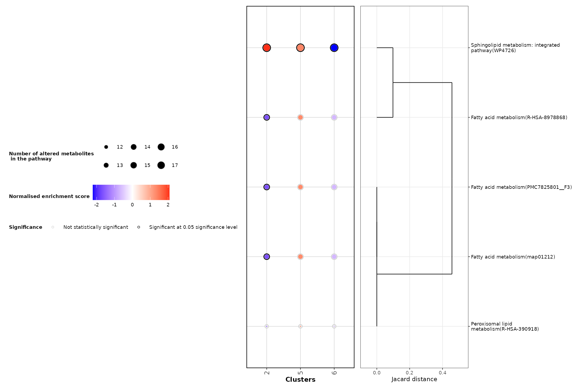

This plot highlights that cluster 5 (bladder muscle) is enriched for
`Biochemical pathways`. Alternatively, the urothelium (cluster 6) is
shown to down regulate numerous pathways including
`Sphingolipid metabolism`. This matches with previous research
suggesting that the metabolism of sphingolipids is mainly associated
with muscle cells of the badder.

These results may not tell the entire story however, the ‘SSC’
clustering results do not capture every region of the tissue according
to the original publication. There is a specific area between the
bladder and urothelium called the ‘lamina propria’ which is currently
unidentifiable based on the ‘SSC’ clustering result (this was also
mentioned in the [original
paper](https://doi.org/10.1038/s41592-023-02070-z)).

  

### Clustering using PCA and Seurat

Because SpaMTP is built on the foundations of a *Seurat* Object, it
allows the user to still use many useful *Seurat* functions on their
spatial metabolomic data using SpaMTP. Below, we will demonstrate how to
use metabolite-based PCA results from **SpaMTP**, along with *Seurat’s*
clustering functions, to identify this rare cell type known as the
([lamina propria](https://doi.org/10.1002/anie.200905559)).

First we will run clustering:

``` r

ROI <- RunMetabolicPCA(ROI, assay = "Spatial", slot = "counts")
ROI <- FindNeighbors(ROI, dims = 1:30, verbose = FALSE) # use the SpaMTP object generated from PCA Pathway Analysis
ROI <- RunUMAP(ROI, dims = 1:30, verbose = FALSE)
ROI <- FindClusters(ROI, resolution = 0.3, cluster.name = "clusters", verbose = FALSE)
```

Now, lets plot the results:

``` r

## Custom palette for SpaMTP/Seurat Clustering
SpaMTP_palette = list("0" = "#0074B0", 
                      "1" = "#008E87", 
                      "2" = "#DE4D6C",
                      "3" = "#BF212E", 
                      "4" = "#C2B03B" ,
                      "5" = "#92f09a",
                      "6" = "#9FBEAC")

DimPlot(ROI, group.by = "clusters", cols = SpaMTP_palette, pt.size = 2) | ImageDimPlot(ROI, size = 2, group.by = "clusters", cols = SpaMTP_palette)  + coord_flip() + scale_x_reverse()
```

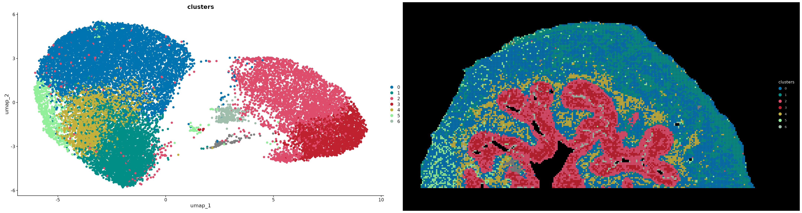

Comparing these results to the SSC segmentation we can see this
clustering can still detect the urinary bladder muscle (cluster 0/1),
urothelium (cluster 2/3) and the adventitia (cluster 4). In addition, we
are able to detect a region that matches a similar location to that of
the lamina propria (cluster 5) identified by the original publication.

### Finding Spatially Correlated Metabolites

An added benefit of using spatial technologies rather then
single-cell/bulk methods is the retainment of spatial context. This
allows us to analyse trends across the whole tissue section that would
otherwise be lost in bulk analyses.

In the original publication they defined an m/z = 743.5482 as the lamina
propria.

Lets use SpaMTP’s feature co-localisation function to check the top
metabolites that spatially correlate to cluster 5!

``` r

correlated_features <- FindCorrelatedFeatures(ROI, ident = "clusters", SM.assay = "Spatial", nfeatures = 6) #find the spatial correlation between each cluster and their relative metabolites
```

Because we are interested in the lamina propria, lets focus on the top
correlated metabolites with cluster 5:

``` r

df <- correlated_features[correlated_features$ident == "5",] # subsets to only include results from cluster 5
df$mz_name <- paste0("mz-",round(df$mz, digits = 6)) # simplifies the m/z names for the plot

## Plots the top 10 results
ggplot(df, aes(x = -rank, y = correlation)) + geom_bar(stat = "identity") + geom_text(aes(label = mz_name), vjust = -0.5, size = 3, color = "black") + coord_flip() + theme_classic()
```


We can see that our top hit is m/z = 734.5467, which is described in
*Cardinal’s* paper as the peak defining the lamina propria.

We can check by looking at the spatial expression of this m/z:

``` r

## Formats Plots 
plots <- list()
for (i in c("0", "2", "3", "4", "5")){
    suppressWarnings(clst <- subset(ROI, subset = clusters %in% i))
    plots[[i]] <- ImageDimPlot(clst, group.by = "clusters", cols = SpaMTP_palette, size = 1.5)
}
plots[["mz"]] <- ImageFeaturePlot(ROI, features = 'mz-743.546752929688', size = 1.2) & scale_fill_gradientn(colors = viridis::turbo(100)) 


## Plots data
patchwork::wrap_plots(plots, ncol = 3, nrow = 2)& coord_flip() & scale_x_reverse()
```

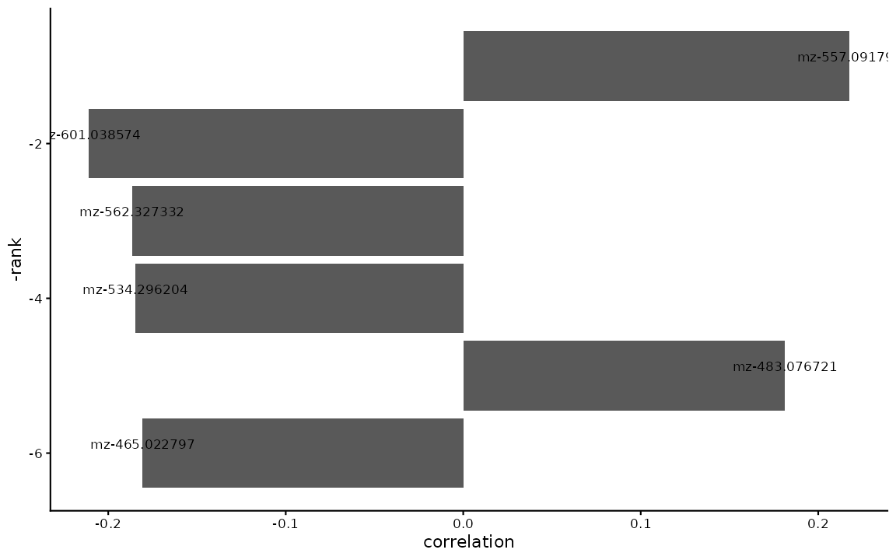

In addition to finding correlated m/z’s based on spatial location, we
can also identify metabolites that demonstrate a strong spatial pattern.
This is done using Moran’s I scores to determine the most spatially
variable features.

``` r

ROI <- FindSpatiallyVariableMetabolites(
  ROI,
  assay = "Spatial",
  image = "fov",
  max_spots = 2000
) # Bounds the dense Moran's I distance matrix for the documentation runner.

ImageFeaturePlot(ROI, features = GetSpatiallyVariableMetabolites(ROI, assay = "Spatial", n = 6), size = 1)  & coord_flip() & scale_x_reverse()
```

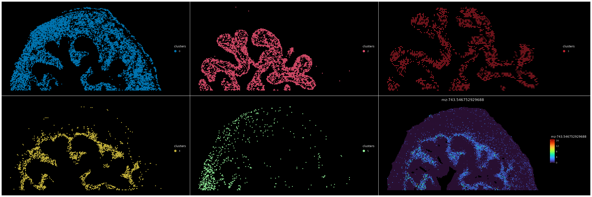

### Switching between SpaMTP and Cardinal Objects

Similar to before we can interchangeably convert our data between
*SpaMTP* and *Cardinal* objects, meaning pre-processing or analysis
tools from either package can be used at any point during the analysis
pipeline.

As an example, we can convert our *SpaMTP* object to *Cardinal* to
generate a figure overlaying key m/z values. Lets first convert our
data:

``` r

bladder_cardinal <- ConvertSeuratToCardinal(data = ROI, assay = "Spatial", slot = "counts")
```

    Gathering Intensity, m/z values and metadata from Seurat Object ...

    Converting intensity matrix and Generating Cardinal Object ...

``` r

bladder_cardinal
```

    ## MSImagingExperiment with 156 features and 21164 spectra 
    ## spectraData(1): intensity
    ## featureData(1): mz
    ## pixelData(13): x, y, run, ..., Seurat_metadata.GPs, Seurat_metadata.clusters, Seurat_metadata.seurat_clusters
    ## coord(2): x = 9...247, y = 11...134
    ## runNames(1): run0
    ## mass range: 403.0434 to 994.1133 
    ## centroided: NA

We can see that the Object layout is correct and we have 79 annotated
m/z values and our seurat metadata has also been stored in the
`pixelData` slot. Next we can generate a plot using Cardinal:

``` r

image(bladder_cardinal, mz=c(798.5410, 741.5307, 743.5482),
        main="Mouse urinary bladder",
        col=c("red", "lightblue", "green"),
        contrast.enhance="suppress",
        smooth.image="adaptive",
        normalize.image="linear",
        superpose=TRUE)
```

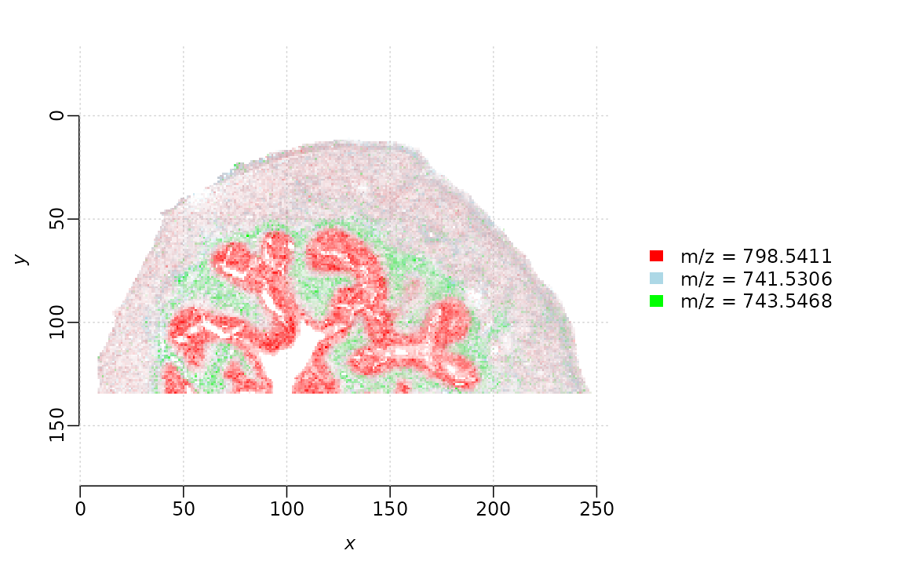

``` r

image(bladder_cardinal, "Seurat_metadata.clusters", col = unlist(unname(SpaMTP_palette)))
```

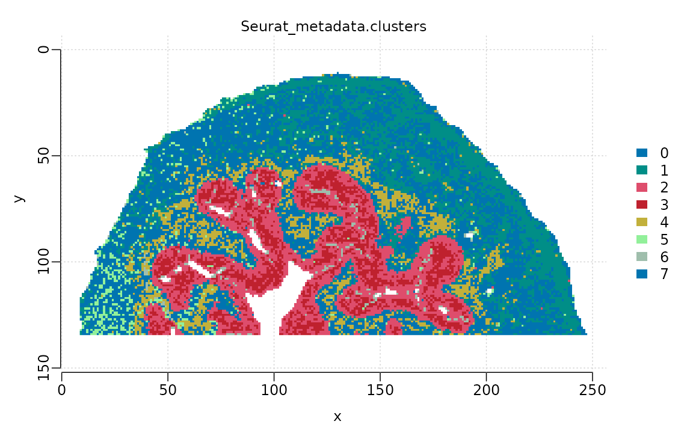 We
can see based on this ion image overlay plot that the three selected
*m/z* values correspond quite significantly with our *Seurat* based
clustering. 743.5482 clearly maps cluster 5 (green), whereas 798.5410
corresponds to cluster 2 and 3 (red).

### Additional Pathway Analysis

We can also run pathway analysis on the new clustering results. Lets do
that now, this time using *Seurat’s* `FindAllMarker()` function to
calculating DE metabolites, highlighting ***SpaMTP’s*** flexibility. You
will see below that `FindAllMarker()` requires normalised data.
***SpaMTP*** has a
[`NormalizeSMData()`](https://genomicsmachinelearning.github.io/SpaMTP/developmental/reference/NormalizeSMData.md)
function that allows for *TIC* (Total Ion Current) normalisation. For
more info on this form of normalisation, please read [Jauhiainen et.al
(2014)](https://doi.org/10.1093/bioinformatics/btu175).

``` r

## Annotate ROI with additional datasets
ROI <- AnnotateSM(
  ROI,
  db = NULL,
  polarity = "positive",
  min_score = 0
)

## Performs TIC normalisation
ROI <- NormalizeSMData(ROI)

## Run FindAllMarkers() on clustering results
Idents(ROI) <- "clusters"
DE <- FindAllMarkers(ROI, assay = "Spatial")

## Runs Pathway Analysis between clusters
DE_pathways <- FindRegionalPathways(SpaMTP = ROI,
                                ident = "clusters",
                                DE.list = list(DE),
                                analyte_types = c("metabolites"),
                                SM_assay = "Spatial",
                                ST_assay = NULL,
                                annotation_score_threshold = pathway_annotation_score_threshold,
                                pval_cutoff_mets = pathway_metabolite_pval_cutoff)
```

Below, we will visualise the top 5 pathways differentially expressed
between clusters:

``` r

PlotRegionalPathways(regpathway = DE_pathways, num_display = 4)
```

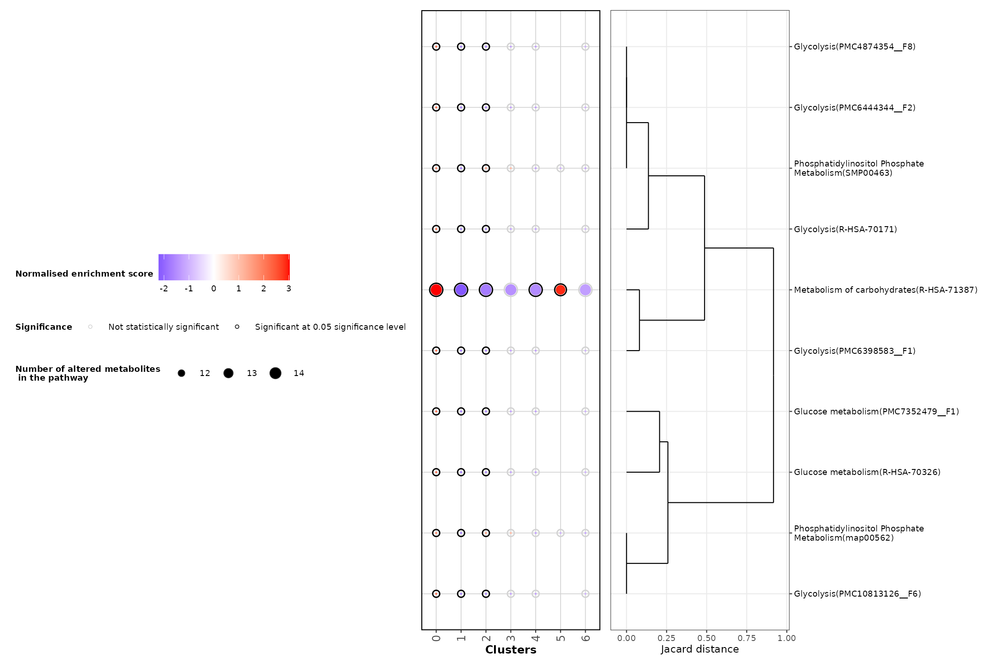

We can also plots some key pathways of interest that were also
upregulated in our dataset.

``` r

key_pathways <- c("Biochemical pathways: part I","G alpha (i) signalling events","Metabolism of carbohydrates","Sphingolipid metabolism: integrated pathway",
                  "Sensory perception of sweet, bitter, and umami (glutamate) taste", "Sensory perception of taste",
                  "G alpha (i) signaling events")

PlotRegionalPathways(regpathway = DE_pathways, selected_pathways = key_pathways)
```

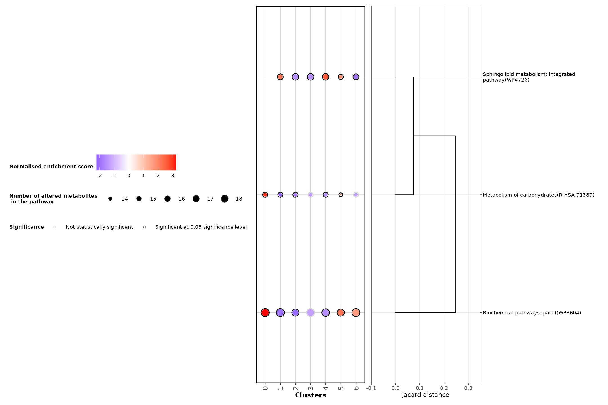

Based on these findings, we observe that the lamina propria (cluster 5)
has an up regulation of metabolites associated with sensory perception
pathways. This matches with biology, as this is the layer of the bladder
that contains sensory neurons.

There are a large range of additional applications SpaMTP can be used
for, such as, multi-modality analysis using both spatial transcriptomics
and spatial metabolomics. Check out the SpaMTP github or documentation
site for more.

### Session Info

``` r

sessionInfo()
```

    ## R version 4.6.1 (2026-06-24)
    ## Platform: x86_64-pc-linux-gnu
    ## Running under: Ubuntu 24.04.4 LTS
    ## 
    ## Matrix products: default
    ## BLAS:   /usr/lib/x86_64-linux-gnu/openblas-pthread/libblas.so.3 
    ## LAPACK: /usr/lib/x86_64-linux-gnu/openblas-pthread/libopenblasp-r0.3.26.so;  LAPACK version 3.12.0
    ## 
    ## locale:
    ##  [1] LC_CTYPE=C.UTF-8       LC_NUMERIC=C           LC_TIME=C.UTF-8       
    ##  [4] LC_COLLATE=C.UTF-8     LC_MONETARY=C.UTF-8    LC_MESSAGES=C.UTF-8   
    ##  [7] LC_PAPER=C.UTF-8       LC_NAME=C              LC_ADDRESS=C          
    ## [10] LC_TELEPHONE=C         LC_MEASUREMENT=C.UTF-8 LC_IDENTIFICATION=C   
    ## 
    ## time zone: UTC
    ## tzcode source: system (glibc)
    ## 
    ## attached base packages:
    ## [1] stats4    stats     graphics  grDevices utils     datasets  methods  
    ## [8] base     
    ## 
    ## other attached packages:
    ##  [1] future_1.75.0          kableExtra_1.4.1       knitr_1.51            
    ##  [4] htmltools_0.5.9        viridis_0.6.5          viridisLite_0.4.3     
    ##  [7] EnhancedVolcano_1.30.0 ggrepel_0.9.8          ggplot2_4.0.3         
    ## [10] dplyr_1.2.1            Seurat_5.5.1           SeuratObject_5.4.0    
    ## [13] sp_2.2-3               Cardinal_3.14.0        S4Vectors_0.50.1      
    ## [16] ProtGenerics_1.44.0    BiocGenerics_0.58.1    generics_0.1.4        
    ## [19] BiocParallel_1.46.0    SpaMTP_1.1.0.9000     
    ## 
    ## loaded via a namespace (and not attached):
    ##   [1] RcppAnnoy_0.0.23            splines_4.6.1              
    ##   [3] later_1.4.8                 tibble_3.3.1               
    ##   [5] polyclip_1.10-7             fastDummies_1.7.6          
    ##   [7] lifecycle_1.0.5             sf_1.1-2                   
    ##   [9] edgeR_4.10.3                globals_0.19.1             
    ##  [11] lattice_0.22-9              MASS_7.3-65                
    ##  [13] crosstalk_1.2.2             magrittr_2.0.5             
    ##  [15] limma_3.68.5                plotly_4.12.1              
    ##  [17] sass_0.4.10                 rmarkdown_2.31             
    ##  [19] jquerylib_0.1.4             yaml_2.3.12                
    ##  [21] httpuv_1.6.17               otel_0.2.0                 
    ##  [23] sctransform_0.4.3           spam_2.11-4                
    ##  [25] spatstat.sparse_3.2-0       reticulate_1.46.0          
    ##  [27] cowplot_1.2.0               pbapply_1.7-4              
    ##  [29] DBI_1.3.0                   RColorBrewer_1.1-3         
    ##  [31] abind_1.4-8                 Rtsne_0.17                 
    ##  [33] GenomicRanges_1.64.0        purrr_1.2.2                
    ##  [35] downlit_0.4.5               IRanges_2.46.0             
    ##  [37] irlba_2.3.7                 listenv_1.0.0              
    ##  [39] spatstat.utils_3.2-4        pheatmap_1.0.13            
    ##  [41] units_1.0-1                 goftest_1.2-3              
    ##  [43] RSpectra_0.16-2             spatstat.random_3.5-1      
    ##  [45] matter_2.14.0               fitdistrplus_1.2-6         
    ##  [47] parallelly_1.48.0           pkgdown_2.2.1              
    ##  [49] svglite_2.2.2               DelayedArray_0.38.2        
    ##  [51] codetools_0.2-20            scuttle_1.22.0             
    ##  [53] xml2_1.6.0                  tidyselect_1.2.1           
    ##  [55] farver_2.1.2                ScaledMatrix_1.20.0        
    ##  [57] matrixStats_1.5.0           spatstat.explore_3.8-2     
    ##  [59] Seqinfo_1.2.0               jsonlite_2.0.0             
    ##  [61] BiocNeighbors_2.6.0         CardinalIO_1.10.0          
    ##  [63] e1071_1.7-17                progressr_1.0.0            
    ##  [65] scater_1.40.2               ggridges_0.5.7             
    ##  [67] survival_3.8-6              systemfonts_1.3.2          
    ##  [69] ggnewscale_0.5.2            tools_4.6.1                
    ##  [71] ragg_1.5.2                  ica_1.0-3                  
    ##  [73] Rcpp_1.1.2                  glue_1.8.1                 
    ##  [75] SparseArray_1.12.2          gridExtra_2.3.1            
    ##  [77] xfun_0.60                   MatrixGenerics_1.24.0      
    ##  [79] withr_3.0.3                 fastmap_1.2.0              
    ##  [81] shinyjs_2.1.1               rsvd_1.0.5                 
    ##  [83] digest_0.6.39               R6_2.6.1                   
    ##  [85] mime_0.13                   textshaping_1.0.5          
    ##  [87] scattermore_1.2             tensor_1.5.1               
    ##  [89] spatstat.data_3.1-9         tidyr_1.3.2                
    ##  [91] data.table_1.18.4           class_7.3-23               
    ##  [93] S4Arrays_1.12.0             httr_1.4.8                 
    ##  [95] htmlwidgets_1.6.4           ontologyIndex_2.12         
    ##  [97] whisker_0.4.1               uwot_0.2.4                 
    ##  [99] pkgconfig_2.0.3             gtable_0.3.6               
    ## [101] lmtest_0.9-40               S7_0.2.2                   
    ## [103] XVector_0.52.0              SingleCellExperiment_1.34.0
    ## [105] fgsea_1.38.0                dotCall64_1.2              
    ## [107] scales_1.4.0                Biobase_2.72.0             
    ## [109] png_0.1-9                   spatstat.univar_3.2-0      
    ## [111] ggdendro_0.2.0              rstudioapi_0.19.0          
    ## [113] reshape2_1.4.5              nlme_3.1-169               
    ## [115] proxy_0.4-29                cachem_1.1.0               
    ## [117] zoo_1.9-0                   stringr_1.6.0              
    ## [119] KernSmooth_2.23-26          vipor_0.4.7                
    ## [121] parallel_4.6.1              miniUI_0.1.2               
    ## [123] desc_1.4.3                  pillar_1.11.1              
    ## [125] grid_4.6.1                  vctrs_0.7.3                
    ## [127] RANN_2.6.2                  promises_1.5.0             
    ## [129] BiocSingular_1.28.0         beachmat_2.28.0            
    ## [131] xtable_1.8-8                cluster_2.1.8.2            
    ## [133] beeswarm_0.4.0              evaluate_1.0.5             
    ## [135] zeallot_0.2.0               locfit_1.5-9.12            
    ## [137] cli_3.6.6                   compiler_4.6.1             
    ## [139] rlang_1.3.0                 rgoslin_1.16.0             
    ## [141] future.apply_1.20.2         labeling_0.4.3             
    ## [143] classInt_0.4-11             ggbeeswarm_0.7.3           
    ## [145] plyr_1.8.9                  fs_2.1.0                   
    ## [147] stringi_1.8.9               deldir_2.0-4               
    ## [149] spatstat.geom_3.8-2         Matrix_1.7-5               
    ## [151] RcppHNSW_0.7.0              patchwork_1.3.2            
    ## [153] statmod_1.5.2               shiny_1.14.0               
    ## [155] SummarizedExperiment_1.42.0 ROCR_1.0-12                
    ## [157] igraph_2.3.3                memoise_2.0.1              
    ## [159] bslib_0.12.0                fastmatch_1.1-8            
    ## [161] ape_5.8-1
