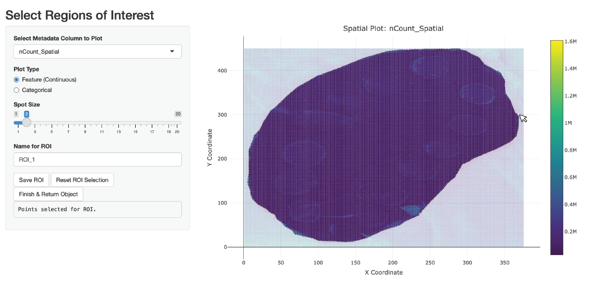

```{r, include = FALSE}
knitr::opts_chunk$set(
  collapse = FALSE,
  comment = "##",
  fig.width = 7,       # smaller inches
  fig.height = 4,      # proportionate aspect ratio
  dpi = 72,
  fig.align = 'center',
  dev.args = list(png = list(compression = 9))  # max compression
)
```


# Handling Large SM Datasets

SpaMTP is suitable for datasets of all sizes. However, extra large datasets may need special handling to speed up the analysis process. To demonstrate some helpful functions for processing large datasets we will use a public mouse liver dataset with spotted chemicals standards published [here]( https://doi.org/10.1101/2024.10.14.618269).

Author: Andrew Causer

<br>


## Import *R* Libraries and Load Data

First we need to import the required libraries for this analysis.

```{r load_packages, warning=FALSE, message=FALSE}
## Install SpaMTP if not previously installed
if (!require("SpaMTP"))
    devtools::install_github("GenomicsMachineLearning/SpaMTP")

#General Libraries
library(SpaMTP)
library(Cardinal)
library(Seurat)
library(dplyr)

#For plotting + DE plots
library(ggplot2)
library(EnhancedVolcano)
library(viridis)
```

Next we will load the data, you can download or load it directly from the [*SpaMTP* zenodo page](https://zenodo.org/communities/spamtp/records).  

```{r eval=FALSE, warning=FALSE, message=FALSE}
spotted_large <- Cardinal::readImzML("./Spotted/2020-12-05_ME_X190_L1_Spotted_20umss_375x450_33at_DAN_Neg",resolution = 3, mass.range = c(100,1000), memory = T)
```


```{r eval=FALSE, warning=FALSE, message=FALSE}
spotted_large
```

    MSImagingExperiment with 767528 features and 168750 spectra 
    spectraData(1): intensity
    featureData(1): mz
    pixelData(3): x, y, run
    coord(2): x = 1...375, y = 1...450
    runNames(1): 2020-12-05_ME_X190_L1_Spotted_20umss_375x450_33at_DAN_Neg
    experimentData(8): spectrumType, instrumentModel, ionSource, ..., scanPattern, scanType, lineScanDirection
    mass range: 100.0000 to 999.9959 
    centroided: NA 


You can see our dataset has 767,529 features and 168,750 pixels. This is quite a large dataset that will require alot of memory to process. However, it is likely we don't need to analyse all the features and pixels to generate meaningful biological conclusion.

## Annotating Large Datasets

Using the function `AnnotateBigData` we can find m/z values that were successfully annotated and only perform the remainder of the downstream analyses using these.


```{r eval=FALSE, warning=FALSE, message=FALSE}
## Get all the m/z values from our cardinal object
mzs <- data.frame(Cardinal::featureData(spotted_large))$mz

## Annotate each m/z value
results <- AnnotateBigData(mzs, db = HMDB_db, ppm_error = 3, adducts = c("M-H", "M+Cl"), polarity = "negative") 
```

```{r, eval=FALSE}
dim(results)[1]
```

    [1] 67060


We can now see we successfully annotated 67,060 different m/z values which will reduce our dataset size by up to ~11.5x.

Lets look at the annoated results:


```{r, echo=TRUE, eval=FALSE}
head(results, n = 5)
```

<div style="margin-left: auto;
            margin-right: auto">
```{r, echo=FALSE}
df <- read.csv("https://zenodo.org/records/17288700/files/results_spotted.csv?download=1", row.names = 1)
df %>%
    knitr::kable(format = "html", table.attr = "class='dataframe'", align = "c") %>%
    kableExtra::kable_styling(bootstrap_options = c("striped", "hover", "condensed", "responsive"),
              full_width = FALSE, position = "center") %>%
    kableExtra::row_spec(0, bold = TRUE)%>%
    kableExtra::row_spec(1:nrow(df), extra_css = "border-bottom: 1px solid #ddd; border-top: 1px solid #ddd;")
```
</div>

We can then use these m/z values to subset our results and then generate our SpaMTP Seurat object.

```{r, eval=FALSE, warning=FALSE, message=FALSE}
## Subset cardinal object
spotted_small <- Cardinal::subset(spotted_large, mz %in% results$observed_mz)

## Convert Cardinal object to SpaMTP object
spotted_small <- CardinalToSeurat(spotted_small)
```


## Region of Interest Selection

Now we have our filtered SpaMTP data object lets plot it.
```{r, include=FALSE}
options(timeout = 600)
spotted_small <- readRDS(url("https://zenodo.org/records/17288700/files/spotted_small_ROI.RDS?download=1"))
```


```{r, warning=FALSE, message=FALSE}
ImageFeaturePlot(spotted_small, features = "nCount_Spatial", dark.background = F)& scale_fill_gradientn(colors = viridis::viridis(100), limits = c(0, 400000), na.value = viridis::viridis(100)[100])
```

We can see that there are alot of pixels outside the tissue section that are clearly noise with high intensity values. We could remove these using filtering methods, but for the purpose of demonstrating the built-in ROI selection tool, we can also use SpaMTP to manually select the region we wish to analyses.

Lets run this below and see an example of how to use this:
```{r, eval=FALSE}
spotted_small <- SelectROIs(spotted_small)
```

<iframe src="https://agc888.shinyapps.io/SelectROI/" width="100%" height="600px"></iframe>

<br>


Here is an example of what the selection might look like:

```{r echo=FALSE, fig.align="center", out.width="80%", dpi=72}

```


```{r, echo=TRUE, results='hide', warning=FALSE, message=FALSE}
head(spotted_small) %>% select(tail(names(.), 3))
```

```{r echo=FALSE, results='asis', warning=FALSE, message=FALSE}
cat('<div style="width: fit-content; display: block; margin-left: auto; margin-right: auto;">')
df <- head(spotted_small) %>% select(tail(names(.), 3))
  df %>%
    knitr::kable(format = "html",
                 table.attr = "class='dataframe'",
                 align = "c") %>%
    kableExtra::kable_styling(
      bootstrap_options = c("striped", "hover", "condensed", "responsive"),
      full_width = FALSE
    ) %>%
    kableExtra::row_spec(0, bold = TRUE) %>%
    kableExtra::row_spec(1:nrow(df),
                         extra_css = "border-bottom:1px solid #ddd; border-top:1px solid #ddd;")
cat('</div>')
```


Looking at the last 3 columns we can see our saved ROI selection area. Lets plot it visually:

```{r, warning=FALSE, message=FALSE}
ImageDimPlot(spotted_small, group.by = "ROI_1", dark.background = F)
```

Now we can simply subset our dataset:

```{r, warning=FALSE, message=FALSE}
spotted_small <- subset(spotted_small, subset = ROI_1 == "1")

ImageFeaturePlot(spotted_small, features = "nCount_Spatial", dark.background = F)& scale_fill_gradientn(colors = viridis::viridis(100), limits = c(0, 400000), na.value = viridis::viridis(100)[100])
```


## Session Info

```{r}
sessionInfo()
```

