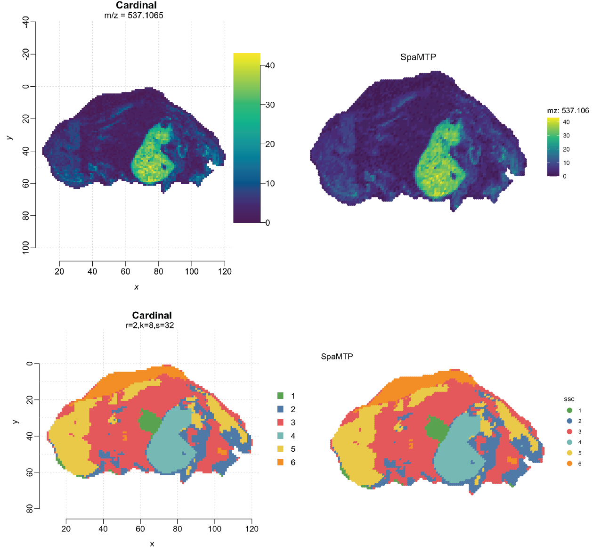

```{r, include = FALSE}
knitr::opts_chunk$set(
  collapse = FALSE,
  comment = "##",
  fig.width = 7,       # smaller inches
  fig.height = 4,      # proportionate aspect ratio
  dpi = 72,
  fig.align = 'center',
  dev.args = list(png = list(compression = 9))  # max compression
)
```


# Analsysing Spatial Metabolomic Data with SpaMTP

This tutorial highlights the utility of [**SpaMTP**](https://github.com/GenomicsMachineLearning/SpaMTP) for analysing pixel level or single-cell resolution spatial metabolomics (SM) data. Note: This tutorial has been updated for compatibility with **Cardinal V3.8**.

Using **SpaMTP** we will highlight:

* Loading Spatial Metabolomic (SM) Data
* Using *Cardinal* tools - Tissue Segmentation using SSC
* Automated Metabolite Annotation of m/z Masses
* Simplifying Lipid Nomenclature into Lipid Categories and Classes
* Differential Expression Analysis of Annotated Metabolites
* Metabolite Expression Visualisation
* Pathway Analysis
* Re-Clustering using PCA and Seurat
* Finding Spatially Correlated Metabolites


Author: Andrew Causer

<br>


## Install and Import *R* Libraries

First we need to import the required libraries for this analysis.

```{r load_packages, warning=FALSE, message=FALSE}
## Install SpaMTP if not previously installed
if (!require("SpaMTP"))
    devtools::install_github("GenomicsMachineLearning/SpaMTP")

#General Libraries
library(SpaMTP)
library(Cardinal)
library(Seurat)
library(dplyr)

#For plotting + DE plots
library(ggplot2)
library(EnhancedVolcano)
library(viridis)
```

```{r, include=FALSE}
options(timeout = 600)
retry_download <- function(url, dest, attempts = 3) {
  for (i in seq_len(attempts)) {
    ok <- tryCatch({
      download.file(url, dest, mode = "wb", quiet = TRUE, method = "libcurl")
      TRUE
    }, error = function(e) {
      message("Download failed (attempt ", i, "): ", conditionMessage(e))
      if (file.exists(dest)) {
        unlink(dest)
      }
      FALSE
    })
    if (ok) return(invisible(TRUE))
    Sys.sleep(i * 2)
  }
  stop("Download failed after ", attempts, " attempts: ", url)
}
```

<br>

## Load SM Data using SpaMTP

There are three main ways to load data with *SpaMTP*. To demonstrate each we will use three different public datasets which you can download or load directly from [*SpaMTP* zenodo page](https://zenodo.org/communities/spamtp/records). 


### 1. Converting From a Cardinal Object

The first method is to convert a already loaded *Cardinal* object directly to a *SpaMTP* object. This will allow users to analyse any pre-existing cardinal dataset using SpaMTP, and also use pre-processing tools implemented by both packages. To demonstrate this we will load, process and convert the 'PIGII_206' [pig fetus dataset](https://bioconductor.org/packages/release/data/experiment/vignettes/CardinalWorkflows/inst/doc/MSI-segmentation.html).


```{r warning=FALSE, message=FALSE}
# Load directly from file
#pig206 <- readRDS("./Documents/pig206.RDS")

# Load directly from URL
pig206_url <- "https://zenodo.org/records/17246555/files/pig206.RDS?download=1"
pig206_path <- "vignette_data_files/Mouse_Urinary_Bladder/pig206.RDS"
if (!file.exists(pig206_path)) {
  dir.create(dirname(pig206_path), recursive = TRUE, showWarnings = FALSE)
  retry_download(pig206_url, pig206_path)
}
pig206 <- readRDS(pig206_path)
```

```{r warning=FALSE, message=FALSE}
pig206
```

This is an unprocessed cardinal object containing 4,959 spectra with 10,200 m/z values ranging between 150 to 1000 m/z. This object can then be processed following [*Cardinal's* vignette](https://bioconductor.org/packages/release/data/experiment/vignettes/CardinalWorkflows/inst/doc/MSI-segmentation.html).

```{r warning=FALSE, message=FALSE}
pig206 <- summarizeFeatures(pig206, c(Mean="mean"))

pig206_peaks <- pig206 |>
    normalize(method="tic") |>
    peakProcess(SNR=3, sampleSize=0.1,
        tolerance=0.5, units="mz")

```


```{r warning=FALSE, message=FALSE}
pig206_peaks
```

Following our processing steps the cleaned dataset contains 687 peaks. Using *Cardinal* we can visualise one of these peaks (m/z 537) below which is abundant in the pig liver. 

```{r fig.width=7, fig.height=4, dpi = 72, dev.args = list(bg = "#ffffff")}
image(pig206_peaks, mz=537.08)
```

In addition to pre-processing methods, we can also run additional analyses such as *Cardinal's* tissue segmentation with spatial shrunken centroids (ssc). 

Following the [*Cardinal's* vignette](https://bioconductor.org/packages/release/data/experiment/vignettes/CardinalWorkflows/inst/doc/MSI-segmentation.html), we will use the same values for: 

* Spatial neighborhood radius  = 2
* Maximum number of segments/clusters = 8
* Sparsity thresholding parameter = 2,4,8,16,32,64


```{r warning=FALSE, message=FALSE}
set.seed(1)
pig206_ssc <- spatialShrunkenCentroids(pig206_peaks,
    weights="adaptive", r=2, k=8, s=2^(1:6))
```


```{r fig.width=7, fig.height=4, dpi = 72, dev.args = list(bg = "#ffffff")}

col_palette = list("1" = "#5aa14f",
                   "2" = "#4f79a6",
                   "3" = "#e2585a",
                   "4" = "#76b8b3", 
                   "5" = "#ebc948", 
                   "6" = "#f18e29")

image(pig206_ssc, i=5,type="class",col= unlist(unname(col_palette)))
```

From this we can see areas such as the liver, heart, and brain distinguished as segments 4, 1, and 5 respectively, as presented in the original *Cardinal* vignette. 

Although the majority of functions within the SpaMTP package are used as wrappers for analysing and modifying Seurat objects, there are a few functions that are designed to assist in SM analysis in Cardinal. The function below is one, which allows you to add the SCC results back to a spectral Cardinal Object, stored in the `pixelData` slot. 

```{r, warning=FALSE, message=FALSE}
pig206_peaks <- add_ssc_annotation(pig206_peaks, pig206_ssc, resolution = "r=2,k=8,s=32")
```

```{r warning=FALSE, message=FALSE}
pig206_peaks
```


Once finished with the analysis using *Cardinal* we can use the *SpaMTP* function `CardinalToSeurat` to generate a SpaMTP object from the processed data.


```{r warning=FALSE, message=FALSE}
pig206_spamtp <- CardinalToSeurat(pig206_peaks)
```

```{r warning=FALSE, message=FALSE}
pig206_spamtp
```

We can see like the *Cardinal* object, the converted *SpaMTP* object also contains 687 peaks and 4,959 pixels. Furthermore, our ssc results are stored in our *SpaMTP* object metadata.

```{r, echo=TRUE, results='hide'}
head(pig206_spamtp@meta.data, n = 5)
```

```{r echo=FALSE, results='asis', warning=FALSE, message=FALSE}
cat('<div style="width: fit-content; display: block; margin-left: auto; margin-right: auto;">')
df <- head(pig206_spamtp@meta.data, n = 5)[,c(1:3,5:8)]
#htmltools::div(
#  style = "margin-left:auto; margin-right:auto; display:table;",
  df %>%
    knitr::kable(format = "html",
                 table.attr = "class='dataframe'",
                 align = "c") %>%
    kableExtra::kable_styling(
      bootstrap_options = c("striped", "hover", "condensed", "responsive"),
      full_width = FALSE
    ) %>%
    kableExtra::row_spec(0, bold = TRUE) %>%
    kableExtra::row_spec(1:nrow(df),
                         extra_css = "border-bottom:1px solid #ddd; border-top:1px solid #ddd;")
cat('</div>')
```

Lets also generate some plots to compare:


```{r, eval = FALSE, fig.width=7, fig.height=4, dpi = 72, dev.args=list(bg="#ffffff"), warning=FALSE, message=FALSE}
image(pig206_peaks, mz=537.08)
title("Cardinal", outer = TRUE)
```


```{r, eval = FALSE,fig.width=7, fig.height=4, dpi = 72, dev.args=list(bg="#ffffff"), warning=FALSE, message=FALSE}
ImageMZPlot(pig206_spamtp, mzs = 537.106, size = 2.2, dark.background = F) + scale_x_reverse()+coord_flip()+scale_fill_gradientn(colours = viridis(10))+ ggtitle("SpaMTP")
```


```{r, eval = FALSE,fig.width=7, fig.height=4, dpi = 72, dev.args=list(bg="#ffffff"), warning=FALSE, message=FALSE}
image(pig206_ssc, i=5,type="class",col= unlist(unname(col_palette)))
title("Cardinal", outer = TRUE)
```


```{r, eval=FALSE, fig.width=7, fig.height=4, dpi = 72, dev.args=list(bg="#ffffff"), warning=FALSE, message=FALSE}
ImageDimPlot(pig206_spamtp, group.by = "ssc", size = 2.2, dark.background = F, cols = col_palette) + scale_x_reverse()+coord_flip() + ggtitle("SpaMTP")
```

```{r echo=FALSE, fig.align="center", out.width="100%", dpi=150}

```

We can see the feature and ssc segment plots match between *SpaMTP* and *Cardinal* objects. 

### 2. Load Data Directly

*SpaMTP* also provides a function for loading data directly from .ibd and .imzML files. This `LoadSM` *SpaMTP* function is a wrapper on *Cardinal's readImzML()* function. For more information on how this function works, and the relative inputs it accepts please head to [*Cardinal's* documentation page](https://rdrr.io/bioc/Cardinal/man/readMSIData.html). This function also has capabilities for splitting data containing multiple runs, into individual *SpaMTP* data FOV's. Below we will use the [Human Renal Cell Carcinoma (RCC)](https://www.bioconductor.org/packages/release/data/experiment/vignettes/CardinalWorkflows/inst/doc/MSI-testing.html) public dataset to demonstrate this. 


The corresponding .imzML files can be downloaded directly from [*SpaMTP* zenodo page](https://zenodo.org/records/17246588). 

```{r eval=FALSE, warning=FALSE, message=FALSE}
rcc_spamtp <- LoadSM(file = "./rcc-files/rcc", mass.range = c(150, 1000), multi.run = T)
```

```{r, include=FALSE}
options(timeout = 600)
rcc_url <- "https://zenodo.org/records/17246588/files/rcc.RDS?download=1"
rcc_path <- "vignette_data_files/Mouse_Urinary_Bladder/rcc.RDS"
if (!file.exists(rcc_path)) {
  dir.create(dirname(rcc_path), recursive = TRUE, showWarnings = FALSE)
  retry_download(rcc_url, rcc_path)
}
rcc_spamtp <- readRDS(rcc_path)
```

```{r warning=FALSE, message=FALSE}
rcc_spamtp
```

This dataset contains 10,200 *m/z*-values across 8 different runs which are split into individual FOV's. Each run contains a cancer and normal sample which have been loaded in the metadata. Lets visualise each run in one plot:


```{r warning=FALSE, message=FALSE,fig.width=7, fig.height=4, dpi = 72, dev.args = list(bg = "#ffffff")}
ImageDimPlot(rcc_spamtp, group.by = "diagnosis", dark.background = F, fov = names(rcc_spamtp@images), size = 2, 
             cols = c("red", "blue"),na.value= "white")
```


### 3. Load Intensity Matrix files

The final method of loading SM data into a *SpaMTP* object is through an intensity matrix stored in a `.csv` file. This is different to .ibd and .imzML files that were used above, the layout of this dataset is demonstrated below:

<div style="display: table; margin: auto;">

|  x  | y  | mz_1| mz_2| mz_3| ... | mz_n|         
| :--:| :---:|:---:|:---:|:---:|:---:|:---:|
| 0 | 1 | 0|0|11|...|0|
| 0 | 2 |0|0|0|...|0|
| 0 | 3 |15|0|0|...|32|
| 0 | 4 |20|0|0|...|32|
| 0 | 5 |0|20|0|...|0|

</div>

To demonstrate this we will use a public mouse bladder SM data first published by [Römpp et al.(2010)](https://doi.org/10.1002/anie.200905559), and used in the [*Cardinal V3* article](https://doi.org/10.1038/s41592-023-02070-z). 

NOTE: The data used below is processed data from [*Cardinal's* V3 Vignette (2023)](https://github.com/Vitek-Lab/Cardinal3-vignettes). The raw data is from, "[Histology by Mass Spectrometry: Label-Free Tissue Characterization Obtained from High-Accuracy Bioanalytical Imaging](https://doi.org/10.1002/anie.200905559)",
and can be downloaded from [Project PXD001283](https://www.ebi.ac.uk/pride/archive/projects/PXD001283). 

This dataset will be used for the remainder of the tutorial.

```{r warning=FALSE, message=FALSE}
# Load directly from file
#bladder <- ReadSM_mtx("./Documents/bladder_csv.csv", mz.prefix = "mz-", feature.start.column = 2)

# Load directly from URL
bladder_url <- "https://zenodo.org/records/17246684/files/bladder_csv.csv?download=1"
bladder_path <- "vignette_data_files/Mouse_Urinary_Bladder/bladder_csv.csv"
if (!file.exists(bladder_path)) {
  dir.create(dirname(bladder_path), recursive = TRUE, showWarnings = FALSE)
  retry_download(bladder_url, bladder_path)
}
bladder <- ReadSM_mtx(mtx.file = bladder_path, mz.prefix = "mz-", feature.start.column = 2)
```


```{r warning=FALSE, message=FALSE}
bladder
```
Because *SpaMTP* is built on a *Seurat* Object, we can use useful pre-established *Seurat* and *ggplot2* functions to plot the spatial distribution of the total number of features (m/z's) present per pixel. 


```{r, fig.width=7, fig.height=4, dpi = 72, warning=FALSE, message=FALSE}
ImageFeaturePlot(bladder, features = "nFeature_Spatial", size = 1) + coord_flip() + scale_x_reverse()
```


In addition we can also add metadata such as tissue segmentation results from ssc. These segments were generated following parameters specified in [*Cardinal's* V3 Vignette (2023)](https://github.com/Vitek-Lab/Cardinal3-vignettes), with 'r= 2, k=10, s=24' using 'gausian' weights.

```{r warning=FALSE, message=FALSE}
metadata_url <- "https://zenodo.org/records/17246684/files/bladder_metadata.csv?download=1"
metadata_path <- "vignette_data_files/Mouse_Urinary_Bladder/bladder_metadata.csv"
if (!file.exists(metadata_path)) {
  dir.create(dirname(metadata_path), recursive = TRUE, showWarnings = FALSE)
  retry_download(metadata_url, metadata_path)
}
bladder_metadata <- read.csv(metadata_path, row.names = 1)
```

```{r, echo=TRUE, results='hide'}
head(bladder_metadata, n = 5)
```

```{r echo=FALSE, results='asis', warning=FALSE, message=FALSE}
cat('<div style="width: fit-content; display: block; margin-left: auto; margin-right: auto;">')

df <- head(bladder_metadata, n = 5)
df %>%
    knitr::kable(format = "html", table.attr = "class='dataframe'", align = "cccccccccc") %>%
    kableExtra::kable_styling(bootstrap_options = c("striped", "hover", "condensed", "responsive"),
                  full_width = F, position = "center") %>%
    kableExtra::row_spec(0, bold = TRUE)%>%
    kableExtra::row_spec(1:nrow(df), extra_css = "border-bottom: 1px solid #ddd; border-top: 1px solid #ddd;")

cat('</div>')
```


```{r warning=FALSE, message=FALSE}
bladder@meta.data[colnames(bladder_metadata)]<- bladder_metadata

bladder$ssc <- factor(bladder$ssc) # Required format for some Seurat functions
```

Lets visualise the ssc segmentations added:

```{r fig.width=7, fig.height=4, dpi = 72, dev.args = list(bg = "#ffffff")}
col_palette = list("1" = "#9FBEAC", 
                   "2" = "#C2B03B",
                   "3" = "#F99D1D",
                   "4" = "#008E87", 
                   "5" = "#0074B0",  
                   "6" = "#DE4D6C", 
                   "7" = "#F99D1D",
                   "8" = "#DE4D6C",
                   "9" = "#BF212E")

ImageDimPlot(bladder, group.by = "ssc", cols = col_palette, dark.background = F, size = 2)+ coord_flip() + scale_x_reverse()
```


We can see that our segmentation plot matches [*Cardinal's* previously published results](https://doi.org/10.1038/s41592-023-02070-z). Published in the original paper by [Römpp et al.(2010)](https://doi.org/10.1002/anie.200905559) we will visualise three m/z values that define organ structures within the urinary bladder. 


```{r fig.width=20, fig.height=3, dpi = 72, warning=FALSE, message=FALSE}
ImageMZPlot(bladder, mzs = c(770.5104, 770.56, 741.5307), size = 1.5) & coord_flip() & scale_x_reverse()
```

Based on the plots above, there are a few clusters that are associated with regions outside the tissue. It is clear that cluster 3 and 4 are outside the tissue and can therefore be removed. 

```{r, warning=FALSE, message=FALSE}
ROI <- subset(bladder, subset = ssc %in% c("3", "4"), invert = T) 
```


However, to ensure our dataset is clean of technical noise before we begin downstream analyses we can perform some further data processing and QC.


### Sample Pre-Processing and Quality Control

Pre-processing and quality control (QC) are import steps in any pipeline and should be performed prior to any downstream analysis. For spatial metabolic data, there are various packages which have robust functions and applications for removing technical noise from a SM dataset, these include *Cardinal* and *SCILS-LAB* as previously described. *SpaMTP* also provides general pre-processing functions such as data normalisation, scaling and filtering. 


<br>

Although our data may be normalised and filtered, it still may contains some pixels which are outside the tissue region (cluster 1). To ensure we remove this technical noise we can visualise some QC metrics using *SpaMTP*.


First we will look at the total number of features and total intensity per pixel between our segments:

```{r, fig.width=20, fig.height=5, dpi = 72, warning=FALSE, message=FALSE}
VlnPlot(ROI, features = c("nCount_Spatial", "nFeature_Spatial"),group.by = "ssc",cols = col_palette)+ theme_minimal()
```

Based on this we can see cluster 1 follows a different distribution compared to the other clusters and is also likely outside the tissue regions. Lets also remove this cluster.

```{r, warning=FALSE, message=FALSE}
ROI <- subset(ROI, subset = ssc == 1, invert = T)
```


Another metric to assess is the relative intensity values of each m/z across a sample. It is likely a sign of technical noise in cases where some m/z values present with excessively large intensities in comparison to the rest of the dataset. We can visualise this by comparing our raw data to our normalised and filtered dataset. 


```{r, fig.width=20, fig.height=5, dpi = 72, warning=FALSE, message=FALSE}
raw_bladder_url <- "https://zenodo.org/records/17246684/files/raw_bladder.RDS?download=1"
raw_bladder_path <- "vignette_data_files/Mouse_Urinary_Bladder/raw_bladder.RDS"
if (!file.exists(raw_bladder_path)) {
  dir.create(dirname(raw_bladder_path), recursive = TRUE, showWarnings = FALSE)
  retry_download(raw_bladder_url, raw_bladder_path)
}
raw_bladder <- readRDS(raw_bladder_path) 
if (inherits(raw_bladder, "Seurat")) {
  raw_bladder <- SeuratObject::UpdateSeuratObject(raw_bladder)
}

MZRidgePlot(seurat.obj = raw_bladder, group.by = "ssc", bins = 50, log.data = TRUE, cols = col_palette, verbose = F)+ theme_minimal() +theme(panel.grid = element_blank()) |
MZRidgePlot(seurat.obj = ROI, group.by = "ssc", bins = 50, log.data = TRUE, cols = col_palette, verbose = F)+ theme_minimal() +theme(panel.grid = element_blank())
```


These plots display the intensity of each m/z summed across all pixels per group. Based on this, the majority of m/z values in our processed data display intensities within a similar distribution, across each cluster, suggesting that there are no outlying m/z values. The unprocessed raw data can be seen to contain some m/z values with excessively large intensities which have been removed through processing.  

Using this function we can also look at the distribution of specific features across groups by providing a feature name. Lets try and visualise the total intensity of "mz-740.471557617188" across each cluster using the box.plot function:

```{r, fig.width=20, fig.height=5, dpi = 72, warning=FALSE, message=FALSE}
MZBoxPlot(seurat.obj = ROI,group.by = "ssc", mzs = "mz-740.471557617188", log.data = TRUE, show.points = F, top.cutoff = 0.05,bottom.cutoff = 0.05,cols = col_palette) 
```

Based on this we can see that the "mz = 740.471557617188" is expressed in all clusters and is highest in cluster 6. 

Similar to before we can interchangeably convert our data between *SpaMTP* and *Cardinal* objects, meaning pre-processing or analysis tools from either package can be used at any point during the analysis pipeline. We will demonstrate how to use the `ConvertSeuratToCardinal` function later in this tutorial. As we have demonstrated our data is of good quality we can continue our analysis. 

<br>


## Metabolite Annotation of m/z Masses

One of the major steps in the analysis of metabolomics is the identification/annotation of m/z masses to their relative common metabolite name. There are various public websites that can be used to run this, however, they are often complicated and do not take in an R object or annotate them directly. 

*SpaMTP* has a user-friendly function that assigns possible annotations to each m/z value based on a few variables:

* db: Database to query the m/z masses against -> options are = "HMDB", "LipidMaps", "GNPS" or "ChEBI"
* polarity: Polarity mode the experiment was run in -> either "positive" or "negative"
* adducts: Specify different adduct ions that are likely formed or lost during the mass spectrometry imaging. 


```{r, warning=FALSE, message=FALSE}
bladder_annotated <- AnnotateSM(bladder, db = Lipidmaps_db, ppm_error = 15, adducts = "M+K", polarity = "positive")
```

    Filtering 'Lipidmaps_db' database by M+K adduct/s
    
    Searching database against input m/z's to return annotaiton results
    
    Adding annotations to Seurat Object .... 
    
    Returning Seurat object that include ONLY SUCCESSFULLY ANNOTATED m/z features
    

```{r}
bladder_annotated
```

Following annotation with the [LIPID_MAPS](https://www.lipidmaps.org/) database, there are 79 m/z masses that were successfully annotated!

These annotations are stored in the feature meta.data slot within our SpaMTP Object, lets take a look:

```{r, echo=TRUE, results='hide'}
head(bladder_annotated[["Spatial"]]@meta.data, n = 3)
```

```{r, echo=FALSE}
df <- head(bladder_annotated[["Spatial"]]@meta.data, n = 3)
df %>%
    knitr::kable(format = "html", table.attr = "class='dataframe'", align = "c") %>%
    kableExtra::kable_styling(bootstrap_options = c("striped", "hover", "condensed", "responsive"),
                  full_width = F, position = "center") %>%
    kableExtra::row_spec(0, bold = TRUE)%>%
    kableExtra::row_spec(1:nrow(df), extra_css = "border-bottom: 1px solid #ddd; border-top: 1px solid #ddd;")
```

We can see that for each m/z value, along with all possible annotations, we also observe information including database ID, the adduct used to annotate this metabolite, the common chemical formula, and the plus-minus ppm error between the observed mass and the reference mass of these annotated molecules in our reference dataset.

In addition to storing the m/z annotations in the feature meta.data slot, if save.intermediates = `TRUE` is set within the *AnnotateSM()* function, then an intermediate data.frame will be stored in the `@tools` slot of the SpaMTP object. This data.frame is a less compressed version of the annotation data.frame stored in the feature meta.data slot, which is used later for pathway analysis. For more information visit the hidden window below:

<details>
  <summary>*Storing an intermediate data.frame for downstream pathway analysis*</summary>
```{r}
str(bladder_annotated@tools) #The stored dataframe is called db_3
```

</details> 

<br>

Based on these results, we can now perform a serious of analyses to identify which metabolites are associated with certain biological features/processes. 

<br>


## Simplifying Lipid Nomenclature into Lipid Catagories and Classes


Because lipids are made of many carbon molecules in a long chain there are many different kinds of lipids that share the same molecular weight. This results in some annotations for a mass being very long, due to the numerous possible lipids matching that m/z value. Lets use a SpaMTP function to simplify the lipid nomenclature into common lipid categories and classes! This gives more simplified annotations to a level that most SM datasets are capable of identifying. 


```{r, message=FALSE, results='hide'}
bladder_annotated@assays$Spatial@meta.data <- RefineLipids(bladder_annotated@assays$Spatial@meta.data, annotation.column = "all_IsomerNames", lipid_info = "simple")

refined_annotations <- bladder_annotated@assays$Spatial@meta.data # get the refined annotations from our feature meta.data slot
```


```{r, echo=TRUE, results='hide'}
cat("non-lipid metabolites ... ")
head(refined_annotations, 1)


cat("refined lipid names ... ")
refined_annotations[11,]
```

<div style="margin-left: auto;
            margin-right: auto;
            width: 30%">
| non-lipid metabolites |       
| :----:      |

</div>

```{r, echo=FALSE, collapse=TRUE}

df <- head(refined_annotations, 1)
df %>%
    knitr::kable(format = "html", table.attr = "class='dataframe'", align = "c") %>%
    kableExtra::kable_styling(bootstrap_options = c("striped", "hover", "condensed", "responsive"),
                  full_width = F, position = "center") %>%
    kableExtra::row_spec(0, bold = TRUE)%>%
    kableExtra::row_spec(1:nrow(df), extra_css = "border-bottom: 1px solid #ddd; border-top: 1px solid #ddd;")
```

<br>

<div style="margin-left: auto;
            margin-right: auto;
            width: 30%">
| refined lipid metabolites |       
| :----:      |

</div>

```{r, echo=FALSE, collapse=TRUE}
df <- refined_annotations[11,]
df %>%
    knitr::kable(format = "html", table.attr = "class='dataframe'", align = "c") %>%
    kableExtra::kable_styling(bootstrap_options = c("striped", "hover", "condensed", "responsive"),
                  full_width = F, position = "center") %>%
    kableExtra::row_spec(0, bold = TRUE)%>%
    kableExtra::row_spec(1:nrow(df), extra_css = "border-bottom: 1px solid #ddd; border-top: 1px solid #ddd;")
```


We can see that for metabolites that are not lipids, the names are returned as NA, however those that are annotated as lipids have been simplified into a more human readable format.

Some key m/z masses that were observed and annotated in the [original publication](https://doi.org/10.1002/anie.200905559) are listed in the table below:


<div style="margin-left: auto;
            margin-right: auto;
            width: 30%">
|  m/z mass  | Annotated Metabolite   |       
| :----:      |     :----:              |
| 741.5307       | SM(34:1) | 
| 798.5410      | PC(34:1) |
| 812.5566      | PE(38:1) | 
</div>


Lets see how these m/z's are annotated using ***SpaMTP***:


```{r, echo=TRUE, results='hide'}
key_mzs <- c(741.5307, 798.5410, 812.5566)
key_mz_names <- c()

for (mz in key_mzs){
    key_mz_names <- c(key_mz_names, FindNearestMZ(bladder_annotated, mz)) #Find the nearest m/z in our dataset to the mass provided
}

matches <- refined_annotations[refined_annotations$mz_names %in% key_mz_names,][c("raw_mz","Species.Name.Simple")] 
matches
```


<div style="margin-left: auto;
            margin-right: auto;
            width: 50%">
|| raw_mz  | Species.Name.Simple   |       
|:--:| :----:      |     :----:              |
|196| 741.5306       | **SM(34:1)**; PA(37:1) | 
|231| 798.5411      | **PC(34:1)**; PE(37:1) |
|238| 812.5562      | PC(35:1); **PE(38:1)** | 

</div>


For plotting we will use our subset ROI object.
```{r warning=FALSE, message=FALSE}
ROI <- subset(bladder_annotated, subset = ssc %in% c("2", "5", "6"))
```

```{r, fig.width=20, fig.height=5,dpi=72, warning=FALSE, message=FALSE}
ImageMZAnnotationPlot(ROI, metabolites = c("SM(34:1)", "PC(34:1)"), size = 1, column.name = "Species.Name.Simple", plot.exact = F, dark.background = F, plot.pixel = T) & coord_flip() & scale_x_reverse()  & scale_colour_gradientn(colors = viridis(100)) 
```


We can see that our annotations match those published previously. Due to the limitations with MSI based technologies, we can not exactly identify the chemical structure of each molecule, meaning that some *m/z* values have multiple lipid names/annotations.

<br>

## Differential Expression Analysis of Annotated Metabolites


One key step in understanding biological processes is determining genes, proteins or metabolites that demonstrate significantly different expression between given populations or cell types. Based on the analysis above, for this urinary bladder we identified 3 main tissue regions these being :


<div style="margin-left: auto;
            margin-right: auto;
            width: 30%">

|  ssc segment  | Tissue Region   |       
| :----:      |     :----:              |
| 2       | adventitia | 
| 5      | muscle |
| 6     | urothelium | 

</div>

These regions are identified also in the following references: [1](https://doi.org/10.1002/anie.200905559), [2](https://www.nature.com/articles/s41592-023-02070-z#citeas)


Lets use SpaMTP's *FindAllDEMs()* function to identify differentially expressed m/z metabolites (DEMs) between each of these three tissue regions. This function uses similar methods to those established for genetic data, whereby pixels are pseudo-bulked into random pools and assessed for differential expression ([limma](https://doi.org/10.1093/nar/gkv007). 


```{r, warning=FALSE, message=FALSE}
# Performs pooling, pseudo-bulking and edgeR Differential Expression Analysis
cluster_DEMs <- FindAllDEMs(data = ROI, ident = "ssc", n = 3, logFC_threshold = 1, 
                            DE_output_dir =NULL, return.individual = FALSE, 
                            run_name = "FindAllDEMs", annotation.column = "all_IsomerNames" ) # DE results are returned in a data.frame
```

    Pooling one sample into 3 replicates...
    
    Running limma DE Analysis for  FindAllDEMs  -> with samples [ 5, 2, 6 ]
    
    Starting condition: 5
    
    Starting condition: 2
    
    Starting condition: 6
    


Lets observe the top 10 DE metabolites for each cluster in a heatmap:


```{r, fig.width=15, fig.height=10, dpi=72, dev.args = list(bg = "#ffffff")}
DEMsHeatmap(cluster_DEMs, only.pos = FALSE, order.by = "logFC",
            plot_annotations_column = "annotations", nlabels.to.show = 1, 
            n = 10, save_to_path = NULL
            ,plot.save.height = 10, plot.save.width = 15, annotation_colors = col_palette[c("2","5","6")])
```


We can also observe the spatial expression patterns of some top DE metabolites. 


```{r, fig.width=33, fig.height=10, dpi=72, warning=FALSE, message=FALSE}
(ImageDimPlot(ROI, group.by = "ssc", split.by = "ssc", size = 2, cols = col_palette)/
ImageMZAnnotationPlot(ROI, metabolites = c("LacCer(d18:1/12:0)","SM(d18:0/16:0)","Bastimolide B"), size = 2)) & coord_flip() & scale_x_reverse()
```


We can see that the expression of these metabolites matches the spatial location of each of these three tissue regions quite well.

Noted in the heatmap above, there are many lipids which are identified as being DE. In particular, there are two lipids of interest which have been identified in the original publication as key metabolites that differentiate the muscle (cluster 5) and urothelium (cluster 6). These being SM(34:1) and PC(34:1) respectively. 

The code below performs differential expression analysis just between the the muscle (cluster 5) and urothelium (cluster 6) pixels, to determine if the differential expression of these lipids can be detected.


```{r, warning=FALSE, message=FALSE, results='hide'}
### Subsets the original dataset to only include cluster 5 and 6
ROI_x <- subset(ROI, subset = ssc %in% c("5", "6"))

### Performs differential expression analysis between the two groups
cluster_DEMs_x <- FindAllDEMs(data = ROI_x, ident = "ssc", n = 5, logFC_threshold = 1, 
                           DE_output_dir =NULL, return.individual = FALSE, 
                            run_name = "FindAllDEMs", annotation.column = "all_IsomerNames" )

### Runs lipid nomenclature simplification on the DEM results
cluster_DEMs_x$DEMs <- RefineLipids(cluster_DEMs_x$DEMs, annotation.column = "annotations", lipid_info = "simple")

### Subsets the DEM results to only get up regulated metabolites for cluster 5 and 6
urothelium <- cluster_DEMs_x$DEMs[cluster_DEMs_x$DEMs$cluster == "6",]

### Sets up colouring for significant spots in volcano plot
keyvals <- ifelse(
    urothelium$logFC < 0  & urothelium$P.Value < 10e-4, 'royalblue',
      ifelse(urothelium$logFC > 0 & urothelium$P.Value < 10e-4, 'red',
        'black'))
  keyvals[is.na(keyvals)] <- 'black'
  names(keyvals)[keyvals == 'red'] <- 'Cluster 6'
  names(keyvals)[keyvals == 'black'] <- 'Non-Sig'
  names(keyvals)[keyvals == 'royalblue'] <- 'Cluster 5'

### Changes the shape of the lipid annotations  of interest in volcano plot
metabolites <- matches$Species.Name.Simple[1:2]

keyvals.shape <- ifelse(
    urothelium$Species.Name.Simple == metabolites[1], 15,
      ifelse(urothelium$Species.Name.Simple == metabolites[2], 17,
        20))
  keyvals.shape[is.na(keyvals.shape)] <- 20
  names(keyvals.shape)[keyvals.shape == 20] <- 'Other'
  names(keyvals.shape)[keyvals.shape == 15] <- metabolites[1]
  names(keyvals.shape)[keyvals.shape == 17] <- metabolites[2]

### Plots volcano plot with DEM results
volc_plot <- EnhancedVolcano::EnhancedVolcano( urothelium,
                                  selectLab = metabolites, 
                                  lab = urothelium$Species.Name.Simple,
                                  #FCcutoff = 0,
                                  colCustom = keyvals,
                                  shapeCustom = keyvals.shape,
                                  #cutoffLineType = 'blank',
                                  pCutoff = 10e-4,
                                  FCcutoff = NA,
                                  pointSize = 6,
                                  labSize = 5,
                                  labCol = 'black',
                                  labFace = 'bold',
                                  colAlpha = 4/5,
                                  x = 'logFC',
                                  y = 'P.Value', 
                                  gridlines.major = FALSE,
                                  gridlines.minor = FALSE)
```


```{r, warning=FALSE,message=FALSE,fig.width=10, fig.height=10, dpi=72}
volc_plot
```


In the volcano plot above, we can see that our analysis correctly identified SM(34:1) to be up-regulated in cluster 5, and PC(34:1) was up-regulated in cluster 6. 

Lipids are a key metabolite expressed within the urinary bladder. Lets take a deeper look into the differentially expressed lipids groups with respect to their main category and class:


```{r, message=FALSE, results='hide'}
### Runs lipid nomenclature simplification on the DEM results generated between cluster 2, 5 and 6
cluster_DEMs$DEMs <- RefineLipids(cluster_DEMs$DEMs, annotation.column = "annotations", lipid_info = "simple")
```


```{r, fig.width=7, fig.height=5, dpi=72,warning=FALSE, message=FALSE}
# lets look at the Differenitally expressed Lipids groups
UP <- cluster_DEMs$DEMs[cluster_DEMs$DEMs$regulate == "Up",] # lets get the upregulated lipids for each cluster

# Compute counts of Lipid Maps Categories for 'Up' and 'Down' entries
category_counts <- UP %>%
  group_by(cluster, Lipid.Maps.Category) %>%
  summarise(count = n()) %>%
  ungroup()

category_counts <- category_counts %>%
  mutate(Lipid.Maps.Category = ifelse(is.na(Lipid.Maps.Category), "Non-Lipids", Lipid.Maps.Category))


# Plot bar graph
ggplot(category_counts, aes(x = Lipid.Maps.Category, y = count, fill = cluster)) +
  geom_bar(stat = "identity", position = "dodge") +
  labs(title = "Relative Number of Up Regulated Lipids Grouped by Catagory",
       x = "Lipid Maps Category",
       y = "Count") +
  theme_classic() +
  scale_fill_manual(values = col_palette) 

```


The results displayed in the bar graph above demonstrate the number of different types of lipid **categories** differentially expressed in each cluster. Lipid categories are the most simple/broad annotation of a lipid. For example, GL stands for glycerolipids, which can represent such lipids classes as diglycerols and triglycerols. Likewise, SP stands for sphingolipids, which include lipids from classes such as sphingomyelins and glycosphingolipids. For more information on different lipid categories and classes, please visit the following links ([1](https://doi.org/10.1016%2Fj.bbalip.2011.06.009),[2](https://doi.org/10.1021/acs.analchem.0c01690)).

Lets now look at the different lipid classes that were differentially expressed by each cluster.


```{r, fig.width=15, fig.height=5,dpi=72, warning=FALSE, message=FALSE}
# Compute counts of Lipid Maps Categories for 'Up' and 'Down' entries
category_counts <- UP %>%
  group_by(cluster, Lipid.Maps.Main.Class) %>%
  summarise(count = n()) %>%
  ungroup()

category_counts <- category_counts %>%
  mutate(Lipid.Maps.Category = ifelse(is.na(Lipid.Maps.Main.Class), "Non-Lipids", Lipid.Maps.Main.Class))


# Plot bar graph
ggplot(category_counts, aes(x = Lipid.Maps.Main.Class, y = count, fill = cluster)) +
  geom_bar(stat = "identity", position = "dodge") +
  labs(title = "Relative Number of Up Regulated Lipids Grouped by Classes",
       x = "Lipid Maps Category",
       y = "Count") +
  theme_classic() +
  scale_fill_manual(values = col_palette) 
```


## Metabolite Expression Visualisation

Based on the analysis performed above, there are various ways we can visualise the data spatially. SpaMTP has a large range of methods to visualise data including binning common metabolites, 3D plots displaying metabolite/gene expression and more. Below, we will demonstrate some of the key plotting methods.

First, using the DE lipid results from above, we can plot the combined expression of all glycerophospholipids (GP) that were up expressed by our urothelium cells (cluster 6).


```{r}
### Identified the m/z values that are GP lipids up expressed in cluster 6
mz <- na.omit(UP[c(UP$cluster == "6"& UP$Lipid.Maps.Category == "GP"),]$gene)

### Adds the binned expression value of all of these lipids into a column in the SpaMTP object's @meta.data slot
ROI <- BinMetabolites(ROI, mz, slot = "counts", bin_name = "GPs")
```


```{r, echo=TRUE, results='hide'}
head(ROI, n = 3)
```

```{r, echo=FALSE}
df <- head(ROI, n = 3)
df %>%
    knitr::kable(format = "html", table.attr = "class='dataframe'", align = "c") %>%
    kableExtra::kable_styling(bootstrap_options = c("striped", "hover", "condensed", "responsive"),
                  full_width = F, position = "center") %>%
    kableExtra::row_spec(0, bold = TRUE)%>%
  kableExtra::row_spec(1:nrow(df), extra_css = "border-bottom: 1px solid #ddd; border-top: 1px solid #ddd;")
```


```{r, fig.width = 10, fig.height = 5,dpi=72, warning=FALSE, message=FALSE}
ImageFeaturePlot(ROI, features = c("GPs"), size = 2, dark.background = F) & coord_flip() & scale_x_reverse()
```


We can see clearly that the combined expression of these GP lipids is highly expressed in the urothelium cells.

Next, we can observe the expression of two key lipids (same as those described above) in a 3D plot:


```{r, fig.width=10, fig.height=10, warning=FALSE, message=FALSE}
### Identified the m/z values that are to be plot
mzs <- unlist(lapply(c(798.5411, 741.5306), function(x) FindNearestMZ(data = ROI, target_mz = x)))

Plot3DFeature(ROI, features = mzs, assays = "Spatial", between.layer.height = 100, names = c("PC(34:1)","SM(34:1)"), plot.height = 400, plot.width = 700)
                     
```


Based on our analysis above the lipid 'PC(30:2)' was enriched in the uroepithelum cluster (cluster 6). This lipid was not mentioned in the original paper, but may be biologically relevant to the uroepithelum. To check this we can generate some key visualisations:

```{r, fig.width=7, fig.height=4, warning=FALSE, message=FALSE}
ImageMZAnnotationPlot(bladder_annotated, metabolites = "PC(30:2)", column.name = "Species.Name.Simple", size = 2) & coord_flip() & scale_x_reverse()
```

SpaMTP also includes a useful density plot function that generates a [HTML](https://github.com/GenomicsMachineLearning/SpaMTP/blob/main/vignettes/vignette_data_files/Mouse_Urinary_Bladder/mzs_density_map.html) which allows the user to simultaneously visualise any m/z peak and it's relative metabolite annotation spatially. Users have access to a mass intensity plot where they can select any m/z peak, which will then be plotted and all possible metabolite annotations will be listed. Lets demonstrate below, try visualising "mz-740.471557617188" which matches the plot for 'PC(30:2)' above:

```{r, eval=FALSE}
DensityMap(object = ROI, assay = "Spatial", slot = "counts", folder = "vignette_data_files/Mouse_Urinary_Bladder/")
```

<br>

```{r echo=FALSE, results='asis', warning=FALSE, }
library(htmltools)

file_path <- "vignette_data_files/Mouse_Urinary_Bladder/mzs_density_map.html"  # Path to the HTML file

includeHTML(file_path)

```


## Pathway Analysis

In order to understand biological processes and complex diseases at a deeper level, we often look at biological pathways as a whole rather the expression of just individual metabolites/genes. SpaMTP pathway analysis uses a reference dataset that contains various biological pathways (i.e. KEGG or RAMP_DB) to determine significant changes in biological, cellular or molecular processes.

The first pathway analysis method uses the *Fishers Exact Test* to identify significant differentially expressed pathways based on the presence of specified features. Users can provide a list of metabolites or metabolites and genes, identified through DE analysis. This method will then identify significant pathways based on the relative proportion of features matching between the list provided and those present within the pathway.   

The below code is performing FishersExactTest Pathway analysis on metabolites significantly over expressed in the urothelium (cluster 6):


```{r, warning=FALSE, message=FALSE}

## Subsets to include only UP-regulated m/z values in cluster 6 (relative to cluster 2 and 5)
cluster_6 <- UP[UP$cluster == "6",] 

## Based on these mz values we can get their corresponding annotations which are in the database ID format (stored in `$all_Isomer_IDs`)
metabolite_ids <- ROI[["Spatial"]]@meta.data[ROI[["Spatial"]]@meta.data$all_IsomerNames %in% cluster_6$annotations,]$all_Isomers_IDs

## We can then unlist them to get all the unique possible annotations 
metabolite_ids <- unique(unlist(lapply(metabolite_ids, function(x){strsplit(x, "; ")[[1]]})))

### NOTE: Rather then matching the annotation results back to the metabolite annotations, DE can be run changing the 'annotation.column' = "all_Isomer_IDs`
```

Lets now run FishersPathwayTest
```{r, warning=FALSE, message=FALSE, results='hide'}
cluster_6_pathways <- FishersPathwayAnalysis(list("metabolites" = metabolite_ids),
                            max_path_size = 500,
                            alternative = "greater",
                            min_path_size = 5,
                            pathway_all_info = T,
                            pval_cutoff = 0.05,
                            verbose = TRUE)
```

    Fisher Testing ......
    Loading files ......
    Loading files finished!
    Expanding database to extract all potential metabolites
    Parsing the information of given analytes class
    Begin metabolic pathway analysis ......
    Merging datasets
    Running test
    Calculating p value......
    P value obtained
    Done
    
```{r, echo=TRUE, results='hide'}
cluster_6_pathways[1:4,]
```

```{r, echo=FALSE}
df <- cluster_6_pathways[1:4,]
df <- df[c("pathway_name",	"pathway_id",	"type",	"pathwayCategory",	"p_val",	"fdr",	"ratio",	"analytes_in_pathways",	"total_in_pathways")]
df %>%
    knitr::kable(format = "html", table.attr = "class='dataframe'", align = "c") %>%
    kableExtra::kable_styling(bootstrap_options = c("striped", "hover", "condensed", "responsive"),
                  full_width = F, position = "center") %>%
    kableExtra::row_spec(0, bold = TRUE)%>%
  kableExtra::column_spec(1, bold = TRUE) %>%
    kableExtra::row_spec(1:nrow(df), extra_css = "border-bottom: 1px solid #ddd; border-top: 1px solid #ddd;")
```

We can also run FisherPathwayTest using just m/z values. Lets try this below and see how the results differ. This time we will use `Chebi_db`, `Lipidmaps_db` and `HMDB_db` to annotate the m/z values, and we will use all possible positive adducts. (Note: the mz values are stored in the data.frame column called `gene`).

```{r, warning=FALSE, message=FALSE, results='hide'}
cluster_6_mz_pathways <- FishersPathwayAnalysis(list("mzs" = cluster_6$gene),
                            min_path_size = 5,
                            max_path_size = 500,    
                            alternative = "greater",
                            pathway_all_info = T,
                            pval_cutoff = 1,
                            verbose = TRUE)
```


```{r, echo=TRUE, results='hide'}
cluster_6_mz_pathways[1:4,]
```

```{r, echo=FALSE}
df <- cluster_6_mz_pathways[1:4,]
df <- df[c("pathway_name",	"pathway_id",	"type",	"pathwayCategory",	"p_val",	"fdr",	"ratio",	"analytes_in_pathways",	"total_in_pathways")]
df %>%
    knitr::kable(format = "html", table.attr = "class='dataframe'", align = "c") %>%
    kableExtra::kable_styling(bootstrap_options = c("striped", "hover", "condensed", "responsive"),
                  full_width = F, position = "center") %>%
    kableExtra::row_spec(0, bold = TRUE)%>%
  kableExtra::column_spec(1, bold = TRUE) %>%
    kableExtra::row_spec(1:nrow(df), extra_css = "border-bottom: 1px solid #ddd; border-top: 1px solid #ddd;")
```

<br>

Now, lets visualise these results.We will first plot the results generated based on the provided metabolite ID's.


```{r, eval=FALSE, dev.args = list(bg = "#ffffff")}
VisualisePathways(ROI,pathway_df = cluster_6_pathways,p_val_threshold = 0.1,assay = "Spatial",slot = "counts")
```

```{r echo=FALSE, results='hide',warning=FALSE, message=FALSE, fig.width=10, fig.height=30,dpi=72, dev.args = list(bg = "#ffffff")}
p <- VisualisePathways(ROI,pathway_df = cluster_6_pathways,p_val_threshold = 0.1,assay = "Spatial",slot = "counts", verbose = F)
```

```{r echo=FALSE, results='asis',warning=FALSE, message=FALSE, fig.width=30, fig.height=10,dpi=72, dev.args = list(bg = "#ffffff")}
p
```

We can also plot the results generated from running Fishers Exact Test using the m/z values. This will allow us to plot the expression of each pathway spatially!

```{r, eval=FALSE, dev.args = list(bg = "#ffffff")}
VisualisePathways(bladder_annotated,pathway_df = cluster_6_mz_pathways,p_val_threshold = 0.1,assay = "Spatial",slot = "counts")
```


```{r echo=FALSE, results='hide',warning=FALSE, message=FALSE, dpi=72,fig.width=10, fig.height=30, dev.args = list(bg = "#ffffff")}
p <- VisualisePathways(bladder_annotated,pathway_df = cluster_6_mz_pathways,p_val_threshold = 0.1,assay = "Spatial",slot = "counts", verbose = F)
```

```{r echo=FALSE, results='asis',warning=FALSE, message=FALSE, dpi=72,fig.width=30, fig.height=10, dev.args = list(bg = "#ffffff")}
p
```


The second form of pathway analysis identifies differentially expressed pathways per group/cluster based on a the relative expression of metabolites and/or genes. Using a similar approach to [GSEA](https://www.gsea-msigdb.org/gsea/index.jsp) features are ranked based on log fold change between groups, and the relative enrichment scores of these features are used to identify significant pathways differentially expressed by each group.


The code below uses the "ssc" clustering and the pseudo-bulking DE results to identify significant pathways per cluster:

```{r, warning=FALSE, message=FALSE, results='hide'}
DE_pathways <- FindRegionalPathways(SpaMTP = ROI,
                                ident = "ssc",
                                DE.list = list(cluster_DEMs$DEMs),
                                analyte_types = c("metabolites"),
                                SM_assay = "Spatial",
                                ST_assay = NULL)
```

```{r, echo=TRUE, results='hide'}
DE_pathways
```

```{r echo=FALSE, warning=FALSE, message=FALSE}
library(knitr)
library(kableExtra)

df <- DE_pathways
df %>%
  kbl() %>%
  kable_styling(
    bootstrap_options = c("striped", "hover"),
    full_width = FALSE,
    position = "center"
  )
```

Based on this, we can see that there is only one significant differentially expressed pathway. Before we annotated our sample based on only `M+K` analytes, and using the LIPIDMAPS database. To increase the number of possible pathways detected we can broaden our annotation range to include `M+H` and `M+K` analytes from the HMDB, LIPIDMAPS and ChEBI databases and re-run the analysis.

```{r, warning=FALSE, message=FALSE, results='hide'}
## Get Data
ROI_pathays <- subset(bladder, subset = ssc %in% c("2", "5", "6"))

## Re-annotate
ROI_pathays <- AnnotateSM(ROI_pathays, db = rbind(Chebi_db,Lipidmaps_db,HMDB_db), ppm_error = 15, polarity = "positive", adducts = c("M+H","M+K"))


## Re-run DE analysis
DE <- FindAllDEMs(data = ROI_pathays, ident = "ssc", n = 5, logFC_threshold = 1, 
                            DE_output_dir =NULL, return.individual = FALSE, 
                            run_name = "FindAllDEMs", annotation.column = "all_IsomerNames")


DE_pathways <- FindRegionalPathways(SpaMTP = ROI_pathays,
                                ident = "ssc",
                                DE.list = list(DE$DEMs),
                                analyte_types = c("metabolites"),
                                SM_assay = "Spatial",
                                ST_assay = NULL)
```

```{r echo=TRUE, eval=FALSE}
DE_pathways
```

```{r echo=FALSE, warning=FALSE, message=FALSE}
df <- DE_pathways
df %>%
    knitr::kable(format = "html", table.attr = "class='dataframe'", align = "c") %>%
    kableExtra::kable_styling(bootstrap_options = c("striped", "hover", "condensed", "responsive"),
                  full_width = F, position = "center") %>%
    kableExtra::row_spec(0, bold = TRUE)%>%
  kableExtra::column_spec(1, bold = TRUE) %>%
    kableExtra::row_spec(1:nrow(df), extra_css = "border-bottom: 1px solid #ddd; border-top: 1px solid #ddd;")
```

We can see that we now have many more differentially expressed pathways! Lets plot these results:


```{r warning=FALSE, message=FALSE, fig.width=15, fig.height=10,dpi=72}
PlotRegionalPathways(regpathway = DE_pathways)
```

This plot highlights that cluster 5 (bladder muscle) is enriched for `Biochemical pathways`. Alternatively, the urothelium (cluster 6) is shown to down regulate numerous pathways including `Sphingolipid metabolism`. This matches with previous research suggesting that the metabolism of sphingolipids is mainly associated with muscle cells of the badder. 

These results may not tell the entire story however, the 'SSC' clustering results do not capture every region of the tissue according to the original publication. There is a specific area between the bladder and urothelium called the 'lamina propria' which is currently unidentifiable based on the 'SSC' clustering result (this was also mentioned in the [original paper](https://doi.org/10.1038/s41592-023-02070-z)). 

<br>

## Clustering using PCA and Seurat

Because SpaMTP is built on the foundations of a *Seurat* Object, it allows the user to still use many useful *Seurat* functions on their spatial metabolomic data using SpaMTP. Below, we will demonstrate how to use metabolite-based PCA results from **SpaMTP**, along with *Seurat's* clustering functions, to identify this rare cell type known as the ([lamina propria](https://doi.org/10.1002/anie.200905559)).

First we will run clustering:

```{r warning=FALSE, message=FALSE}
ROI <- RunMetabolicPCA(ROI, assay = "Spatial", slot = "counts")
ROI <- FindNeighbors(ROI, dims = 1:30, verbose = FALSE) # use the SpaMTP object generated from PCA Pathway Analysis
ROI <- RunUMAP(ROI, dims = 1:30, verbose = FALSE)
ROI <- FindClusters(ROI, resolution = 0.3, cluster.name = "clusters", verbose = FALSE)
```

Now, lets plot the results:

```{r warning=FALSE, message=FALSE,dpi=72, fig.width=30, fig.height=8}
## Custom palette for SpaMTP/Seurat Clustering
SpaMTP_palette = list("0" = "#0074B0", 
                      "1" = "#008E87", 
                      "2" = "#DE4D6C",
                      "3" = "#BF212E", 
                      "4" = "#C2B03B" ,
                      "5" = "#92f09a",
                      "6" = "#9FBEAC")

DimPlot(ROI, group.by = "clusters", cols = SpaMTP_palette, pt.size = 2) | ImageDimPlot(ROI, size = 2, group.by = "clusters", cols = SpaMTP_palette)  + coord_flip() + scale_x_reverse()
```


Comparing these results to the SSC segmentation we can see this clustering can still detect the urinary bladder muscle (cluster <span style="color: #0074B0">0</span>/<span style="color: #008E87">1</span>), urothelium (cluster <span style="color: #DE4D6C">2</span>/<span style="color: #BF212E">3</span>) and the adventitia (cluster <span style="color: #C2B03B"> 4</span>). In addition, we are able to detect a region that matches a similar location to that of the lamina propria <span style="color: #92f09a">(cluster 5)</span> identified by the original publication.


## Finding Spatially Correlated Metabolites

An added benefit of using spatial technologies rather then single-cell/bulk methods is the retainment of spatial context. This allows us to analyse trends across the whole tissue section that would otherwise be lost in bulk analyses. 

In the original publication they defined an m/z = 743.5482 as the lamina propria. 

Lets use SpaMTP's feature co-localisation function to check the top metabolites that spatially correlate to cluster 5! 


```{r warning=FALSE, message=FALSE}
correlated_features <- FindCorrelatedFeatures(ROI, ident = "clusters", SM.assay = "Spatial", nfeatures = 6) #find the spatial correlation between each cluster and their relative metabolites
```


Because we are interested in the lamina propria, lets focus on the top correlated metabolites with cluster 5:


```{r, warning=FALSE, message=FALSE, fig.width=8, dpi=72,fig.height=5}
df <- correlated_features[correlated_features$ident == "5",] # subsets to only include results from cluster 5
df$mz_name <- paste0("mz-",round(df$mz, digits = 6)) # simplifies the m/z names for the plot

## Plots the top 10 results
ggplot(df, aes(x = -rank, y = correlation)) + geom_bar(stat = "identity") + geom_text(aes(label = mz_name), vjust = -0.5, size = 3, color = "black") + coord_flip() + theme_classic()
```


We can see that our top hit is m/z = 734.5467, which is described in *Cardinal's* paper as the peak defining the lamina propria.

We can check by looking at the spatial expression of this m/z:


```{r warning=FALSE, message=FALSE, fig.width=30,dpi=72, fig.height=10}
## Formats Plots 
plots <- list()
for (i in c("0", "2", "3", "4", "5")){
    suppressWarnings(clst <- subset(ROI, subset = clusters %in% i))
    plots[[i]] <- ImageDimPlot(clst, group.by = "clusters", cols = SpaMTP_palette, size = 1.5)
}
plots[["mz"]] <- ImageFeaturePlot(ROI, features = 'mz-743.546752929688', size = 1.2) & scale_fill_gradientn(colors = viridis::turbo(100)) 


## Plots data
patchwork::wrap_plots(plots, ncol = 3, nrow = 2)& coord_flip() & scale_x_reverse()
```


In addition to finding correlated m/z's based on spatial location, we can also identify metabolites that demonstrate a strong spatial pattern. This is done using Moran's I scores to determine the most spatially variable features.

```{r fig.width=30, fig.height=10, dpi=72,warning=FALSE, message=FALSE}
ROI <- tryCatch(
  FindSpatiallyVariableMetabolites(ROI, assay = "Spatial", image = "fov"),
  error = function(e) {
    message("Skipping spatially variable metabolites: ", conditionMessage(e))
    ROI
  }
)

if (inherits(ROI, "Seurat")) {
  ImageFeaturePlot(ROI, features = GetSpatiallyVariableMetabolites(ROI, assay = "Spatial", n = 6), size = 1) &
    coord_flip() & scale_x_reverse()
}
```


## Switching between SpaMTP and Cardinal Objects

Similar to before we can interchangeably convert our data between *SpaMTP* and *Cardinal* objects, meaning pre-processing or analysis tools from either package can be used at any point during the analysis pipeline. 

As an example, we can convert our *SpaMTP* object to *Cardinal* to generate a figure overlaying key m/z values. Lets first convert our data:


```{r, warning=FALSE, message=FALSE}
bladder_cardinal <- ConvertSeuratToCardinal(data = ROI, assay = "Spatial", slot = "counts")
```

    Gathering Intensity, m/z values and metadata from Seurat Object ...
    
    Converting intensity matrix and Generating Cardinal Object ...
    

```{r}
bladder_cardinal
```


We can see that the Object layout is correct and we have 79 annotated m/z values and our seurat metadata has also been stored in the `pixelData` slot. Next we can generate a plot using Cardinal:

```{r, fig.width=8, fig.height=5 ,dpi=72, dev.args = list(bg = "#ffffff")}

image(bladder_cardinal, mz=c(798.5410, 741.5307, 743.5482),
        main="Mouse urinary bladder",
        col=c("red", "lightblue", "green"),
        contrast.enhance="suppress",
        smooth.image="adaptive",
        normalize.image="linear",
        superpose=TRUE)

image(bladder_cardinal, "Seurat_metadata.seurat_clusters", col = unlist(unname(SpaMTP_palette)))

```
We can see based on this ion image overlay plot that the three selected *m/z* values correspond quite significantly with our *Seurat* based clustering. 743.5482 clearly maps cluster 5 (green), whereas 798.5410 corresponds to cluster 2 and 3 (red).


## Additional Pathway Analysis 

We can also run pathway analysis on the new clustering results. Lets do that now, this time using *Seurat's* `FindAllMarker()` function to calculating DE metabolites, highlighting ***SpaMTP's*** flexibility. You will see below that `FindAllMarker()` requires normalised data. ***SpaMTP*** has a `NormalizeSMData()` function that allows for *TIC* (Total Ion Current) normalisation. For more info on this form of normalisation, please read [Jauhiainen et.al (2014)](https://doi.org/10.1093/bioinformatics/btu175).

```{r warning=FALSE, message=FALSE, results='hide'}
## Annotate ROI with additional datasets
ROI <- AnnotateSM(ROI, db = rbind(Chebi_db,Lipidmaps_db, HMDB_db), polarity = "positive")

## Performs TIC normalisation
ROI <- NormalizeSMData(ROI)

## Run FindAllMarkers() on clustering results
Idents(ROI) <- "clusters"
DE <- FindAllMarkers(ROI, assay = "Spatial")

## Runs Pathway Analysis between clusters
DE_pathways <- FindRegionalPathways(SpaMTP = ROI,
                                ident = "clusters",
                                DE.list = list(DE),
                                analyte_types = c("metabolites"),
                                SM_assay = "Spatial",
                                ST_assay = NULL)
```


Below, we will visualise the top 5 pathways differentially expressed between clusters:

```{r warning=FALSE, message=FALSE,dpi=72, fig.width=15, fig.height=10}
PlotRegionalPathways(regpathway = DE_pathways, num_display = 4)
```

We can also plots some key pathways of interest that were also upregulated in our dataset.

```{r warning=FALSE, message=FALSE, dpi=72, fig.width=15, fig.height=10}
key_pathways <- c("Biochemical pathways: part I","G alpha (i) signalling events","Metabolism of carbohydrates","Sphingolipid metabolism: integrated pathway",
                  "Sensory perception of sweet, bitter, and umami (glutamate) taste", "Sensory perception of taste",
                  "G alpha (i) signaling events")

PlotRegionalPathways(regpathway = DE_pathways, selected_pathways = key_pathways)
```

Based on these findings, we observe that the lamina propria (cluster 5) has an up regulation of metabolites associated with sensory perception pathways. This matches with biology, as this is the layer of the bladder that contains sensory neurons.   


There are a large range of additional applications SpaMTP can be used for, such as, multi-modality analysis using both spatial transcriptomics and spatial metabolomics. Check out the SpaMTP github or documentation site for more. 

## Session Info

```{r}
sessionInfo()
```


```{r, include=FALSE}
gc()
rm(list = ls())
```


