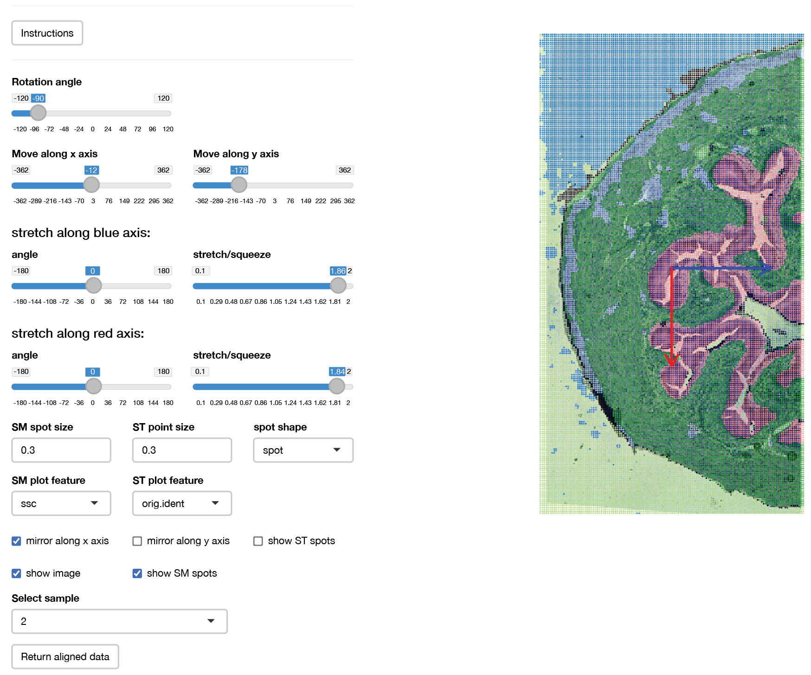

```{r, include = FALSE}
knitr::opts_chunk$set(
  collapse = FALSE,
  comment = "##"
)
```

<br>

This vignette will highlights some additional features of [***SpaMTP***](https://github.com/GenomicsMachineLearning/SpaMTP) that can be useful for analysing and visualising your SM data. This vignette will again use the public mouse urinary bladder dataset analysed extensively [here](https://genomicsmachinelearning.github.io/SpaMTP/articles/Mouse_Urinary_Bladder.html).

*Author: Andrew Causer*

```{r load_packages, warning=FALSE, message=FALSE}
## Install SpaMTP if not previously installed
if (!require("SpaMTP"))
    devtools::install_github("BiomedicalMachineLearning/SpaMTP")

#General Libraries
library(SpaMTP)
library(Cardinal)
library(Seurat)
library(dplyr)

#For plotting + DE plots
library(ggplot2)
library(EnhancedVolcano)
```


##### Load Processed Data

Here, we will be using already processed, clustered (via spatially-aware Shrunken Centroid) and annotated data. For more information about how the data was processed, please visit [here](https://genomicsmachinelearning.github.io/SpaMTP/articles/Mouse_Urinary_Bladder.html).

```{r warning=FALSE, message=FALSE}
bladder_annotated <- readRDS("vignette_data_files/Mouse_Urinary_Bladder/bladder_annotated.RDS")
```    


## Querying an ***SpaMTP*** Dataset 

***SpaMTP*** stores the relative m/z value annotations in the objects feature metadata slot. We can see this below:

```{r, echo=TRUE, results='hide', warning=FALSE, message=FALSE}
head(bladder_annotated@assays$Spatial@meta.data)
```

```{r, echo=FALSE}
df <- head(bladder_annotated@assays$Spatial@meta.data)
knitr::kable(df, format = "html", table.attr = "class='dataframe'", align = "c")
```


However, there is are some useful functions that lets the user search through their **SpaMTP** dataset to find either exact m/z values or metabolite names that they are interested in. Lets see how each works:

The first is *FindNearestMZ()*, this function lets users find the m/z value in their dataset that is closest to the value being queried.

```{r warning=FALSE, message=FALSE}
FindNearestMZ(bladder_annotated, 741.5)
```  

This is useful if the metabolite of interest has a known m/z mass, or if the user wants to use *Seurat's* feature plotting functions. 

<br> 

The second is *SearchAnnotations()*, this function lets users query a metabolite to find if it is present within their dataset. 

```{r, echo=TRUE, results='hide', warning=FALSE, message=FALSE}
SearchAnnotations(bladder_annotated, metabolite = "Isorhamnetin 3-(6''-malonylglucoside)", search.exact = TRUE)
```

```{r, echo=FALSE}
df <-SearchAnnotations(bladder_annotated, metabolite = "Isorhamnetin 3-(6''-malonylglucoside)", search.exact = TRUE)
knitr::kable(df, format = "html", table.attr = "class='dataframe'", align = "c")
```

The `search.exact` parameter specifies whether there needs to be an exact match to the metabolite name. If set to `FALSE`, users can find all metabolites with similar names. For example, we want to see all the different types of `(3'-sulfo)Galbeta-Cer` lipids in our dataset.

```{r, echo=TRUE, results='hide', warning=FALSE, message=FALSE}
SearchAnnotations(bladder_annotated, metabolite = "(3'-sulfo)Galbeta-Cer", search.exact = FALSE)
```

```{r, echo=FALSE}
df <-SearchAnnotations(bladder_annotated, metabolite = "(3'-sulfo)Galbeta-Cer", search.exact = FALSE)

knitr::kable(df, format = "html", table.attr = "class='dataframe'", align = "c")
```


This function also lets users select the feature metadata column they want to query. For example, if *RefineLipis()* has been run, users can search for all lipids of the Class "GlcCer". 

```{r, echo=TRUE, results='hide', warning=FALSE, message=FALSE}
SearchAnnotations(bladder_annotated, metabolite = "GlcCer", search.exact = FALSE, column.name = "Lipid.Maps.Main.Class")
```

```{r, echo=FALSE}
df <-SearchAnnotations(bladder_annotated, metabolite = "GlcCer", search.exact = FALSE, column.name = "Lipid.Maps.Main.Class")

knitr::kable(df, format = "html", table.attr = "class='dataframe'", align = "c")
```


## Subsetting a ***SpaMTP*** Dataset by Metabolites

In some cases, we may want to reduce the number of features present in our dataset. Often there are thousands or millions of metabolites in one dataset, removing unwanted metabolites can often reduce the computational load. Below, we demonstrate how to subset our bladder dataset to only include Glycerophospholipids.

```{r warning=FALSE, message=FALSE}
GPs <- SearchAnnotations(bladder_annotated, metabolite = "GP", search.exact = FALSE, column.name = "Lipid.Maps.Category")

bladder_GPs <- SubsetMZFeatures(bladder_annotated, features = GPs$mz_names)
```

```{r warning=FALSE, message=FALSE}
bladder_annotated
``` 
```{r warning=FALSE, message=FALSE}
bladder_GPs
``` 
We now only have 33 features, compared to the 79 in the original dataset. 

## Visualising SM data using ***SpaMTP***

An important part of any analysis pipeline is to generate informative and clear visualisations of the results. ***SpaMTP*** has a range of visualisation functions and features, which we will step through below.


### Plotting a m/z Value

Plotting in ***SpaMTP*** builds on *ggplot2* allowing for easy organisation and plot manipulation. Below, we will plot the expression of the m/z 741.530578613281 using *Seurat's* plotting function *ImageFeaturePlot()*. Below we use ggplot helper functions to orientate the image correctly.  

```{r, fig.width=11, fig.height=5, warning=FALSE, message=FALSE}
ImageFeaturePlot(bladder_annotated, features = "mz-741.530578613281", size = 2) & coord_flip() & scale_x_reverse()
```

Comparatively, the ***SpaMTP*** function *ImageMZPlot()* provides more SM-based functionality, including:

* Plotting the closest m/z value to the numeric value provided.
* Plotting the combined expression of &#177; the mz value in ppm
* Plotting the spots as either circles (*ST*) or pixels (*SM*)

```{r, fig.width=11, fig.height=5, warning=FALSE, message=FALSE}
ImageMZPlot(bladder_annotated, mz = 741.53057, plusminus = 1, size = 1, plot.pixel = TRUE) & coord_flip() & scale_x_reverse()
```

### Plotting a Metabolite Name

In addition, ***SpaMTP*** also has the function *ImageMZAnnotationPlot()*, which allows users to plot the spatial expression of named metabolites. In addition to the features above, this function also lets users:

* Plot from a specific column in the feature metadata containing the m/z metabolite annotations
* Combine the expression of all metabolites that match the specified name (as described above using plot.exact = `FALSE`). 

We will use the "Galbeta-Cer" metabolites as an example:

```{r, warning=FALSE, message=FALSE}
mb <- (SearchAnnotations(bladder_annotated, metabolite = "Galbeta-Cer", search.exact = FALSE))$all_IsomerNames

mb
```

Lets plot them individually:

```{r, fig.width=22, fig.height=5, warning=FALSE, message=FALSE}
ImageMZAnnotationPlot(bladder_annotated, metabolites = c("(3'-sulfo)Galbeta-Cer(d18:1/22:0(2OH))", "(3'-sulfo)Galbeta-Cer(d18:1/24:0(2OH))"), slot = "counts", plot.exact = FALSE, size = 1.5) & coord_flip() & scale_x_reverse()
```

Lets plot them combined:

```{r, fig.width=11, fig.height=5, warning=FALSE, message=FALSE}
ImageMZAnnotationPlot(bladder_annotated, metabolites = "Galbeta-Cer", slot = "counts", plot.exact = FALSE, size = 1.5) & coord_flip() & 
  scale_x_reverse()
```

There are equivalent functions for ***SpaMTP*** *Seurat* objects that contain images these being *SpatialMZPlot()* and *SpatialMZAnnotationPlot()*. Examples of these are shown below.    


### Plotting Mass Intensity Spectra Plots

Often we are interested in different patterns of metabolite expression between groups such as clusters. Mass intensity plots can be useful at displaying the overall patters of each tissue region. ***SpaMTP*** provides functionality to generate these plots and also label peaks with selected metabolites. 


```{r, fig.width=20, fig.height=5, warning=FALSE, message=FALSE}
ROI <- subset(bladder_annotated, subset = ssc %in% c("2", "5", "6")) 

MassIntensityPlot(ROI, group.by = "ssc", label.annotations = TRUE, metabolite.labels = c("PC(34:1)"), annotation.column = "Species.Name.Simple")
```

Based on this plot, we can see that our metabolite "PC(34:1)" has been annotated on the plot. The plot looks quite crowded though. We can either change the mass range to only show the specific region on the spectrum, or we could generate individual plots for each cluster. We will show both approaches below:

Change the mass range:
```{r, fig.width=20, fig.height=5, warning=FALSE, message=FALSE}
MassIntensityPlot(ROI, group.by = "ssc", mass.range = c(750, 850), label.annotations = TRUE, metabolite.labels = c("PC(34:1)"), annotation.column = "Species.Name.Simple")
```

Generate individual plots per cluster:
```{r, fig.width=20, fig.height=10, warning=FALSE, message=FALSE}
MassIntensityPlot(ROI, split.by  = "ssc", label.annotations = TRUE, metabolite.labels = c("PC(34:1)"), annotation.column = "Species.Name.Simple")
```

Now we can clearly see that this metabolite is highly expressed by cluster 6!


There are various additional visualisation techniques such as 3D Density Kernel plotting and various DE and pathway analysis plotting functions. These can all be seen in either the [SM data analysis](https://genomicsmachinelearning.github.io/SpaMTP/articles/Mouse_Urinary_Bladder.html) or [Multi-Omic data](https://genomicsmachinelearning.github.io/SpaMTP/articles/Multi-Omic_Mouse_Brain.html) analysis vignettes.


## Binning Metabolites

Expression of specific metabolites on their own can sometime be difficult to detect, however when combining the expression of similar metabolites, these patterns can become more observable. ***SpaMTP*** has the function *BinMetabolites()*, which lets users specify the metabolites they want to combine the expression of. These values are then stored in the `@meta.data` slot of the ***SpaMTP*** *Seurat* object and can be plotted or used for further analysis. Below, we will demonstrate how to bin the expression of all Glycerophospholipids. 

```{r, echo=TRUE, results='hide', warning=FALSE, message=FALSE}
mzs <- SearchAnnotations(bladder_annotated, metabolite = "GP", search.exact = FALSE, column.name = "Lipid.Maps.Category")$mz_names

bladder_annotated <- BinMetabolites(bladder_annotated, mzs = mzs, assay = "Spatial", slot = "counts", bin_name = "Binned_GPs")

head(bladder_annotated@meta.data)
```

```{r, echo=FALSE}
df <-head(bladder_annotated@meta.data)

knitr::kable(df, format = "html", table.attr = "class='dataframe'", align = "c")
```


We can see the expression values have been stored in the `@meta.data` column "Binnde_GPs". Now lets plot the results:

```{r, fig.width=11, fig.height=5, warning=FALSE, message=FALSE}
ImageFeaturePlot(bladder_annotated, features = "Binned_GPs", size = 2) & coord_flip() & scale_x_reverse() & scale_fill_gradientn(colors = viridis::viridis(100))
```

We can see that there is high expression of GP's in the urothelium and adventitia layers of the bladder. This feature is especially useful to combine metabolites that are all up expressed in a specific condition/cluster (following differential expression analysis).

## Adding H&E Image to Spatial Metabolomic Data

One useful feature of ***SpaMPT*** is the ability to add a H&E or tissue image to the *SpaMTP* object. This can allow the user to visualise key structural metabolic patterns that match to the tissue morphology. Below, we will demonstrate how to manually align your image with your SM dataset. 

```{r, eval=FALSE}
bladder_HE <- AddSMImage("vignettes/vignette_data_files/Mouse_Urinary_Bladder/mouse_urinary_bladder_HE.tif", bladder_annotated, msi.pixel.multiplier = 2)
```

This function will activate an interactive window where you can change the MSI coordinates to align to the image provided. This includes rotating, adjusting x and y coordinates, flipping around the x or y axis, and also scaling. The user can also select any column in the object's metadata to plot. This can help assist the alignment process, in particular by using clustering results.  

Here is an example of what the alignment GUI looks like, and also the perimeters we used to align the H&E image:

```{r echo=FALSE, fig.align="center", out.width="100%", dpi=1000}

```

After clicking the return aligned data button a ***SpaMTP*** *Seurat* object with the H&E image added to the `@image$slice1` slot will be returned. Here "fov" is the original SM plotting coordinates and "slice1" has the adjusted coordinates to match the H&E image.

```{r, include=FALSE}
bladder_HE <- readRDS("vignette_data_files/Mouse_Urinary_Bladder/bladder_HE.RDS")
```  

```{r fig.width=30, fig.height=5, warning=FALSE, message=FALSE}
bladder_HE@images
```

Lets now visualise this:

```{r fig.width=20, fig.height=10, warning=FALSE, message=FALSE}
(ImageDimPlot(bladder_HE, group.by = "ssc", fov = "fov", size = 1) & scale_y_reverse() )/ 
  (SpatialDimPlot(bladder_HE, group.by = "ssc", images = "slice1", pt.size.factor = 3) &theme_void())
```


This also means that we can now visualise our data using the *Plot3D()* function with a H&E image:

```{r, fig.width=10, fig.height=10, warning=FALSE, message=FALSE}
### Identified the m/z values that are to be plot
mzs <- unlist(lapply(c(798.5411, 741.5306), function(x) FindNearestMZ(data = bladder_annotated, target_mz = x)))
ROI_HE <- subset(bladder_HE, subset = ssc %in% c("2", "5", "6"))

Plot3DFeature(ROI_HE, features = mzs, show.image = "slice1", assays = "Spatial", between.layer.height = 300, names = c("PC(34:1)","SM(34:1)"), plot.height = 400, plot.width = 800, downscale.image = 2)
```


This function is designed for plotting two features simultaneously. If we only want to visualise one of the features, we can use a work around to only show a single trace, where trace 1 = feature1, trace 2 = feature2 and trace 3 = image. Here, we just provide one feature to plot. To stop this one feature being replicated, we can add an additional line of code shown below:

```{r, fig.width=10, fig.height=10, warning=FALSE, message=FALSE}
p <- Plot3DFeature(ROI_HE, features = mzs[2], show.image = "slice1", assays = "Spatial", between.layer.height = 300, names = c("SM(34:1)", "SM(34:1)"), plot.height = 400, plot.width = 800, downscale.image = 2)

plotly::style(p, visible = FALSE, traces = 1)
```

## 3D Ploting of features and metadata

Although the Plot3DFeatures function is mainly used for plotting features from different modalities (i.e. genes and metabolites). It can also be used to plot metadata with feature or metadata between modalities. Lets visualise this below:

```{r, fig.width=10, fig.height=10, warning=FALSE, message=FALSE}
# Plot3DFeatures can either take in a colour palette (i.e. "Reds", "Blues", etc.) or a list of RGB values
# In this case we want our feature to be plotted using "Reds" and our clustering results to be coloured in categorical colours 

col.palette <- list(
  "Reds",  # Use built-in Plotly colorscale
  list(     # Define custom colorscale manually
    list(0, "rgb(0,0,255)"),   # Blue at 0
    list(0.5, "rgb(0,255,0)"), # Green at 0.5
    list(1, "rgb(255,0,0)")    # Red at 1
  )
)


Plot3DFeature(ROI_HE, features = c(mzs[2], "ssc"), show.image = "slice1", assays = "Spatial", between.layer.height = 300, names = c("Metabolite", "Clusters"), plot.height = 400, plot.width = 800, downscale.image = 2, col.palette = col.palette)
```

If we want to specify the exact colours for our clusters we can use the code below to convert colours/hex values to RGB:
```{r, fig.width=10, fig.height=10, warning=FALSE, message=FALSE}
# We will use the same colour palette as used in the "Mouse Urinary Bladder" tutorial
# Make sure that you only include values that are present in your plot
hex_list = list("2" = "#C2B03B",
                   "5" = "#0074B0",  
                   "6" = "#DE4D6C")

# Convert the names to numeric values
values <- as.numeric(names(hex_list))

# Normalize values between 0 and 1
normalized_values <- (values - min(values)) / (max(values) - min(values))

# Convert colors to RGB (supports both hex and named colors)
custom_colorscale <- lapply(seq_along(values), function(i) {
  rgb_values <- col2rgb(hex_list[[as.character(values[i])]])  # Convert to RGB
  list(normalized_values[i], paste0("rgb(", paste(rgb_values, collapse=","), ")"))
})


Plot3DFeature(ROI_HE, features = c(mzs[2], "ssc"), show.image = "slice1", assays = "Spatial", between.layer.height = 300, names = c("Metabolite", "Clusters"), plot.height = 400, plot.width = 800, downscale.image = 2, col.palette = list("Reds", custom_colorscale))
```

## Selecting Data Bin Size

One important element in analysing spatial metabolic data is choosing a bin size to reduce the dimensionality of the dataset. SpaMTP provides an interactive plot that lets you change the size of the bin and see which metabolites are included within that bin for a specific peak, and how that changes the expression spatially across the tissue. We can observe this below:

```{r, eval=FALSE}
InteractiveSpatialPlot(ROI_HE)
```


<iframe src="https://agc888.shinyapps.io/InteractiveSpatialPlot/" width="100%" height="600px"></iframe>


Based on this plot, users can adjust the bin size of their data (by running `BinSpaMTP`) or can adjust the `plusminus` attribute when using `ImageMZPlot`.    

<br> 

## Data Export

Exporting data can often be difficult when dealing with large datasets of different data object types such as *R's Seurat* compared to *Python's scanpy*. ***SpaMTP*** can easily export the data object into matrix.mtx, barcodes.csv and features.csv files, which can be easily read into all major spatial analysis packages. In addition, cell/pixel and feature metadata is also exported as .csv files. Below we demonstrate how to export the files:

```{r, eval=FALSE}
saveSpaMTPData(bladder_HE, outdir = "../Documents/SpaMTP_Output/", assay = "Spatial", slot = "counts", annotations = TRUE)
```


## Session Info

```{r}
sessionInfo()
```


